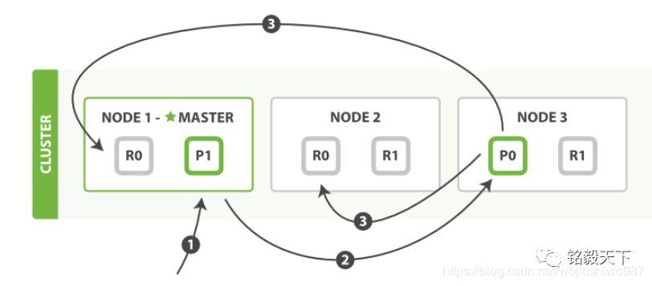

摘自：`https://www.javazhiyin.com/28067.html`

### 1、elasticsearch了解多少，说说你们公司es的集群架构，索引数据大小，分片有多少，以及一些调优手段 。

`面试官`：想了解应聘者之前公司接触的ES使用场景、规模，有没有做过比较大规模的索引设计、规划、调优。
`解答`：
如*实结合自己的实践场景回答即可。*
*比如：ES集群架构13个节点，索引根据通道不同共20+索引，根据日期，每日递增20+，索引：10分片，每日递增1亿+数据，*
*每个通道每天索引大小控制：150GB之内。*

*仅索引层面调优手段：*

#### *1.1、设计阶段调优*

- *1）根据业务增量需*求，采取基于日期模板创建索引，通过roll over API滚动索引；
- 2）使用别名进行索引管理；
- 3）每天凌晨定时对索引做force_merge操作，以释放空间；
- 4）采取冷热分离机制，热数据存储到SSD，提高检索效率；冷数据定期进行shrink操作，以缩减存储；
- 5）采取curator进行索引的生命周期管理；
- 6）仅针对需要分词的字段，合理的设置分词器；
- 7）Mapping阶段充分结合各个字段的属性，是否需要检索、是否需要存储等。 ……..

#### 1.2、写入调优

- 1）写入前副本数设置为0；
- 2）写入前关闭refresh_interval设置为-1，禁用刷新机制；
- 3）写入过程中：采取bulk批量写入；
- 4）写入后恢复副本数和刷新间隔；
- 5）尽量使用自动生成的id。

#### 1.3、查询调优

- 1）禁用wildcard；
- 2）禁用批量terms（成百上千的场景）；
- 3）充分利用倒排索引机制，能keyword类型尽量keyword；
- 4）数据量大时候，可以先基于时间敲定索引再检索；
- 5）设置合理的路由机制。

#### 1.4、其他调优

部署调优，业务调优等。

上面的提及一部分，面试者就基本对你之前的实践或者运维经验有所评估了。

### 2、elasticsearch的倒排索引是什么

`面试官`：想了解你对基础概念的认知。
`解答`：通俗解释一下就可以。

传统的我们的检索是通过文章，逐个遍历找到对应关键词的位置。
而倒排索引，是通过分词策略，形成了词和文章的映射关系表，这种词典+映射表即为倒排索引。
有了倒排索引，就能实现`o（1）时间复杂度`的效率检索文章了，极大的提高了检索效率。

学术的解答方式：

> 倒排索引，相反于一篇文章包含了哪些词，它从词出发，记载了这个词在哪些文档中出现过，由两部分组成——词典和倒排表。

`加分项`：倒排索引的底层实现是基于：FST（Finite State Transducer）数据结构。
lucene从4+版本后开始大量使用的数据结构是FST。FST有两个优点：

- 1）空间占用小。通过对词典中单词前缀和后缀的重复利用，压缩了存储空间；
- 2）查询速度快。O(len(str))的查询时间复杂度。

### 3、elasticsearch 索引数据多了怎么办，如何调优，部署

`面试官`：想了解大数据量的运维能力。
`解答`：索引数据的规划，应在前期做好规划，正所谓“设计先行，编码在后”，这样才能有效的避免突如其来的数据激增导致集群处理能力不足引发的线上客户检索或者其他业务受到影响。
如何调优，正如问题1所说，这里细化一下：

#### 3.1 动态索引层面

基于`模板+时间+rollover api滚动`创建索引，举例：设计阶段定义：blog索引的模板格式为：blog_index_时间戳的形式，每天递增数据。

这样做的好处：不至于数据量激增导致单个索引数据量非常大，接近于上线2的32次幂-1，索引存储达到了TB+甚至更大。

一旦单个索引很大，存储等各种风险也随之而来，所以要提前考虑+及早避免。

#### 3.2 存储层面

`冷热数据分离存储`，热数据（比如最近3天或者一周的数据），其余为冷数据。
对于冷数据不会再写入新数据，可以考虑定期force_merge加shrink压缩操作，节省存储空间和检索效率。

#### 3.3 部署层面

一旦之前没有规划，这里就属于应急策略。
结合ES自身的支持动态扩展的特点，动态新增机器的方式可以缓解集群压力，注意：如果之前主节点等`规划合理`，不需要重启集群也能完成动态新增的。

### 4、elasticsearch是如何实现master选举的

`面试官`：想了解ES集群的底层原理，不再只关注业务层面了。
`解答`：
前置前提：

- 1）只有候选主节点（master：true）的节点才能成为主节点。
- 2）最小主节点数（min_master_nodes）的目的是防止脑裂。

这个我看了各种网上分析的版本和源码分析的书籍，云里雾里。
核对了一下代码，核心入口为findMaster，选择主节点成功返回对应Master，否则返回null。选举流程大致描述如下：

- 第一步：确认候选主节点数达标，elasticsearch.yml设置的值discovery.zen.minimum_master_nodes；
- 第二步：比较：先判定是否具备master资格，具备候选主节点资格的优先返回；若两节点都为候选主节点，则id小的值会主节点。注意这里的id为string类型。

题外话：获取节点id的方法。

```
1GET /_cat/nodes?v&h=ip,port,heapPercent,heapMax,id,name
2ip        port heapPercent heapMax id   name
3127.0.0.1 9300          39   1.9gb Hk9w Hk9wFwU
```

### 5、详细描述一下Elasticsearch索引文档的过程

`面试官`：想了解ES的底层原理，不再只关注业务层面了。
`解答`：
这里的索引文档应该理解为文档写入ES，创建索引的过程。
文档写入包含：单文档写入和批量bulk写入，这里只解释一下：单文档写入流程。

记住官方文档中的这个图。




第一步：客户写集群某节点写入数据，发送请求。（如果没有指定路由/协调节点，请求的节点扮演`路由节点`的角色。）

第二步：节点1接受到请求后，使用文档_id来确定文档属于分片0。请求会被转到另外的节点，假定节点3。因此分片0的主分片分配到节点3上。

第三步：节点3在主分片上执行写操作，如果成功，则将请求并行转发到节点1和节点2的副本分片上，等待结果返回。所有的副本分片都报告成功，节点3将向协调节点（节点1）报告成功，节点1向请求客户端报告写入成功。

如果面试官再问：第二步中的文档获取分片的过程？
回答：借助路由算法获取，路由算法就是根据路由和文档id计算目标的分片id的过程。

```
1shard = hash(_routing) % (num_of_primary_shards)
```

### 6、详细描述一下Elasticsearch搜索的过程？

`面试官`：想了解ES搜索的底层原理，不再只关注业务层面了。
`解答`：
搜索拆解为“query then fetch” 两个阶段。
**query阶段的目的**：定位到位置，但不取。
步骤拆解如下：

- 1）假设一个索引数据有5主+1副本 共10分片，一次请求会命中（主或者副本分片中）的一个。
- 2）每个分片在本地进行查询，结果返回到本地有序的优先队列中。
- 3）第2）步骤的结果发送到协调节点，协调节点产生一个全局的排序列表。

**fetch阶段的目的**：取数据。
路由节点获取所有文档，返回给客户端。

### 7、Elasticsearch在部署时，对Linux的设置有哪些优化方法

`面试官`：想了解对ES集群的运维能力。
`解答`：

- 1）关闭缓存swap;
- 2）堆内存设置为：Min（节点内存/2, 32GB）;
- 3)设置最大文件句柄数；
- 4）线程池+队列大小根据业务需要做调整；
- 5）磁盘存储raid方式——存储有条件使用RAID10，增加单节点性能以及避免单节点存储故障。