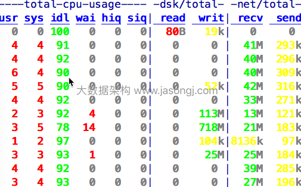
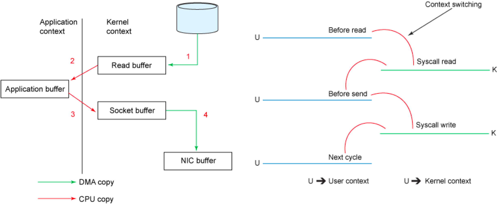
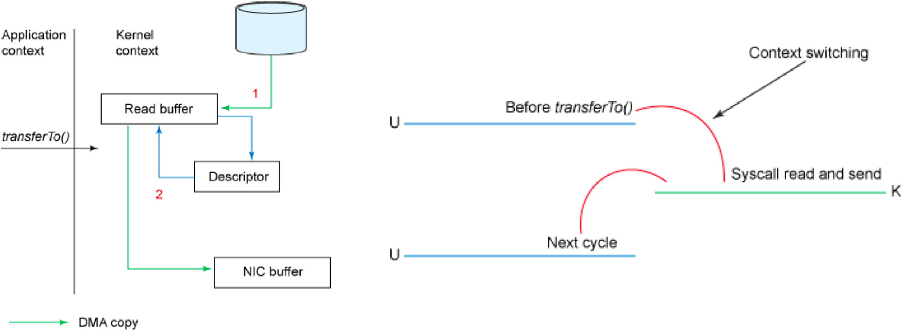

摘自：

```
https://www.jianshu.com/p/d6a73be9d803
https://segmentfault.com/a/1190000003985468
https://www.infoq.cn/article/kafka-analysis-part-6
```


# 基本原理

- 读写文件依赖OS文件系统的页缓存，而不是在JVM内部缓存数据，利用OS来缓存，内存利用率高
- sendfile技术（零拷贝），避免了传统网络IO四步流程
- 支持End-to-End的压缩
- 顺序IO以及常量时间get、put消息
- Partition 可以很好的横向扩展和提供高并发处理

# 充分利用 Page Cache

使用 Page Cache 的好处如下

\- I/O Scheduler 会将连续的小块写组装成大块的物理写从而提高性能

\- I/O Scheduler 会尝试将一些写操作重新按顺序排好，从而减少磁盘头的移动时间

\- 充分利用所有空闲内存（非 JVM 内存）。如果使用应用层 Cache（即 JVM 堆内存），会增加 GC 负担

\- 读操作可直接在 Page Cache 内进行。如果消费和生产速度相当，甚至不需要通过物理磁盘（直接通过 Page Cache）交换数据

\- 如果进程重启，JVM 内的 Cache 会失效，但 Page Cache 仍然可用

Broker 收到数据后，写磁盘时只是将数据写入 Page Cache，并不保证数据一定完全写入磁盘。从这一点看，可能会造成机器宕机时，Page Cache 内的数据未写入磁盘从而造成数据丢失。但是这种丢失只发生在机器断电等造成操作系统不工作的场景，而这种场景完全可以由 Kafka 层面的 Replication 机制去解决。如果为了保证这种情况下数据不丢失而强制将 Page Cache 中的数据 Flush 到磁盘，反而会降低性能。也正因如此，Kafka 虽然提供了 flush.messages 和 flush.ms 两个参数将 Page Cache 中的数据强制 Flush 到磁盘，但是 Kafka 并不建议使用。

如果数据消费速度与生产速度相当，甚至不需要通过物理磁盘交换数据，而是直接通过 Page Cache 交换数据。同时，Follower 从 Leader Fetch 数据时，也可通过 Page Cache 完成。下图为某 Partition 的 Leader 节点的网络 / 磁盘读写信息。



从上图可以看到，该 Broker 每秒通过网络从 Producer 接收约 35MB 数据，虽然有 Follower 从该 Broker Fetch 数据，但是该 Broker 基本无读磁盘。这是因为该 Broker 直接从 Page Cache 中将数据取出返回给了 Follower。

# 支持多 Disk Drive

Broker 的 log.dirs 配置项，允许配置多个文件夹。如果机器上有多个 Disk Drive，可将不同的 Disk 挂载到不同的目录，然后将这些目录都配置到 log.dirs 里。Kafka 会尽可能将不同的 Partition 分配到不同的目录，也即不同的 Disk 上，从而充分利用了多 Disk 的优势。

# 零拷贝

Kafka 中存在大量的网络数据持久化到磁盘（Producer 到 Broker）和磁盘文件通过网络发送（Broker 到 Consumer）的过程。这一过程的性能直接影响 Kafka 的整体吞吐量。

# 传统模式下的四次拷贝与四次上下文切换

以将磁盘文件通过网络发送为例。传统模式下，一般使用如下伪代码所示的方法先将文件数据读入内存，然后通过 Socket 将内存中的数据发送出去。

```
buffer = File.read
Socket.send(buffer)
```

这一过程实际上发生了四次数据拷贝。首先通过系统调用将文件数据读入到内核态 Buffer（DMA 拷贝），然后应用程序将内存态 Buffer 数据读入到用户态 Buffer（CPU 拷贝），接着用户程序通过 Socket 发送数据时将用户态 Buffer 数据拷贝到内核态 Buffer（CPU 拷贝），最后通过 DMA 拷贝将数据拷贝到 NIC Buffer。同时，还伴随着四次上下文切换，如下图所示。




# sendfile 和 transferTo 实现零拷贝

而 Linux 2.4+ 内核通过 sendfile 系统调用，提供了零拷贝。数据通过 DMA 拷贝到内核态 Buffer 后，直接通过 DMA 拷贝到 NIC Buffer，无需 CPU 拷贝。这也是零拷贝这一说法的来源。除了减少数据拷贝外，因为整个读文件 - 网络发送由一个 sendfile 调用完成，整个过程只有两次上下文切换，因此大大提高了性能。零拷贝过程如下图所示。



从具体实现来看，Kafka 的数据传输通过 TransportLayer 来完成，其子类 PlaintextTransportLayer 通过[Java NIO ](http://www.jasongj.com/java/nio_reactor/)的 FileChannel 的 transferTo 和 transferFrom 方法实现零拷贝，如下所示。

```java
@Override
public long transferFrom(FileChannel fileChannel, long position, long count) throws IOException {
    return fileChannel.transferTo(position, count, socketChannel);
}
```

**注：** transferTo 和 transferFrom 并不保证一定能使用零拷贝。实际上是否能使用零拷贝与操作系统相关，如果操作系统提供 sendfile 这样的零拷贝系统调用，则这两个方法会通过这样的系统调用充分利用零拷贝的优势，否则并不能通过这两个方法本身实现零拷贝。

# 减少网络开销

## 批处理

批处理是一种常用的用于提高 I/O 性能的方式。对 Kafka 而言，批处理既减少了网络传输的 Overhead，又提高了写磁盘的效率。

Kafka 0.8.1 及以前的 Producer 区分同步 Producer 和异步 Producer。同步 Producer 的 send 方法主要分两种形式。一种是接受一个 KeyedMessage 作为参数，一次发送一条消息。另一种是接受一批 KeyedMessage 作为参数，一次性发送多条消息。而对于异步发送而言，无论是使用哪个 send 方法，实现上都不会立即将消息发送给 Broker，而是先存到内部的队列中，直到消息条数达到阈值或者达到指定的 Timeout 才真正的将消息发送出去，从而实现了消息的批量发送。

Kafka 0.8.2 开始支持新的 Producer API，将同步 Producer 和异步 Producer 结合。虽然从 send 接口来看，一次只能发送一个 ProducerRecord，而不能像之前版本的 send 方法一样接受消息列表，但是 send 方法并非立即将消息发送出去，而是通过 batch.size 和 linger.ms 控制实际发送频率，从而实现批量发送。

由于每次网络传输，除了传输消息本身以外，还要传输非常多的网络协议本身的一些内容（称为 Overhead），所以将多条消息合并到一起传输，可有效减少网络传输的 Overhead，进而提高了传输效率。

从零拷贝章节的图中可以看到，虽然 Broker 持续从网络接收数据，但是写磁盘并非每秒都在发生，而是间隔一段时间写一次磁盘，并且每次写磁盘的数据量都非常大（最高达到 718MB/S）。

## 数据压缩降低网络负载

Kafka 从 0.7 开始，即支持将数据压缩后再传输给 Broker。除了可以将每条消息单独压缩然后传输外，Kafka 还支持在批量发送时，将整个 Batch 的消息一起压缩后传输。数据压缩的一个基本原理是，重复数据越多压缩效果越好。因此将整个 Batch 的数据一起压缩能更大幅度减小数据量，从而更大程度提高网络传输效率。

Broker 接收消息后，并不直接解压缩，而是直接将消息以压缩后的形式持久化到磁盘。Consumer Fetch 到数据后再解压缩。因此 Kafka 的压缩不仅减少了 Producer 到 Broker 的网络传输负载，同时也降低了 Broker 磁盘操作的负载，也降低了 Consumer 与 Broker 间的网络传输量，从而极大得提高了传输效率，提高了吞吐量。

## 高效的序列化方式

Kafka 消息的 Key 和 Payload（或者说 Value）的类型可自定义，只需同时提供相应的序列化器和反序列化器即可。因此用户可以通过使用快速且紧凑的序列化 - 反序列化方式（如 Avro，Protocal Buffer）来减少实际网络传输和磁盘存储的数据规模，从而提高吞吐率。这里要注意，如果使用的序列化方法太慢，即使压缩比非常高，最终的效率也不一定高。