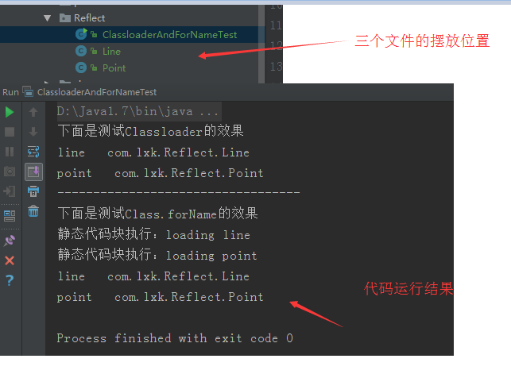
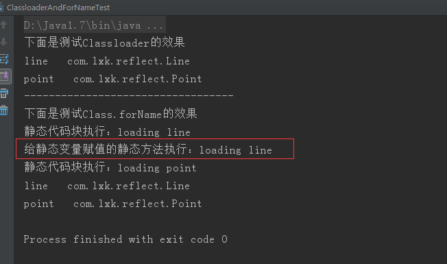

摘自：`https://blog.csdn.net/qq_27093465/article/details/52262340`

java中class.forName()和classLoader都可用来对类进行加载。
class.forName()前者除了将类的.class文件加载到jvm中之外，还会对类进行解释，执行类中的static块。
而classLoader只干一件事情，就是将.class文件加载到jvm中，不会执行static中的内容,只有在newInstance才会去执行static块。
Class.forName(name, initialize, loader)带参函数也可控制是否加载static块。并且只有调用了newInstance()方法采用调用构造函数，创建类的对象
看下Class.forName()源码

```java
//Class.forName(String className)  这是1.8的源码
public static Class<?> forName(String className) throws ClassNotFoundException {
    Class<?> caller = Reflection.getCallerClass();
    return forName0(className, true, ClassLoader.getClassLoader(caller), caller);
}
//注意第二个参数，是指Class被loading后是不是必须被初始化。 不初始化就是不执行static的代码即静态代码
```

然后就是，测试代码证明上面的结论是OK的，如下：

```java
package com.lxk.Reflect;
 
/**
 * Created by lxk on 2017/2/21
 */
public class Line {
    static {
        System.out.println("静态代码块执行：loading line");
    }
}
```


```java
package com.lxk.Reflect;
 
/**
 * Created by lxk on 2017/2/21
 */
public class Point {
    static {
        System.out.println("静态代码块执行：loading point");
    }
}
```


```java
package com.lxk.Reflect;
 
/**
 * Class.forName和classloader的区别
 * <p>
 * Created by lxk on 2017/2/21
 */
public class ClassloaderAndForNameTest {
    public static void main(String[] args) {
        String wholeNameLine = "com.lxk.Reflect.Line";
        String wholeNamePoint = "com.lxk.Reflect.Point";
        System.out.println("下面是测试Classloader的效果");
        testClassloader(wholeNameLine, wholeNamePoint);
        System.out.println("----------------------------------");
        System.out.println("下面是测试Class.forName的效果");
        testForName(wholeNameLine, wholeNamePoint);
 
    }
 
    /**
     * classloader
     */
    private static void testClassloader(String wholeNameLine, String wholeNamePoint) {
        Class<?> line;
        Class<?> point;
        ClassLoader loader = ClassLoader.getSystemClassLoader();
        try {
            line = loader.loadClass(wholeNameLine);
            point = loader.loadClass(wholeNamePoint);
            //demo = ClassloaderAndForNameTest.class.getClassLoader().loadClass(wholeNamePoint);//这个也是可以的
            System.out.println("line   " + line.getName());
            System.out.println("point   " + point.getName());
        } catch (ClassNotFoundException e) {
            e.printStackTrace();
        }
    }
 
    /**
     * Class.forName
     */
    private static void testForName(String wholeNameLine, String wholeNamePoint) {
 
        try {
            Class line = Class.forName(wholeNameLine);
            Class point = Class.forName(wholeNamePoint);
            System.out.println("line   " + line.getName());
            System.out.println("point   " + point.getName());
        } catch (Exception e) {
            e.printStackTrace();
        }
    }
 
 
}
```



备注：

根据运行结果，可以看到，classloader并没有执行静态代码块，如开头的理论所说。

而下面的Class.forName则是夹在完之后，就里面执行了静态代码块，可以看到，2个类，line和point的静态代码块执行结果是一起的，然后才是各自的打印结果。也说明上面理论是OK的。

但是，因为我的Javabean model又经历了其他的测试，所以，两个model内部的代码稍有变化，

然后，还真就测试出来了不一样的地方。这估计是其他理论所没有的。具体看下面的代码吧。只是修改了Line的代码，添加了几个静态的方法和变量。

```java
package com.lxk.reflect;
 
/**
 * Created by lxk on 2017/2/21
 */
public class Line {
    static {
        System.out.println("静态代码块执行：loading line");
    }
 
    public static String s = getString();
 
    private static String getString() {
        System.out.println("给静态变量赋值的静态方法执行：loading line");
        return "ss";
    }
 
    public static void test() {
        System.out.println("普通静态方法执行：loading line");
    }
 
    {
        System.out.println("要是普通的代码块呢？");
    }
 
    public Line() {
        System.out.println("构造方法执行");
    }
}
```

可以看到，除了原来的简单的一个静态代码块以外，我又添加了构造方法，静态方法，以及静态变量，且，静态变量被一个静态方法赋值。



除了，静态代码块的执行外，竟然还有一个静态方法被执行，就是给静态变量赋值的静态方法被执行了。


