# 网络相关内容说明

## 七层网络模型


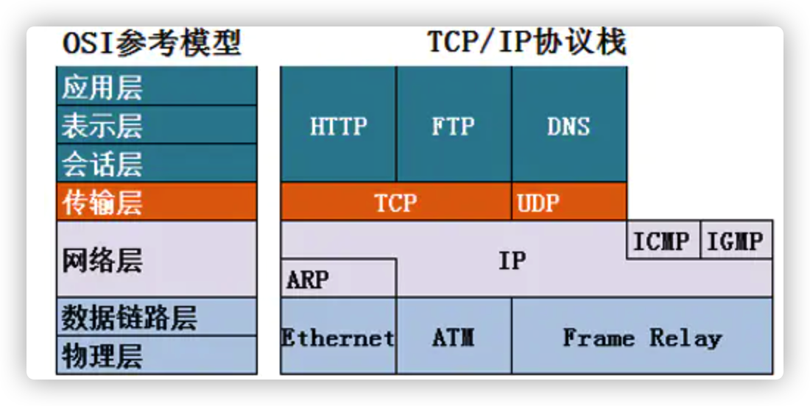

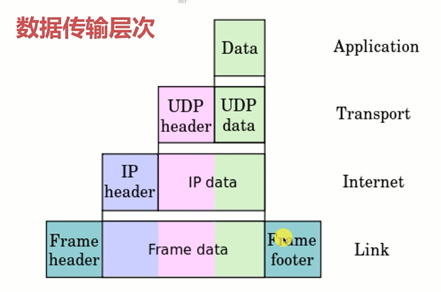

参考：`https://www.jianshu.com/p/bc0786af4fff`

`https://zhuanlan.zhihu.com/p/101662799`

各层的作用

* 第一层：物理层(`PhysicalLayer`)

    规定通信设备的机械的、电气的、功能的和过程的特性，用以建立、维护和拆除物理链路连接。具体地讲，机械特性规定了网络连接时所需接插件的规格尺寸、引脚数量和排列情况等;电气特性规定了在物理连接上传输`bit`流时线路上信号电平的大小、阻抗匹配、传输速率 距离限制等;功能特性是指对各个信号先分配确切的信号含义，即定义了`DTE`和`DCE`之间各个线路的功能;规程特性定义了利用信号线进行`bit`流传输的一组 操作规程，是指在物理连接的建立、维护、交换信息是，`DTE`和`DCE`双放在各电路上的动作系列。在这一层，数据的单位称为比特(`bit`)。属于物理层定义的典型规范代表包括：`EIA/TIA RS-232、EIA/TIA RS-449、V.35、RJ-45`等。

* 第二层：数据链路层(`DataLinkLayer`)

    在物理层提供比特流服务的基础上，建立相邻结点之间的数据链路，通过差错控制提供数据帧(`Frame`)在信道上无差错的传输，并进行各电路上的动作系列。数据链路层在不可靠的物理介质上提供可靠的传输。该层的作用包括：**物理地址寻址、数据的成帧、流量控制、数据的检错、重发等**。在这一层，数据的单位称为帧(`frame`)。数据链路层协议的代表包括：`SDLC、HDLC、PPP、STP`、帧中继等。

* 第三层是网络层

    在计算机网络中进行通信的两个计算机之间可能会经过很多个数据链路，也可能还要经过很多通信子网。**网络层的任务就是选择合适的网间路由和交换结点， 确保数据及时传送**。网络层将数据链路层提供的帧组成数据包，包中封装有网络层包头，其中含有逻辑地址信息- -**源站点和目的站点地址的网络地址**。如 果你在谈论一个`IP`地址，那么你是在处理第3层的问题，这是“数据包”问题，而不是第2层的“帧”。`IP`是第3层问题的一部分，此外还有一些路由协议和地址解析协议(`ARP`)。有关**路由**的一切事情都在这第3层处理。地址解析和路由是3层的重要目的。网络层还可以实现拥塞控制、网际互连等功能。在这一层，数据的单位称为数据包(`packet`)。网络层协议的代表包括：`IP、IPX、RIP、OSPF`等。

* 第四层是处理信息的传输层

    第4层的数据单元也称作数据包(`packets`)。但是，当你谈论`TCP`等具体的协议时又有特殊的叫法，`TCP`的数据单元称为段 (`segments`), 而`UDP`协议的数据单元称为“数据报(`datagrams`)”。这个层负责获取全部信息，因此，它必须跟踪数据单元碎片、乱序到达的 数据包和其它在传输过程中可能发生的危险。第4层为上层提供端到端(最终用户到最终用户)的透明的、可靠的数据传输服务。所为透明的传输是指在通信过程中 传输层对上层屏蔽了通信传输系统的具体细节。传输层协议的代表包括：`TCP、UDP、SPX`等。

* 第五层是会话层

    这一层也可以称为会晤层或对话层，**在会话层及以上的高层次中，数据传送的单位不再另外命名，而是统称为报文**。会话层不参与具体的传输，它提供包括访问验证和会话管理在内的建立和维护应用之间通信的机制。如服务器验证用户登录便是由会话层完成的。

* 第六层是表示层

    这一层主要解决拥护信息的语法表示问题。它将欲交换的数据从适合于某一用户的抽象语法，转换为适合于`OSI`系统内部使用的传送语法。即提供格式化的表示和转换数据服务。数据的压缩和解压缩， 加密和解密等工作都由表示层负责。

* 第七层应用层

    应用层为操作系统或网络应用程序提供访问网络服务的接口。应用层协议的代表包括：`Telnet、FTP、HTTP、SNMP`等。


一般可以分为几组：

* 基础层：物理层、数据链路层、网络层
* 传输层：`TCP-UDP`协议、`Socket`(简单理解就是`IP+Port`)
* 高级层：会话层、表示层、应用层，其中`TCP`协议模型中将这一层统称为应用层。


## 报文、协议、`Mac`地址

报文段是指`TCP/IP`协议网络传输过程中，起着路由导航作用。用以查询各个网络路由网段、`IP`地址、交换协议等`IP`数据包。其在传输过程中会不断地封装成分组、包、帧来传输。封装的方式就是添加一些控制信息组成首部，即报文头。

协议其实就是传输双方的一种约定。

`Mac`地址：物理地址，标识物理设备在网络中的地址，如`08:60:6e:29:58:03`。而一般我们的`IP`地址是当前所处的局域网根据`mac`地址分配的一个临时可用的地址。


## `IP`、端口

`IPv4`地址由32位二进制数组成，常以`xxx.xxx.xxx.xxx`形式表现，每组`xxx`代表小于或等于255的十进制数。分为`A, B, C, D, E`五大类，其中`E`类属于特殊保留地址。

如果主机号全是1，如`1.1.1.1`，那么这个地址为直接广播地址。若为`255.255.255.255`为受限广播地址。

* A: `1.0.0.0—126.0.0.0`

  `0.X.X.X`是私有地址（所谓的私有地址就是在互联网上不使用，而被用在局域网络中的地址）。 范围（`10.0.0.0—10.255.255.255`）；

  `127.X.X.X`是保留地址，用做循环测试用的。 

* B: `128.0.0.0—191.255.0.0`。

  `172.16.0.0—172.31.255.255`是私有地址 
  `169.254.X.X`是保留地址。如果你的`IP`地址是自动获取`IP`地址，而你在网络上又没有找到可用的`DHCP`服务器。就会得到其中一个`IP`。 `191.255.255.255`是广播地址，不能分配。

* C: `192.0.0.0—223.255.255.0`

  `192.168.X.X`是私有地址。（`192.168.0.0—192.168.255.255`) ，广播地址一般为`xxx.xxx.xxx.255`

* D: `224.0.0.0—239.255.255.255 `，为多播预留地址

* E: `240.0.0.0—255.255.255.254 `

* `255.255.255.255`为受限广播地址

`IPv6`总共128位长，其表达形式一般采用32位十六进制数。由两个逻辑部分组成：一个64位网络前缀和一个64位的主机地址，主机地址通常根据物理地址自动生成，叫做`EUI-64`。`IPv6`可以转换成`IPv4`，但是反过来不行。


地址运算：

如`IP`为`192.168.124.7`，子网掩码为`255.255.255.192`，此时将其转换为二进制可以看到子网掩码为`11111111 11111111 11111111 11000000`，从这里要明白前面26位就是**网络号**，后面6位是**主机号**，最多可容纳的的主机位64，而可用的数量还要减2位62，此时广播地址就是取`IP`地址的前面26位，然后将最后的6位全部补0，得到广播地址位`192.168.124.63`。如果两个主机的广播地址不同，是不能进行相互广播的。


端口：计算机之间依照互联网传输层`TCP/IP`协议的协议通信，不同协议都对应不同的端口。


# `UDP`

不同于`TCP`，`UDP`并没有合并到`Socket API`中，下面看一下基本使用

```java
// 接收端
package net;

import java.io.IOException;
import java.net.DatagramPacket;
import java.net.DatagramSocket;

/**
 * @author joyang
 */
public class UdpProvider1 {

    public static void main(String[] args) throws IOException {
        System.out.println("UDP provider started...");

        // 作为接收者，指定一个端口用于数据接收
        DatagramSocket ds = new DatagramSocket(20000);

        // 构建接收实体缓存
        final byte[] buf = new byte[512];
        DatagramPacket receivePack = new DatagramPacket(buf, buf.length);

        // 接收
        ds.receive(receivePack);

        // 打印接收到的信息与发送者的信息
        String senderIp = receivePack.getAddress().getHostAddress();
        int senderPort = receivePack.getPort();
        int dataLen = receivePack.getLength();
        String data = new String(receivePack.getData(), 0, dataLen);
        System.out.println("UDP provider receive from ip: " + senderIp + "\tport: "
            + senderPort + "\tdata: " + data);

        // 构建一份发送的数据
        String respData = "Receive data with len: " + dataLen;
        byte[] respDataBytes = respData.getBytes();

        // 直接根据发送者构建一份发送的信息
        DatagramPacket respPacket = new DatagramPacket(respDataBytes, respDataBytes.length, receivePack.getAddress(),
            senderPort);
        // 发送
        ds.send(respPacket);

        System.out.println("UDP provider finished...");
        ds.close();
    }
}
```

```java
// 发起端或搜索端
package net;

import java.io.IOException;
import java.net.DatagramPacket;
import java.net.DatagramSocket;
import java.net.InetAddress;

/**
 * @author joyang
 */
public class UdpSearcher1 {
    public static void main(String[] args) throws IOException {
        System.out.println("UDP searcher started...");

        // 作为搜索方，让系统自动分配端口
        DatagramSocket ds = new DatagramSocket();

        // 构建一份请求数据
        String reqData = "Hello World";
        byte[] reqDataBytes = reqData.getBytes();
        // 直接根据发送者构建一份要发送的信息
        DatagramPacket reqPacket = new DatagramPacket(reqDataBytes, reqDataBytes.length);
        // 上面没有直接设置地址
        reqPacket.setAddress(InetAddress.getLocalHost());
        // 这里表示要往这个端口发送数据
        reqPacket.setPort(20000);
        // 发送
        ds.send(reqPacket);

        // 构建接收实体缓存
        final byte[] buf = new byte[512];
        DatagramPacket receivePack = new DatagramPacket(buf, buf.length);
        // 接收会送的数据
        ds.receive(receivePack);

        // 打印接收到的信息与发送者的信息
        String senderIp = receivePack.getAddress().getHostAddress();
        int senderPort = receivePack.getPort();
        int dataLen = receivePack.getLength();
        String data = new String(receivePack.getData(), 0, dataLen);
        System.out.println("UDP searcher receive from ip: " + senderIp + "\tport: "
            + senderPort + "\tdata: " + data);

        System.out.println("UDP searcher finished...");
        ds.close();
    }
}
```

下面以这个为基础实现一个**广播局域网**的功能。比如家里如果洗衣机、冰箱、电视等都有相关网络模块，这里将其都归为信息提供者，可以提供自身相关网络信息，而通过一个唯一的广播发送方通过发送广播消息来收集各个设备的信息。

```java
// 信息提供方
package net;

import java.io.IOException;
import java.net.DatagramPacket;
import java.net.DatagramSocket;
import java.util.Objects;
import java.util.UUID;

/**
 * @author joyang
 */
public class UdpProvider2 {

    public static void main(String[] args) throws IOException {
        // 生成唯一标识
        String sn = UUID.randomUUID().toString();
        Provider provider = new Provider(sn);
        provider.start();

        // 读取任意键盘信息后可以退出
        System.in.read();
        provider.exit();
    }

    private static class Provider extends Thread {

        private final String sn;
        private DatagramSocket ds = null;

        private boolean done = false;

        public Provider(String sn) {
            this.sn = sn;
        }

        @Override
        public void run() {
            System.out.println("UDP provider started...");

            try {
                // 构建一个监听端口20000，等待接收数据
                ds = new DatagramSocket(20000);
                while (!done) {
                    // 构建接收实体缓存
                    final byte[] buf = new byte[512];
                    DatagramPacket receivePack = new DatagramPacket(buf, buf.length);

                    // 接收
                    ds.receive(receivePack);

                    // 打印接收到的信息与发送者的信息
                    String senderIp = receivePack.getAddress().getHostAddress();
                    int senderPort = receivePack.getPort();
                    int dataLen = receivePack.getLength();
                    String data = new String(receivePack.getData(), 0, dataLen);
                    System.out.println("UDP provider receive from ip: " + senderIp + "\tport: "
                        + senderPort + "\tdata: " + data);

                    // 下面开始回送，但是回送的端口不能是上面发送端的端口，而应该回送到指定端口
                    int respPort = MessageCreator.parsePort(data);
                    if (respPort != -1) {
                        // 构建一份回送数据，将我们的SN回送过去
                        String respData = MessageCreator.buildWithSn(sn);
                        byte[] respDataBytes = respData.getBytes();

                        // 直接根据发送者构建一份发送的信息
                        DatagramPacket respPacket = new DatagramPacket(
                            respDataBytes, respDataBytes.length, receivePack.getAddress(),
                            respPort);
                        // 发送
                        ds.send(respPacket);
                    }
                }
            } catch (Exception e) {
                System.out.println("异常");
            } finally {
                close();
            }
            System.out.println("UDP provider finished...");
        }

        public void exit() {
            this.done = true;
            this.close();
        }

        public void close() {
            if (!Objects.isNull(ds)) {
                ds.close();
                ds = null;
            }
        }
    }
}
```

信息提供方就比如电视机、冰箱等，只要不关闭，可以一直提供自己的相关网络信息

```java
// 广播方（信息采集方）
package net;

import java.net.DatagramPacket;
import java.net.DatagramSocket;
import java.net.InetAddress;
import java.util.ArrayList;
import java.util.List;
import java.util.Objects;
import java.util.concurrent.CountDownLatch;

/**
 * @author joyang
 */
public class UdpSearcher2 {

    // 监听30000端口
    private static final int LISTEN_PORT = 30000;


    public static void main(String[] args) throws Exception {
        System.out.println("UDP searcher started...");

        // 1、开启一个监听线程
        Listner listen = listen();
        // 2、发送广播消息
        sendBroadcast();

        System.out.println("UDP searcher finished...");

        // 读取任意键盘信息后可以退出
        System.in.read();
        // 3、接收信息反馈
        List<Device> devices = listen.getDevicesAndClose();
        devices.forEach(device -> System.out.println(device.toString()));
    }

    private static Listner listen() throws InterruptedException {
        System.out.println("UDP searcher start listen...");
        CountDownLatch countDownLatch = new CountDownLatch(1);
        Listner listner = new Listner(LISTEN_PORT, countDownLatch);
        listner.start();
        countDownLatch.await();
        return listner;
    }

    // 发送广播消息
    private static void sendBroadcast() throws Exception {
        System.out.println("UDP searcher send broadcast started...");

        // 作为搜索方，让系统自动分配端口
        DatagramSocket ds = new DatagramSocket();

        // 构建一份请求数据
        String reqData = MessageCreator.buildWithPort(LISTEN_PORT);
        byte[] reqDataBytes = reqData.getBytes();
        // 直接根据发送者构建一份要发送的信息
        DatagramPacket reqPacket = new DatagramPacket(reqDataBytes, reqDataBytes.length);
        // 这里要填广播地址
        reqPacket.setAddress(InetAddress.getByName("255.255.255.255"));
        // 这里表示要往这个端口发送数据
        reqPacket.setPort(20000);
        // 发送
        ds.send(reqPacket);
        ds.close();

        System.out.println("UDP searcher send broadcast finished...");
    }

    private static class Device {

        final int port;
        final String ip;
        final String sn;

        private Device(int port, String ip, String sn) {
            this.port = port;
            this.ip = ip;
            this.sn = sn;
        }

        @Override
        public String toString() {
            return "Device{ port=" + port + ", ip='" + ip + '\'' +
                ", sn='" + sn + '\'' + '}';
        }
    }

    private static class Listner extends Thread {

        private final int listenPort;
        private final CountDownLatch countDownLatch;
        private final List<Device> devices = new ArrayList<>();
        private boolean done = false;
        private DatagramSocket ds = null;

        public Listner(int listenPort, CountDownLatch countDownLatch) {
            this.listenPort = listenPort;
            this.countDownLatch = countDownLatch;
        }

        @Override
        public void run() {
            // 通知已启动
            countDownLatch.countDown();
            try {
                ds = new DatagramSocket(listenPort);
                while (!done) {
                    // 构建接收实体缓存
                    final byte[] buf = new byte[512];
                    DatagramPacket reqPack = new DatagramPacket(buf, buf.length);
                    // 接收回送的数据
                    ds.receive(reqPack);

                    // 打印接收到的信息与发送者的信息
                    String senderIp = reqPack.getAddress().getHostAddress();
                    int senderPort = reqPack.getPort();
                    int dataLen = reqPack.getLength();
                    String data = new String(reqPack.getData(), 0, dataLen);
                    System.out.println("UDP searcher receive from ip: " + senderIp + "\tport: "
                        + senderPort + "\tdata: " + data);

                    String sn = MessageCreator.parseSn(data);
                    if (!Objects.isNull(sn)) {
                        devices.add(new Device(senderPort, senderIp, sn));
                    }
                }
            } catch (Exception e) {
                System.out.println("异常");
            } finally {
                close();
            }
            System.out.println("end");
        }

        private List<Device> getDevicesAndClose() {
            this.done = true;
            close();
            return devices;
        }

        public void close() {
            if (!Objects.isNull(ds)) {
                ds.close();
                ds = null;
            }
        }
    }
}
```

信息采集方需要先向各个设备发送一个信息手机的广播信息，然后告知各个设备相自己的哪个端口反馈信息。

```java
package net;

/**
 * 消息的创建者
 *
 * @author joyang
 */
public class MessageCreator {

    private static final String SN_HEADER = "收到暗号，我是（SN）:";
    private static final String PORT_HEADER = "这是暗号，请回电端口（Port）:";

    public static String buildWithPort(int port) {
        return PORT_HEADER + port;
    }

    public static int parsePort(String data) {
        if (data.startsWith(PORT_HEADER)) {
            return Integer.parseInt(data.substring(PORT_HEADER.length()));
        }
        return -1;
    }

    public static String buildWithSn(String sn) {
        return SN_HEADER + sn;
    }

    public static String parseSn(String data) {
        if (data.startsWith(SN_HEADER)) {
            return data.substring(SN_HEADER.length());
        }
        return null;
    }
}
```

这里先将信息提供方（服务方）启动，然后启动信息采集方（客户方）,此时客户端发送一个广播消息，然后服务端收到后将相关信息发送到客户端。


# TCP

`TCP`与`UDP`不同，需要一个服务端和一个客户端，而且是一对一连接，基于字节流（`UDP`是基于报文），不能发送广播。下面看一个基本的实现操作

```java
// 服务端
package net;

import java.io.BufferedReader;
import java.io.IOException;
import java.io.InputStreamReader;
import java.io.PrintStream;
import java.net.ServerSocket;
import java.net.Socket;

public class Server1 {

    public static void main(String[] args) throws IOException {
        ServerSocket server = new ServerSocket(8888);
        System.out.println("服务器准备就绪");
        System.out.println("服务器信息： " + server.getInetAddress() + " P: " + server.getLocalPort());

        for (; ; ) {
            Socket client = server.accept();
            ClientHandler clientHandler = new ClientHandler(client);
            clientHandler.start();
        }
    }

    private static class ClientHandler extends Thread {

        private Socket socket;
        private boolean flag = true;


        ClientHandler(Socket socket) {
            this.socket = socket;
        }

        @Override
        public void run() {
            System.out.println("新客户端连接： " + socket.getInetAddress() + " P: " + socket.getPort());
            try {
                // 得到打印流，用户数据输出，服务器回送数据使用
                PrintStream socketOut = new PrintStream(socket.getOutputStream());
                // 得到输入流，用于接收数据
                BufferedReader socketIn = new BufferedReader(new InputStreamReader(socket.getInputStream()));
                do {
                    String str = socketIn.readLine();
                    if ("bye".equalsIgnoreCase(str)) {
                        flag = false;
                        socketOut.println(str);
                    } else {
                        System.out.println(str);
                        socketOut.println("回送数据长度: " + str.length());
                    }
                } while (flag);
                socketIn.close();
                socketOut.close();
            } catch (Exception e) {
                System.out.println("异常断开连接");
            } finally {
                try {
                    socket.close();
                } catch (IOException e) {
                    e.printStackTrace();
                }
            }
            System.out.println("客户端退出: " + socket.getInetAddress() + " P: " + socket.getPort());
        }
    }
}
```

```java
// 客户端
package net;

import java.io.BufferedReader;
import java.io.IOException;
import java.io.InputStream;
import java.io.InputStreamReader;
import java.io.OutputStream;
import java.io.PrintStream;
import java.net.Inet4Address;
import java.net.InetSocketAddress;
import java.net.Socket;

public class Client1 {

    public static void main(String[] args) throws IOException {
        Socket socket = new Socket();
        socket.connect(new InetSocketAddress(Inet4Address.getLocalHost(), 8888), 3000);

        System.out.println("发起服务器连接， 并进入到后续流程");
        System.out.println("客户端信息： " + socket.getLocalAddress() + " P: " + socket.getLocalPort());
        System.out.println("服务端信息： " + socket.getInetAddress() + " P: " + socket.getPort());

        try {
            handle(socket);
        } catch (Exception e) {
            System.out.println("异常关闭");
        }
        socket.close();
        System.out.println("客户端退出");
    }


    private static void handle(Socket client) throws Exception {
        //键盘输入流
        InputStream inStream = System.in;
        BufferedReader keyboardIn = new BufferedReader(new InputStreamReader(inStream));

        // socket输出流
        OutputStream outStream = client.getOutputStream();
        PrintStream out = new PrintStream(outStream);

        // socket输入流，用于获取服务端返回
        BufferedReader in = new BufferedReader(new InputStreamReader(client.getInputStream()));

        boolean flag = true;
        do {
            String line = keyboardIn.readLine();
            // 发送数据
            out.println(line);
            // 从服务器端读取一行
            String resp = in.readLine();
            if ("bye".equalsIgnoreCase(resp)) {
                flag = false;
            } else {
                System.out.println("服务端返回： " + resp);
            }
        } while (flag);

        keyboardIn.close();
        in.close();
        out.close();
        System.out.println("客户端断开");
    }
}
```

默认情况下每一个进程都可以创建一个或多个Socket连接


## 连接可靠性-三次握手


`SYN`：发起连接命令

`ACK`：回送命令

## 连接可靠性-四次挥手

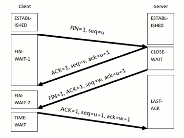

操作的发起方可以是客户端也可以是服务端。当向别人请求断开的时候，对方回复可以断开，此时表示可以断开输出，但是输入还是可以保留的。后面对方向你说断开的时候就可以将输入也断开了。四次挥手就是保证`TCP`是一个全双工模式。

`FIN`: 断开连接命令，其实目前来说图上只是画了一个，但是每次发送`FIN`命令的时候会等待，30s

间隔之后持续发送，知道收到回送数据

`ACK`: 回送命令

`seq`: 随机数


## 传输可靠性

* 排序、顺序发送、顺序组装：在发送一条数据的时候会将此数据拆分成不同的片段，然后进行排序，然后顺序发送，顺序组装，保证了传输的有序性。如果不拆分直接发送如果失败，那么再次发送就又要发送一个完整的包，这样比较浪费资源。同时多个数据片不一定是按顺序到达，所以需要顺序组装。
* 丢弃、超时：在传输过程中出现数据丢失和超时的情况，此时发送方是会收到超时、数据丢失的消息的，此时就会再次发送。
* 重发机制-定时器：服务端会定时反馈其收到的数据片，客户端也是一样，如果没有收到反馈，那么也会重发。

一些更细的API

```java
import java.io.IOException;
import java.io.InputStream;
import java.io.OutputStream;
import java.net.Inet4Address;
import java.net.InetSocketAddress;
import java.net.Socket;
import java.net.SocketException;
import java.nio.ByteBuffer;

public class Client {
    private static final int PORT = 20000;
    private static final int LOCAL_PORT = 20001;

    public static void main(String[] args) throws IOException {
        Socket socket = createSocket();

        initSocket(socket);

        // 链接到本地20000端口，超时时间3秒，超过则抛出超时异常
        socket.connect(new InetSocketAddress(Inet4Address.getLocalHost(), PORT), 3000);

        System.out.println("已发起服务器连接，并进入后续流程～");
        System.out.println("客户端信息：" + socket.getLocalAddress() + " P:" + socket.getLocalPort());
        System.out.println("服务器信息：" + socket.getInetAddress() + " P:" + socket.getPort());

        try {
            // 发送接收数据
            todo(socket);
        } catch (Exception e) {
            System.out.println("异常关闭");
        }

        // 释放资源
        socket.close();
        System.out.println("客户端已退出～");
    }

    private static Socket createSocket() throws IOException {
        /*
        // 无代理模式，等效于空构造函数
        Socket socket = new Socket(Proxy.NO_PROXY);

        // 新建一份具有HTTP代理的套接字，传输数据将通过www.baidu.com:8080端口转发
        Proxy proxy = new Proxy(Proxy.Type.HTTP,
                new InetSocketAddress(Inet4Address.getByName("www.baidu.com"), 8800));
        socket = new Socket(proxy);

        // 新建一个套接字，并且直接链接到本地20000的服务器上
        socket = new Socket("localhost", PORT);

        // 新建一个套接字，并且直接链接到本地20000的服务器上
        socket = new Socket(Inet4Address.getLocalHost(), PORT);

        // 新建一个套接字，并且直接链接到本地20000的服务器上，并且绑定到本地20001端口上
        socket = new Socket("localhost", PORT, Inet4Address.getLocalHost(), LOCAL_PORT);
        socket = new Socket(Inet4Address.getLocalHost(), PORT, Inet4Address.getLocalHost(), LOCAL_PORT);
        */

        Socket socket = new Socket();
        // 绑定到本地20001端口
        socket.bind(new InetSocketAddress(Inet4Address.getLocalHost(), LOCAL_PORT));

        return socket;
    }

    private static void initSocket(Socket socket) throws SocketException {
        // 设置读取超时时间为2秒
        socket.setSoTimeout(2000);

        // 是否复用未完全关闭的Socket地址，对于指定bind操作后的套接字有效
        socket.setReuseAddress(true);

        // 是否开启Nagle算法
        socket.setTcpNoDelay(true);

        // 是否需要在长时无数据响应时发送确认数据（类似心跳包），时间大约为2小时
        socket.setKeepAlive(true);

        // 对于close关闭操作行为进行怎样的处理；默认为false，0
        // false、0：默认情况，关闭时立即返回，底层系统接管输出流，将缓冲区内的数据发送完成
        // true、0：关闭时立即返回，缓冲区数据抛弃，直接发送RST结束命令到对方，并无需经过2MSL等待
        // true、200：关闭时最长阻塞200毫秒，随后按第二情况处理
        socket.setSoLinger(true, 20);

        // 是否让紧急数据内敛，默认false；紧急数据通过 socket.sendUrgentData(1);发送
        socket.setOOBInline(true);

        // 设置接收发送缓冲器大小
        socket.setRexceiveBufferSize(64 * 1024 * 1024);
        socket.setSendBufferSize(64 * 1024 * 1024);

        // 设置性能参数：短链接，延迟，带宽的相对重要性
        socket.setPerformancePreferences(1, 1, 0);
    }

    private static void todo(Socket client) throws IOException {
        // 得到Socket输出流
        OutputStream outputStream = client.getOutputStream();


        // 得到Socket输入流
        InputStream inputStream = client.getInputStream();
        byte[] buffer = new byte[256];
        ByteBuffer byteBuffer = ByteBuffer.wrap(buffer);

        // byte
        byteBuffer.put((byte) 126);

        // char
        char c = 'a';
        byteBuffer.putChar(c);

        // int
        int i = 2323123;
        byteBuffer.putInt(i);

        // bool
        boolean b = true;
        byteBuffer.put(b ? (byte) 1 : (byte) 0);

        // Long
        long l = 298789739;
        byteBuffer.putLong(l);

        // float
        float f = 12.345f;
        byteBuffer.putFloat(f);

        // double
        double d = 13.31241248782973;
        byteBuffer.putDouble(d);

        // String
        String str = "Hello你好！";
        byteBuffer.put(str.getBytes());

        // 发送到服务器
        outputStream.write(buffer, 0, byteBuffer.position() + 1);

        // 接收服务器返回
        int read = inputStream.read(buffer);
        System.out.println("收到数量：" + read);

        // 资源释放
        outputStream.close();
        inputStream.close();
    }
}
```

```java
import java.io.IOException;
import java.io.InputStream;
import java.io.OutputStream;
import java.net.Inet4Address;
import java.net.InetSocketAddress;
import java.net.ServerSocket;
import java.net.Socket;
import java.nio.ByteBuffer;

public class Server {
    private static final int PORT = 20000;

    public static void main(String[] args) throws IOException {
        ServerSocket server = createServerSocket();

        initServerSocket(server);

        // 绑定到本地端口上
        server.bind(new InetSocketAddress(Inet4Address.getLocalHost(), PORT), 50);

        System.out.println("服务器准备就绪～");
        System.out.println("服务器信息：" + server.getInetAddress() + " P:" + server.getLocalPort());

        // 等待客户端连接
        for (; ; ) {
            // 得到客户端
            Socket client = server.accept();
            // 客户端构建异步线程
            ClientHandler clientHandler = new ClientHandler(client);
            // 启动线程
            clientHandler.start();
        }
    }

    private static ServerSocket createServerSocket() throws IOException {
        // 创建基础的ServerSocket
        ServerSocket serverSocket = new ServerSocket();

        // 绑定到本地端口20000上，并且设置当前可允许等待链接的队列为50个
        //serverSocket = new ServerSocket(PORT);

        // 等效于上面的方案，队列设置为50个
        //serverSocket = new ServerSocket(PORT, 50);

        // 与上面等同
        // serverSocket = new ServerSocket(PORT, 50, Inet4Address.getLocalHost());

        return serverSocket;
    }

    private static void initServerSocket(ServerSocket serverSocket) throws IOException {
        // 是否复用未完全关闭的地址端口
        serverSocket.setReuseAddress(true);

        // 等效Socket#setReceiveBufferSize
        serverSocket.setReceiveBufferSize(64 * 1024 * 1024);

        // 设置serverSocket#accept超时时间
        // serverSocket.setSoTimeout(2000);

        // 设置性能参数：短链接，延迟，带宽的相对重要性
        serverSocket.setPerformancePreferences(1, 1, 1);
    }

    /**
     * 客户端消息处理
     */
    private static class ClientHandler extends Thread {
        private Socket socket;

        ClientHandler(Socket socket) {
            this.socket = socket;
        }

        @Override
        public void run() {
            super.run();
            System.out.println("新客户端连接：" + socket.getInetAddress() +
                    " P:" + socket.getPort());

            try {
                // 得到套接字流
                OutputStream outputStream = socket.getOutputStream();
                InputStream inputStream = socket.getInputStream();

                byte[] buffer = new byte[256];
                int readCount = inputStream.read(buffer);
                ByteBuffer byteBuffer = ByteBuffer.wrap(buffer, 0, readCount);

                // byte
                byte be = byteBuffer.get();

                // char
                char c = byteBuffer.getChar();

                // int
                int i = byteBuffer.getInt();

                // bool
                boolean b = byteBuffer.get() == 1;

                // Long
                long l = byteBuffer.getLong();

                // float
                float f = byteBuffer.getFloat();

                // double
                double d = byteBuffer.getDouble();

                // String
                int pos = byteBuffer.position();
                String str = new String(buffer, pos, readCount - pos - 1);

                System.out.println("收到数量：" + readCount + " 数据："
                        + be + "\n"
                        + c + "\n"
                        + i + "\n"
                        + b + "\n"
                        + l + "\n"
                        + f + "\n"
                        + d + "\n"
                        + str + "\n");

                outputStream.write(buffer, 0, readCount);
                outputStream.close();
                inputStream.close();

            } catch (Exception e) {
                System.out.println("连接异常断开");
            } finally {
                // 连接关闭
                try {
                    socket.close();
                } catch (IOException e) {
                    e.printStackTrace();
                }
            }
            System.out.println("客户端已退出：" + socket.getInetAddress() +
                    " P:" + socket.getPort());
        }
    }
}
```


# `UDP`辅助`TCP`实现点对点传输

这里主要是通过`UDP`报文来搜索，然后和搜索到的客户端建立`TCP`连接。这里又几个要点

* 构建基础口令消息，用于搜索
* 局域网广播口令消息（指定端口）
* 接收指定端口回送消息（得到客户端`IP、Port`）

## `UDP` 搜索取消实现

* 异步线程接收回送消息
* 异步线程等待完成（定时）
* 关闭等待-终止线程等待

这里先对之前讲的`UDP`建立广播连接优化一下，参考：`ch5udp`。然后在此基础先建立一个`TCP`点对点的连接，参考：`ch5tcp`。这里有一个问题就是每次客户端给服务端发送一个消息，服务端都会回送一个，但是真实场景下，客户端发送消息和服务端回送消息并不是同步的，而是异步的，也就是数据的发送和接收是并行的。下面进行改造，参考：`ch5`，而这里回送给客户端的数据也是在服务端通过输入进去的。


# 简易聊天室

总体说明，服务器会先启动，那么首先会启动TCP和UDP服务用户对客户端进行服务，这里UDP服务接收从30201端口过来的数据。然后客户端启动的时候会首先启动一个UDP服务向端口30201端口发送广播消息，并且将自己接收消息的端口设置为30202，当服务端UDP服务收到消息解析出来端口，向客户端发送其TCP服务端口，客户端收到消息后解析出端口，然后和服务端建立TCP连接。同时没个建立的TCP连接都会保存在本地，这样当服务器发送消息的时候就会向所有的客户端发送。


代码地址：`https://github.com/yjaal/ChatRoom`，后续以此为基础进行相关开发

这里主要是对前面的代码进行了分模块，同时进行了一些基本的改造。

## 服务器状态测试

* 每个客户端都需要服务器进行双通等待
* 双通：客户端发送数据到服务器的接收通道
* 双通：服务器回送消息的发送通道
* 每条通道因为堵塞只能使用异步线程实现


如果是一个客户端，那么双通的话就是需要对应2个线程，如果有n个客户端，那就对应2n个线程，而服务器自己还需要一些线程，那么一般来说服务器线程数量是大于2n的。这里如果要进行测试，那么需要对客户端进行改造。如果需要创建比如上千个线程，那么是很低效的。


## 服务器性能数据分析

CPU：取决于数据的频繁性、数据的转发复杂性

内存：取决于客户端的数量、客户端发送的数据大小

线程：取决于连接的客户端的数量


## 服务器优化方案的分析

* 减少线程数量，使用线程池

* 增加线程执行繁忙状态，如使用NIO
* 客户端Buffer服用机制


# 服务器传输优化-NIO

`Selector`注册事件：

`SelectionKey.OP_CONNECT`连接就绪

`SelectionKey.OP_ACCEPT`接收就绪

`SelectionKey.OP_READ`读就绪

`SelectionKey.OP_WRITE`写就绪


`FileChannel`不能用于`Selector`，因为`FileChannel`不能切换位非阻塞模式，套接字通道可以。也就是说不能说当前文件是可读可写的状态，而只有网络套接字可以这么说。

基本的使用参考`TCPServer`的`run()`。注意相关`buffer`的应用。到这里只是用`NIO`将之前的工程进行了重写，并没有线程上的优化。比如要建立和两个客户端的连接，首先需要一个线程来发现服务，然后和某个客户端建立连接后分别建立了一个读线程和一个写线程，这样算下来如果建立和两个客户端的连接就消耗了5个线程，建立更多的客户端就会消耗更多的线程，这样是比较浪费的，和之前未重写时差不多。


如果要优化，那么使用单线程也是不合适的，因为一般CPU都是多核的，而且单线程在各个任务之间会有影响，效率太低。

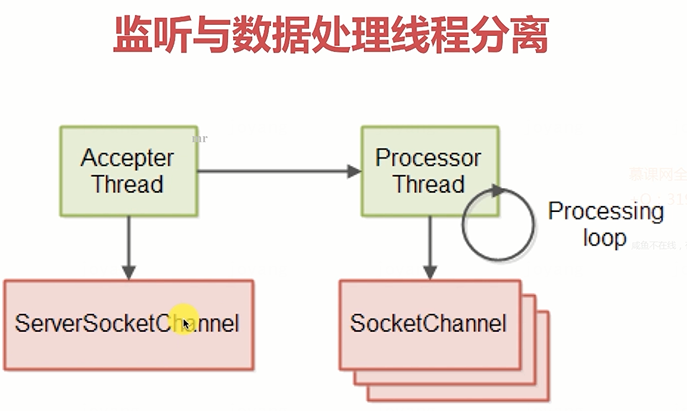

这里就是使用一个线程专门处理服务端与客户端的连接问题，然后具体的数据发送和接收使用一个线程池来做，线程池中线程的数量视具体情况而定。

相关模块基本功能提供代码放在`lib-clink`中，其中`Connector`用于标识服务器和客户端的某个连接；`IoArgs`用户对`buffer`进行一个封装，提供基本的读写功能；而`IoSelectorProvider`提供基本的通道选择器的注册、关闭等操作；而`SocketChannelAdapter`提供通道功能整合，比如监听、关闭通道，数据IO读写、数据收发的功能。

这里对连接的接收还是使用单独的线程完成，比如`TCPServer`在接收到线程连接后，会在处理的时候将相关任务交给`ClientHandler`去异步处理，而`ClientHandler`中就维护了一个上面所说的`Connector`。这里首先将数据接收进行了改造，这里进行测试一下，并和之前的数据发送比较线程数量。

首先启动服务器，然后跑`ClientTest`进行压测，这里可以启动10个线程试试。然后发送数据，发现`input`线程池中只有四个线程。而总线程多了10个，这是转发部分的线程，这里还未进行改造，目前只是改造了接收部分的功能，可以看到相关线程的减少。

启动服务端

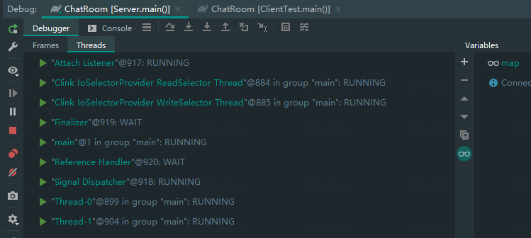

启动客户端测试类，发送消息

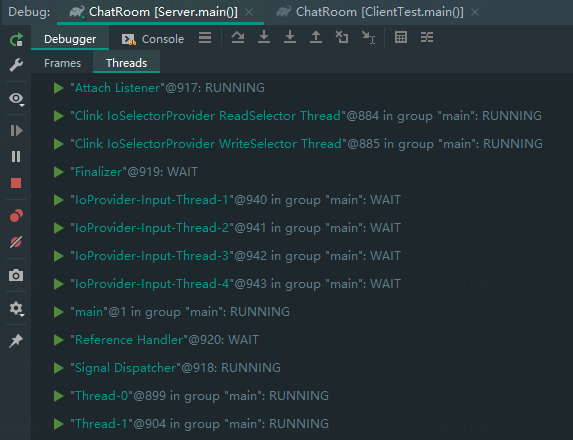

客户端测试类发送消息就退出了，这里我们再次启动，然后服务器发送消息

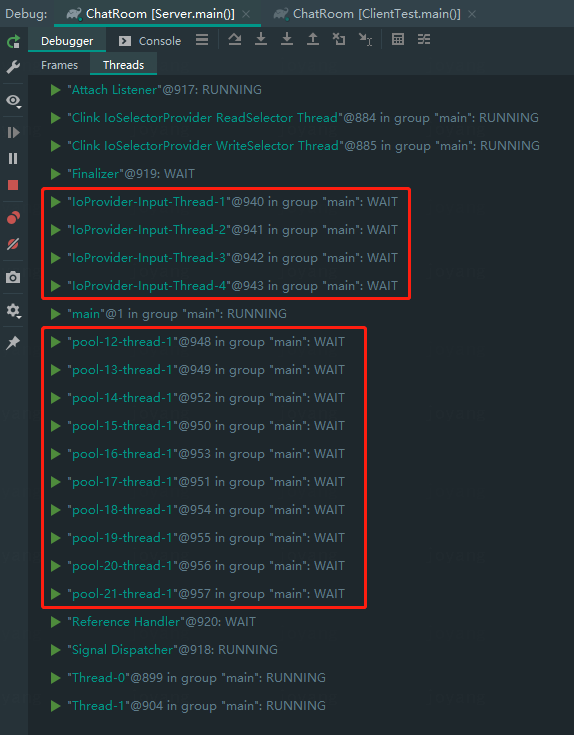

这里可以明显看到改造后和改造前的差别。


# 服务器传输稳定性优化

## 消息不完整与消息粘包

之前发送和接收消息都是通过对字符串进行解析完成的，而传输结束也是通过解析结束符来判断的，这样会导致解析成本比较高。

**消息粘包**

* TCP本质山并不会发生数据层面的粘包

  TCP本质上是一个包一个包的发送，并不会发生粘包。这里的粘包主要是针对上层应用的

* TCP的发送方与接收方一定会确保数据是以一种有序的方式到达客户端，并且会确保数据包的完整性

* UDP不保证消息完整性，所以往往会发生丢包等情况；TCP具有顺序性和完整性

* 常规所说的Socket粘包，并非数据传输层粘包，而是指数据处理的逻辑层面上发生的粘包

* Mina、Netty等框架从根本上来说也是未了解决粘包而设计的高并发库

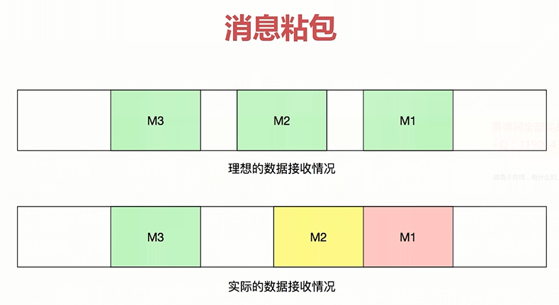

理论上我们发送三条消息，然后依次接收到三条消息，但是实际情况确实前面两条消息有可能同时到达。


**消息不完整**

* 从数据的传输层来讲TCP也不会发生数据丢失不全等情况
* 一旦出现一定是TCP停止运行终止之时
* “数据不完整”依然针对的是数据的逻辑接收层面
* 在物理传输层面来将数据一定是能安全的完整的送达另一端，但另一端可能缓冲区不够或者数据处理上不够完整导致数据只能读取一部分数据，这种情况称为“数据不完整”、“数据丢包”等。

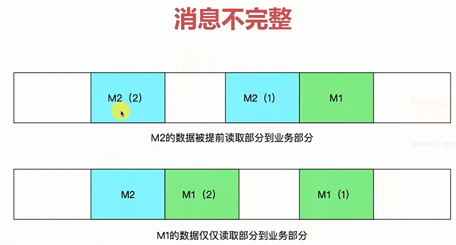

这里有两条消息M1、M2，但是M2比较大，被分层了两部分，在读取的时候可能M1和M2的一部分被读取下来，或者如下面的情况，这种就是消息不完整。


## 复现数据传输异常现象

**消息到达提醒重复出发（读消息时未设置取消监听）**

这里在测试的时候将

```java
// IoSelectorProvider.handleSelection
key.interestOps(key.readyOps() & ~opRead);
```

注意，也就是在处理消息的时候不将监听标志修改，此时将继续监听，同时在实际读取数据的时候添加延迟

```java
// SocketChannelAdapter.inputCallback
private boolean runed;

private final HandleInputCallback inputCallback = new HandleInputCallback() {
    @Override
    protected void canProviderInput() {
        if (isClosed.get()) {
            return;
        }

        if (runed) {
            return;
        }
        runed = true;
        try {
            // 这里延迟5s进行实际读取
            Thread.sleep(5000);
        } catch (InterruptedException e) {
            e.printStackTrace();
        }
```

由于没有改变读写标志，这里我们在下面类方法中加了一个打印标志

```java
// IoSelectorProvider.startRead
for (SelectionKey selectionKey : selectionKeys) {
    if (selectionKey.isValid()) {
        handleSelection(selectionKey, SelectionKey.OP_READ, inputCallbackMap, inputHandlePool);
    }
}
System.out.println("有数据需要读取：" + selectionKeys.size());
selectionKeys.clear();
```


此时启动服务端和客户端，然后从客户端发送一条数据，在延迟期间`selector`一直处于可读状态（由于没有修改`key`标识），于是会一直读取，直到延迟时间过了实际处理了数据才会停下来。

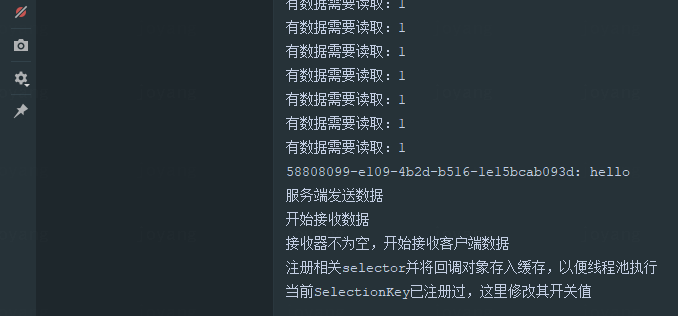


**多消息粘包**

这里只要客户端读取输入向服务端发消息的时候多次重复发送

```java
// Client.write
private static void write(TCPClient tcpClient) throws IOException {
    // 构建键盘输入流
    InputStream in = System.in;
    BufferedReader input = new BufferedReader(new InputStreamReader(in));
    do {
        // 键盘读取一行
        String str = input.readLine();
        // 发送到服务器
        tcpClient.send(str);
        tcpClient.send(str);
        tcpClient.send(str);
        tcpClient.send(str);

        if ("00bye00".equalsIgnoreCase(str)) {
            break;
        }
    } while (true);
}
```

同时在服务端

```java
// TCPServer.onNewMsgArrived
public void onNewMsgArrived(final ClientHandler handler, final String msg) {
    // 这里在试验的时候要注意，win中的换行符是\r\n，而mac中的换行符是\r
    System.out.println(msg.replace("\r\n", "-----"));
```

这里将之前的换行符（消息分隔符）替换，然后打印出来就可以得到效果


**单消息不完整**

这里直接将每次接收数据的缓存大小改小，然后发送一个较大的数据即可

```java
public class IoArgs {
    private byte[] byteBuffer = new byte[4];
```

我们会发现会分几次接收客户端的数据，然后打印，同时可能会丢失一些数据（因为理论上我们将最后一个字符当作换行符丢弃了）。


## 如何有序的混传数据

**数据传输加上开始结束标记**

比如之前我们以换行符作为两条消息之间的间隔


**数据传输使用固定头部的方案**

比如在每条数据前面加上特殊的标识符，以确保进行分割

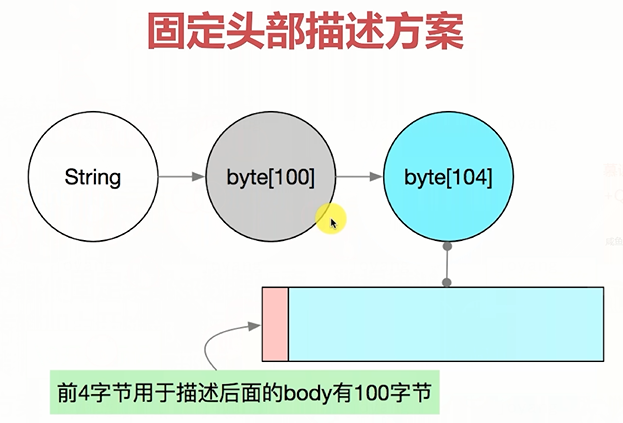

服务端会先读取前面四个字节，刚好是一个`int`长度，而这个值可以存后面实际数据的长度。


**混合方案：固定头部、数据加密、数据描述**

这里不论是什么方案都会消耗资源，因为不清楚为什么每条消息都需要进行字节校验，同时并不知道在什么时候校验，这里涉及到字节的搜索。一般提倡第二种方案。


## 借鉴学习HTTP

**HTTP如何识别一个请求**

在1.X版本中每发一条消息都会建立一次socket连接，而在2.0后不需要每次都建立连接

**HTTP如何读取请求头，请求头协议是怎样的**


**HTTP如何接受数据包体**


**当数据为文件时，HTTP如何判断文件已接收到底了**


**HTTP 1.X**

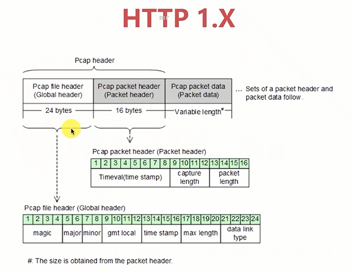

这里前面两段其实就是一个对消息包的描述


**HTTP 2.X**


这里涉及到一个分帧的概念，比如上面将头分为了一帧，而数据部分可能会分为很多帧

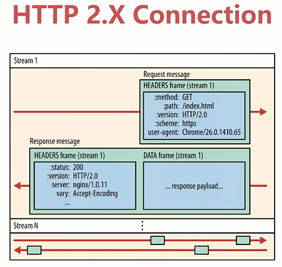

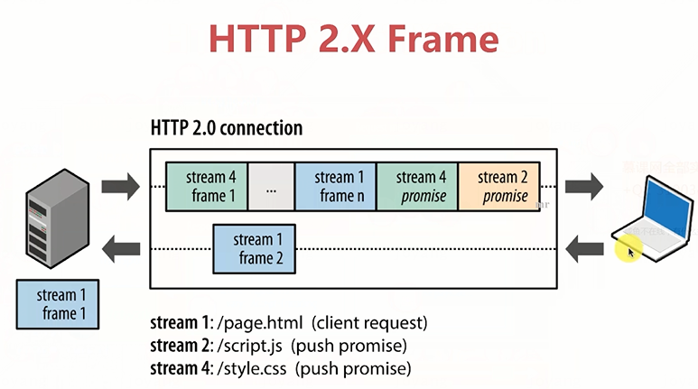

这里可以看到建立一个连接，就能发送多条数据。


这里就可以借鉴，可以标识长度、加密、加密类型。


## 构建有序消息体

之前我们使用`IoArgs`类作为缓存接收数据，这里我们定义一个上面协议中的包的概念。相关包的封装解析等操作全部由`IoArgs`来完成，而服务端和客户端都继承`Connector`类，通过这个类来进行消息的接收和发送。


# 局域网文件快传技术


# 聊天室升级版实践


# 语音数据即时通信


