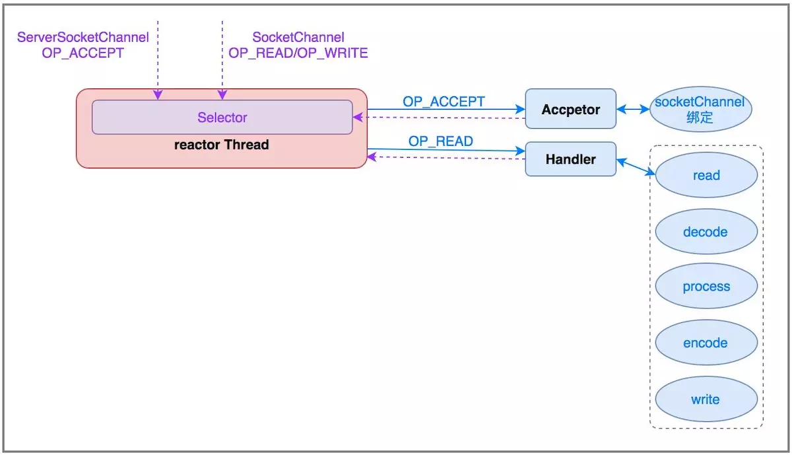
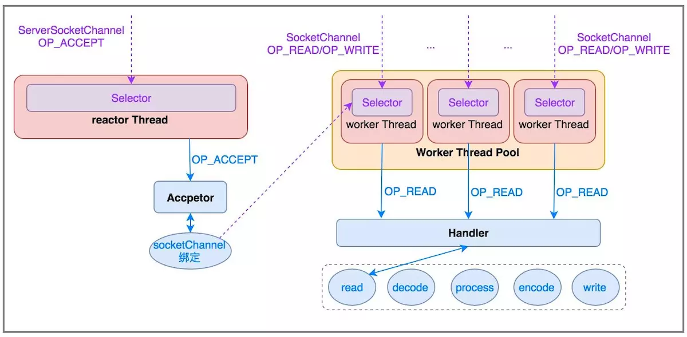
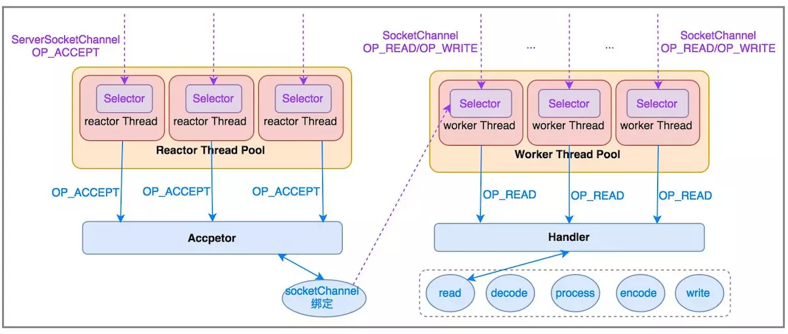
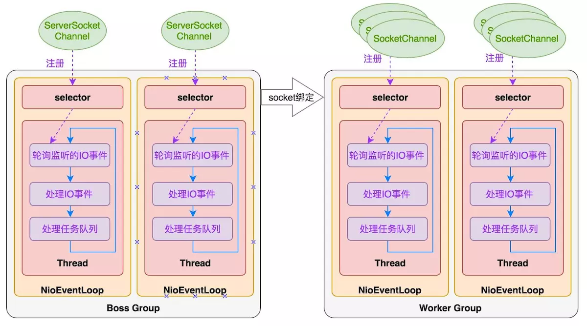
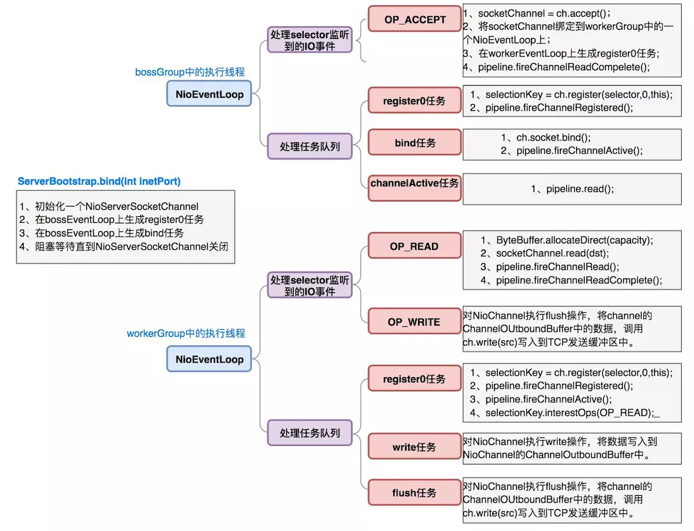
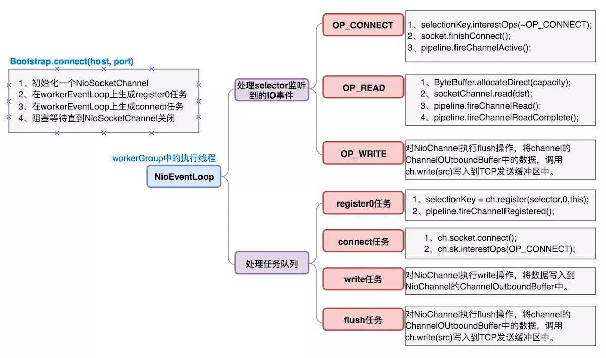

摘自：`https://www.jianshu.com/p/38b56531565d`

# 一、NIO Reactor模型

#### **1、Reactor模式思想：分而治之+事件驱动** 

1）分而治之

*一个连接里完整的网络处理过程一般分为accept、read、decode、process、encode、send这几步。*

*Reactor模式将每个步骤映射为一个Task，服务端线程执行的最小逻辑单元不再是一次完整的网络请求，而是Task，且采*用非阻塞方式执行。

2）事件驱动

每个Task对应特定网络事件。当Task准备就绪时，Reactor收到对应的网络事件通知，并将Task分发给绑定了对应网络事件的Handler执行。

3）几个角色

Reactor：负责响应事件，将事件分发给绑定了该事件的Handler处理；

Handler：事件处理器，绑定了某类事件，负责执行对应事件的Task对事件进行处理；

Acceptor：Handler的一种，绑定了connect事件。当客户端发起connect请求时，Reactor会将accept事件分发给Acceptor处理。

#### 2、单线程Reactor

**1）优点：**

不需要做并发控制，代码实现简单清晰。

**2）缺点：**

a)不能利用多核CPU；

b)一个线程需要执行处理所有的accept、read、decode、process、encode、send事件，处理成百上千的链路时性能上无法支撑；

c)一旦reactor线程意外跑飞或者进入死循环，会导致整个系统通信模块不可用。

#### 3、多线程Reactor

**特点：**

a)有专门一个reactor线程用于监听服务端ServerSocketChannel，接收客户端的TCP连接请求；

b)网络IO的读/写操作等由一个worker reactor线程池负责，由线程池中的NIO线程负责监听SocketChannel事件，进行消息的读取、解码、编码和发送。

c)一个NIO线程可以同时处理N条链路，但是一个链路只注册在一个NIO线程上处理，防止发生并发操作问题。

#### 4、主从多线程

在绝大多数场景下，Reactor多线程模型都可以满足性能需求；但是在极个别特殊场景中，一个NIO线程负责监听和处理所有的客户端连接可能会存在性能问题。

**特点：**

a)服务端用于接收客户端连接的不再是个1个单独的reactor线程，而是一个boss reactor线程池；

b)服务端启用多个ServerSocketChannel监听不同端口时，每个ServerSocketChannel的监听工作可以由线程池中的一个NIO线程完成。

------

# 二、Netty线程模型

netty线程模型采用“服务端监听线程”和“IO线程”分离的方式，与多线程Reactor模型类似。

抽象出NioEventLoop来表示一个不断循环执行处理任务的线程，每个NioEventLoop有一个selector，用于监听绑定在其上的socket链路。

#### 1、串行化设计避免线程竞争

netty采用串行化设计理念，从消息的读取->解码->处理->编码->发送，始终由IO线程NioEventLoop负责。整个流程不会进行线程上下文切换，数据无并发修改风险。

一个NioEventLoop聚合一个多路复用器selector，因此可以处理多个客户端连接。

netty只负责提供和管理“IO线程”，其他的业务线程模型由用户自己集成。

时间可控的简单业务建议直接在“IO线程”上处理，复杂和时间不可控的业务建议投递到后端业务线程池中处理。

#### 2、定时任务与时间轮

NioEventLoop中的Thread线程按照时间轮中的步骤不断循环执行：

a)在时间片Tirck内执行selector.select()轮询监听IO事件；

b)处理监听到的就绪IO事件；

c)执行任务队列taskQueue/delayTaskQueue中的非IO任务。

------

# 三、NioEventLoop与NioChannel类关系

一个NioEventLoopGroup下包含多个NioEventLoop

每个NioEventLoop中包含有一个Selector，一个taskQueue，一个delayedTaskQueue

每个NioEventLoop的Selector上可以注册监听多个AbstractNioChannel.ch

每个AbstractNioChannel只会绑定在唯一的NioEventLoop上

每个AbstractNioChannel都绑定有一个自己的DefaultChannelPipeline

------

# 四、NioEventLoop线程执行过程

#### 1、轮询监听的IO事件

**1）netty的轮询注册机制**

netty将AbstractNioChannel内部的jdk类SelectableChannel对象注册到NioEventLoopGroup中的jdk类Selector对象上去，并且将AbstractNioChannel作为SelectableChannel对象的一个attachment附属上。

这样在Selector轮询到某个SelectableChannel有IO事件发生时，就可以直接取出IO事件对应的AbstractNioChannel进行后续操作。

**2）循环执行阻塞selector.select(timeoutMIllis)操作直到以下条件产生**

a)轮询到了IO事件（selectedKey != 0）

b)oldWakenUp参数为true

c)任务队列里面有待处理任务（hasTasks()）

d)第一个定时任务即将要被执行（hasScheduledTasks()）

e)用户主动唤醒（wakenUp.get()==true）

**3）解决JDK的NIO epoll bug**

该bug会导致Selector一直空轮询，最终导致cpu 100%。

在每次selector.select(timeoutMillis)后，如果没有监听到就绪IO事件，会记录此次select的耗时。如果耗时不足timeoutMillis，说明select操作没有阻塞那么长时间，可能触发了空轮询，进行一次计数。

计数累积超过阈值（默认512）后，开始进行Selector重建：

a)拿到有效的selectionKey集合

b)取消该selectionKey在旧的selector上的事件注册

c)将该selectionKey对应的Channel注册到新的selector上，生成新的selectionKey

d)重新绑定Channel和新的selectionKey的关系

**4）netty优化了sun.nio.ch.SelectorImpl类中的selectedKeys和publicSelectedKeys这两个field的实现**

netty通过反射将这两个filed替换掉，替换后的field采用数组实现。

这样每次在轮询到nio事件的时候，netty只需要O(1)的时间复杂度就能将SelectionKey塞到set中去，而jdk原有field底层使用的hashSet需要O(lgn)的时间复杂度。

#### 2、处理IO事件

**1）对于boss NioEventLoop来说，轮询到的是基本上是连接事件（OP_ACCEPT）：**

a)socketChannel = ch.accept()；

b)将socketChannel绑定到worker NioEventLoop上；

c)socketChannel在worker NioEventLoop上创建register0任务；

d)pipeline.fireChannelReadComplete();

**2）对于worker NioEventLoop来说，轮询到的基本上是IO读写事件（以OP_READ为例）：**

a)ByteBuffer.allocateDirect(capacity)；

b)socketChannel.read(dst);

c)pipeline.fireChannelRead();

d)pipeline.fireChannelReadComplete();

#### 3、处理任务队列

**1）处理用户产生的普通任务**

NioEventLoop中的Queue<Runnable> taskQueue被用来承载用户产生的普通Task。

taskQueue被实现为netty的mpscQueue，即多生产者单消费者队列。netty使用该队列将外部用户线程产生的Task聚集，并在reactor线程内部用单线程的方式串行执行队列中的Task。

当用户在非IO线程调用Channel的各种方法执行Channel相关的操作时，比如channel.write()、channel.flush()等，netty会将相关操作封装成一个Task并放入taskQueue中，保证相关操作在IO线程中串行执行。

**2）处理用户产生的定时任务**

NioEventLoop中的Queue<ScheduledFutureTask<?>> delayedTaskQueue = new PriorityQueue被用来承载用户产生的定时Task。

当用户在非IO线程需要产生定时操作时，netty将用户的定时操作封装成ScheduledFutureTask，即一个netty内部的定时Task，并将定时Task放入delayedTaskQueue中等待对应Channel的IO线程串行执行。

为了解决多线程并发写入delayedTaskQueue的问题，netty将添加ScheduledFutureTask到delayedTaskQueue中的操作封装成普通Task，放入taskQueue中，通过NioEventLoop的IO线程对delayedTaskQueue进行单线程写操作。

**3）处理任务队列的逻辑**

a)将已到期的定时Task从delayedTaskQueue中转移到taskQueue中

b)计算本次循环执行的截止时间

c)循环执行taskQueue中的任务，每隔64个任务检查一下是否已过截止时间，直到taskQueue中任务全部执行完或者超过执行截止时间。

------

# 五、Netty中Reactor线程和worker线程所处理的事件

#### 1、Server端NioEventLoop处理的事件

#### 2、Client端NioEventLoop处理的事件

