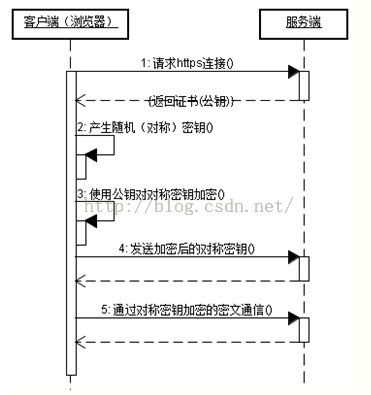

# 网络

### 1、`TCP`建立连接和断开连接的过程

参考：`https://andrewpqc.github.nio/2018/07/17/tcp-connection-manage/`

`TCP`是一个面向连接的服务,面向连接的服务是电话系统服务模式的抽象,每一次完整的数据传输都必须经过建立连接,数据传输和终止连接三个过程,TCP建立连接的过程称为三次握手,下面说一下三次握手的具体过程:

**TCP三次握手过程**

* 1、主机`A`通过向主机`B`发送一个含有同步序列号的标志位的数据段给主机`B` ,向主机`B`请求建立连接,通过这个数据段,主机`A`告诉主机`B`两件事:**我想要和你通信;你可以用哪个序列号作为起始数据段来回应我**。
* 2、主机`B `收到主机`A`的请求后,用一个带有确认应答(`ACK`)和同步序列号(`SYN`)标志位的数据段响应主机`A`,也告诉主机`A`两件事:**我已经收到你的请求了,你可以传输数据了;你要用哪个序列号作为起始数据段来回应我**。
* 3、主机`A`收到这个数据段后,再发送一个确认应答,确认已收到主机`B `的数据段:**我已收到回复,我现在要开始传输实际数据了**。这样TCP三次握手就完成了,主机`A`和主机`B `就可以传输数据了。三次握手的特点：没有应用层的数据,`SYN`这个标志位只有在`TCP`建产连接时才会被置`1`,握手完成后`SYN`标志位被置`0`。

`TCP`建立连接要进行三次握手,而断开连接要进行四次,这是由于`TCP`的**半关闭造成**的,因为`TCP`连接是**全双工**的(即数据可在两个方向上同时传递),所以进行关闭时每个方向上都要单独进行关闭,这个**单方向的关闭就叫半关闭**.关闭的方法是一方完成它的数据传输后,就发送一个`FIN`来向另一方通告将要终止这个方向的连接.当一端收到一个`FIN`,它必须通知应用层`TCP`连接已终止了这个方向的数据传送,发送`FIN`通常是应用层进行关闭的结果。

**四次断开过程**

* 1、当主机`A`完成数据传输后,将控制位`FIN`置`1`,提出停止`TCP`连接的请求
* 2、主机`B`收到`FIN`后对其作出响应,确认这一方向上的`TCP`连接将关闭,将`ACK`置`1`
* 3、由`B` 端再提出反方向的关闭请求,将`FIN`置`1`
* 4、主机`A`对主机`B`的请求进行确认,将`ACK`置`1`,双方向的关闭结束。

### 2、`HTTP`协议的交互流程以及`HTTP`和`HTTPS`的差异

**`HTTPS`协议**
`HTTPS`协议就是基于`SSL`的`HTTP`协议
`HTTPS`使用与`HTTP`不同的端口（`HTTP:80 ， HTTPS:443`）
提供了身份验证与加密通信方法，被广泛用于互联网上安全敏感的通信。

**交互过程：客户端在使用`HTTPS`方式与`Web`服务器通信时有以下几个步骤 **

* 客户端请求`SSL`连接，并将自己支持的加密规则发给网站。
* 服务器端将自己的身份信息以证书形式发回给客户端。证书里面包含了网站地址，加密公钥，以及证书的颁发机构。
* 获得证书后，客户要做以下工作： 
    * 验证证书合法性 
    * 如果证书受信任，客户端会生成一串随机数的密码，并用证书提供的公钥进行加密。
    * 将加密好的随机数发给服务器。
* 获得到客户端发的加密了的随机数之后，服务器用自己的私钥进行解密，得到这个随机数，把这个随机数作为对称加密的密钥
* 之后服务器与客户之间就可以用随机数对各自的信息进行加密，解密。

注意的是：证书是一个公钥，这个公钥是进行加密用的。而私钥是进行解密用的。公钥任何都知道，私钥只有自己知道。这是非对称加密。而对称加密就是钥匙只有一把，我们都知道。之所以用到对称加密，是因为对称加密的速度更快。而非对称加密的可靠性更高。

**`HTTP`与`HTTPS`的区别**
* 1.`HTTPS`协议需要申请证书。 
* 2.`HTTP`是明文传输；`HTTPS`使用的是具有安全性的`SSL`加密传输协议 
* 3.`HTTP`端口是`80`；`HTTPS`端口号是`443 `
* 4.`HTTP`连接简单无状态；`HTTPS`由`SSL+HTTP`协议构件的可进行加密传输、身份验证的网络协议。

### 3、`HTTP`相关请求响应格式

参考：`http://blog.jobbole.com/106632/`

`HTTP`请求格式主要有四部分组成，分别是：请求行、请求头、空行、消息体，每部分内容占一行

* 请求行：请求行是请求消息的第一行，由三部分组成：分别是请求方法（`GET/POST/DELETE/PUT/HEAD`）、请求资源的`URI`路径、`HTTP`的版本号
* 请求头：请求头中的信息有和缓存相关的头（`Cache-Control，If-Modified-Since`）、客户端身份信息（`User-Agent`）等等
* 消息体：请求体是客户端发给服务端的请求数据，这部分数据并不是每个请求必须的。

`HTTP`响应消息的格式包括：状态行、响应头、空行、消息体。每部分内容占一行

* 状态行：状态行位于相应消息的第一行，有`HTTP`协议版本号，状态码和状态说明三部分构成。
* 响应头：响应头是服务器传递给客户端用于说明服务器的一些信息，以及将来继续访问该资源时的策略
* 响应体：响应体是服务端返回给客户端的`HTML`文本内容，或者其他格式的数据，比如：视频流、图片或者音频数据。

### 4、`SSL`的交互流程

参考：`https://kefeng.wang/2018/03/12/https-protocol/`

`SSL`协议（安全套接字协议）是`Web`浏览器与`Web`服务器之间安全交换信息的协议

`SSL`协议的三个特性

* 保密：在握手协议中定义了会话的密钥后，所有的消息都被加密
* 鉴别：可选的客户端验证，和强制的服务器端验证
* 完整性：传送的消息包括消息完整性检查

`SSL`的位置 

### 5、Socket交互的基本流程

参考：`https://uule.iteye.com/blog/2429228`

**服务器端：**

* 第一步：用指定的端口号和服务器的`ip`建立一个`EndPoint`对象；
* 第二步：建立一个`Socket`对象；
* 第三步：用`socket`对象的`Bind()`方法绑定`EndPoint`；
* 第四步：用`socket`对象的`Listen()`方法开始监听；
* 第五步：接受到客户端的连接，用`socket`对象的`Accept()`方法创建新的`socket`对象用于和请求的客户端进行通信;
* 第六步：通信结束后一定记得关闭`socket`;

**客户端：**

* 第一步：用指定的端口号和服务器的`ip`建立一个`EndPoint`对象
* 第二步：建立一个`Socket`对象；
* 第三步：用`socket`对象的`Connect()`方法以上面建立的`EndPoint`对象做为参数，向服务器发出连接请求；
* 第四步：如果连接成功，就用`socket`对象的`Send()`方法向服务器发送信息；
* 第五步：用`socket`对象的`Receive()`方法接受服务器发来的信息 ;
* 第六步：通信结束后一定记得关闭`socket`；

