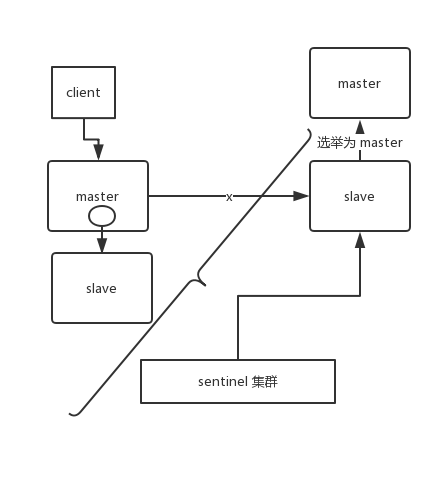

# Redis 哨兵集群实现高可用

## 哨兵的介绍
sentinel，中文名是哨兵。哨兵是 redis 集群机构中非常重要的一个组件，主要有以下功能：

- 集群监控：负责监控 redis master 和 slave 进程是否正常工作。
- 消息通知：如果某个 redis 实例有故障，那么哨兵负责发送消息作为报警通知给管理员。
- 故障转移：如果 master node 挂掉了，会自动转移到 slave node 上。
- 配置中心：如果故障转移发生了，通知 client 客户端新的 master 地址。

哨兵用于实现 redis 集群的高可用，本身也是分布式的，作为一个哨兵集群去运行，互相协同工作。

- 故障转移时，判断一个 master node 是否宕机了，需要大部分的哨兵都同意才行，涉及到了分布式选举的问题。
- 即使部分哨兵节点挂掉了，哨兵集群还是能正常工作的，因为如果一个作为高可用机制重要组成部分的故障转移系统本身是单点的，那就很坑爹了。

## 哨兵的核心知识
- 哨兵至少需要 3 个实例，来保证自己的健壮性。
- 哨兵 + redis 主从的部署架构，是**不保证数据零丢失**的，只能保证 redis 集群的高可用性。
- 对于哨兵 + redis 主从这种复杂的部署架构，尽量在测试环境和生产环境，都进行充足的测试和演练。

哨兵集群必须部署 2 个以上节点，如果哨兵集群仅仅部署了 2 个哨兵实例，quorum = 1。

```
+----+         +----+
| M1 |---------| R1 |
| S1 |         | S2 |
+----+         +----+
```

配置 `quorum=1`，如果 master 宕机， s1 和 s2 中只要有 1 个哨兵认为 master 宕机了，就可以进行切换，同时 s1 和 s2 会选举出一个哨兵来执行故障转移。但是同时这个时候，需要 majority，也就是大多数哨兵都是运行的。

```
2 个哨兵，majority=2
3 个哨兵，majority=2
4 个哨兵，majority=2
5 个哨兵，majority=3
...
```

如果此时仅仅是 M1 进程宕机了，哨兵 s1 正常运行，那么故障转移是 OK 的。但是如果是整个 M1 和 S1 运行的机器宕机了，那么哨兵只有 1 个，此时就没有 majority 来允许执行故障转移，虽然另外一台机器上还有一个 R1，但是故障转移不会执行。

经典的 3 节点哨兵集群是这样的：

```
       +----+
       | M1 |
       | S1 |
       +----+
          |
+----+    |    +----+
| R2 |----+----| R3 |
| S2 |         | S3 |
+----+         +----+
```

配置 `quorum=2`，如果 M1 所在机器宕机了，那么三个哨兵还剩下 2 个，S2 和 S3 可以一致认为 master 宕机了，然后选举出一个来执行故障转移，同时 3 个哨兵的 majority 是 2，所以还剩下的 2 个哨兵运行着，就可以允许执行故障转移。

## redis 哨兵主备切换的数据丢失问题
### 两种情况和导致数据丢失
主备切换的过程，可能会导致数据丢失：

- 异步复制导致的数据丢失

因为 master->slave 的复制是异步的，所以可能有部分数据还没复制到 slave，master 就宕机了，此时这部分数据就丢失了。


- 脑裂导致的数据丢失

脑裂，也就是说，某个 master 所在机器突然**脱离了正常的网络**，跟其他 slave 机器不能连接，但是实际上 master 还运行着。此时哨兵可能就会**认为** master 宕机了，然后开启选举，将其他 slave 切换成了 master。这个时候，集群里就会有两个 master ，也就是所谓的**脑裂**。

此时虽然某个 slave 被切换成了 master，但是可能 client 还没来得及切换到新的 master，还继续向旧 master 写数据。因此旧 master 再次恢复的时候，会被作为一个 slave 挂到新的 master 上去，自己的数据会清空，重新从新的 master 复制数据。而新的 master 并没有后来 client 写入的数据，因此，这部分数据也就丢失了。



### 数据丢失问题的解决方案
进行如下配置：

```bash
min-slaves-to-write 1
min-slaves-max-lag 10
```

表示，要求至少有 1 个 slave，数据复制和同步的延迟不能超过 10 秒。

如果说一旦所有的 slave，数据复制和同步的延迟都超过了 10 秒钟，那么这个时候，master 就不会再接收任何请求了。

- 减少异步复制数据的丢失

有了 `min-slaves-max-lag` 这个配置，就可以确保说，一旦 slave 复制数据和 ack 延时太长，就认为可能 master 宕机后损失的数据太多了，那么就拒绝写请求，这样可以把 master 宕机时由于部分数据未同步到 slave 导致的数据丢失降低的可控范围内。

- 减少脑裂的数据丢失

如果一个 master 出现了脑裂，跟其他 slave 丢了连接，那么上面两个配置可以确保说，如果不能继续给指定数量的 slave 发送数据，而且 slave 超过 10 秒没有给自己 ack 消息，那么就直接拒绝客户端的写请求。因此在脑裂场景下，最多就丢失 10 秒的数据。

## sdown 和 odown 转换机制
- sdown 是主观宕机，就一个哨兵如果自己觉得一个 master 宕机了，那么就是主观宕机
- odown 是客观宕机，如果 quorum 数量的哨兵都觉得一个 master 宕机了，那么就是客观宕机

sdown 达成的条件很简单，如果一个哨兵 ping 一个 master，超过了 `is-master-down-after-milliseconds` 指定的毫秒数之后，就主观认为 master 宕机了；如果一个哨兵在指定时间内，收到了 quorum 数量的其它哨兵也认为那个 master 是 sdown 的，那么就认为是 odown 了。

## 哨兵集群的自动发现机制
哨兵互相之间的发现，是通过 redis 的 `pub/sub` 系统实现的，每个哨兵都会往 `__sentinel__:hello` 这个 channel 里发送一个消息，这时候所有其他哨兵都可以消费到这个消息，并感知到其他的哨兵的存在。

每隔两秒钟，每个哨兵都会往自己监控的某个 master+slaves 对应的 `__sentinel__:hello` channel 里**发送一个消息**，内容是自己的 host、ip 和 runid 还有对这个 master 的监控配置。

每个哨兵也会去**监听**自己监控的每个 master+slaves 对应的 `__sentinel__:hello` channel，然后去感知到同样在监听这个 master+slaves 的其他哨兵的存在。

每个哨兵还会跟其他哨兵交换对 `master` 的监控配置，互相进行监控配置的同步。

## slave 配置的自动纠正
哨兵会负责自动纠正 slave 的一些配置，比如 slave 如果要成为潜在的 master 候选人，哨兵会确保 slave 复制现有 master 的数据；如果 slave 连接到了一个错误的 master 上，比如故障转移之后，那么哨兵会确保它们连接到正确的 master 上。

## slave->master 选举算法
如果一个 master 被认为 odown 了，而且 majority 数量的哨兵都允许主备切换，那么某个哨兵就会执行主备切换操作，此时首先要选举一个 slave 来，会考虑 slave 的一些信息：

- 跟 master 断开连接的时长
- slave 优先级
- 复制 offset
- run id

如果一个 slave 跟 master 断开连接的时间已经超过了 `down-after-milliseconds` 的 10 倍，外加 master 宕机的时长，那么 slave 就被认为不适合选举为 master。

```
(down-after-milliseconds * 10) + milliseconds_since_master_is_in_SDOWN_state
```

接下来会对 slave 进行排序：

- 按照 slave 优先级进行排序，slave priority 越低，优先级就越高。
- 如果 slave priority 相同，那么看 replica offset，哪个 slave 复制了越多的数据，offset 越靠后，优先级就越高。
- 如果上面两个条件都相同，那么选择一个 run id 比较小的那个 slave。

## quorum 和 majority
每次一个哨兵要做主备切换，首先需要 quorum 数量的哨兵认为 odown，然后选举出一个哨兵来做切换，这个哨兵还需要得到 majority 哨兵的授权，才能正式执行切换。

如果 quorum < majority，比如 5 个哨兵，majority 就是 3，quorum 设置为 2，那么就 3 个哨兵授权就可以执行切换。

但是如果 quorum >= majority，那么必须 quorum 数量的哨兵都授权，比如 5 个哨兵，quorum 是 5，那么必须 5 个哨兵都同意授权，才能执行切换。

## configuration epoch
哨兵会对一套 redis master+slaves 进行监控，有相应的监控的配置。

执行切换的那个哨兵，会从要切换到的新 master（salve->master）那里得到一个 configuration epoch，这就是一个 version 号，每次切换的 version 号都必须是唯一的。

如果第一个选举出的哨兵切换失败了，那么其他哨兵，会等待 failover-timeout 时间，然后接替继续执行切换，此时会重新获取一个新的 configuration epoch，作为新的 version 号。

## configuration 传播
哨兵完成切换之后，会在自己本地更新生成最新的 master 配置，然后同步给其他的哨兵，就是通过之前说的 `pub/sub` 消息机制。

这里之前的 version 号就很重要了，因为各种消息都是通过一个 channel 去发布和监听的，所以一个哨兵完成一次新的切换之后，新的 master 配置是跟着新的 version 号的。其他的哨兵都是根据版本号的大小来更新自己的 master 配置的。