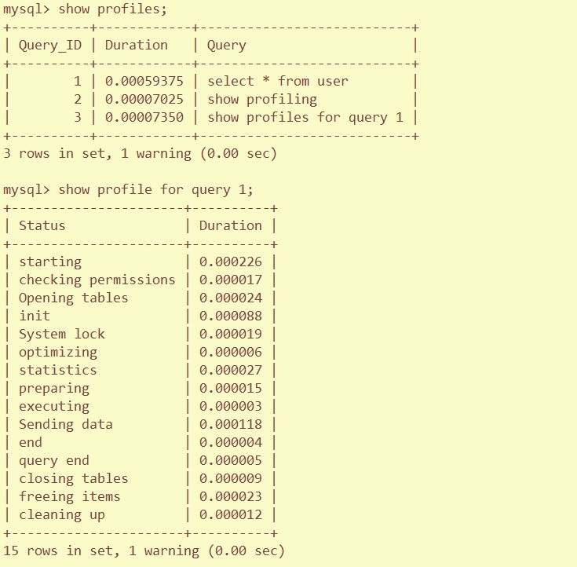

摘自：`https://kaimingwan.com/post/shu-ju-ku/mysqlxing-neng-fen-xi-fang-fa-gong-ju-jing-yan-zong-jie`


# 1. 介绍

*MYSQL的性能瓶颈分析一般从两个维度去排查：*

1. *操作系统层面： 这个可以利用vmstat、iostat等工具查看OS本身在CPU、磁盘、内存上的瓶颈。提前利用一些mysqlslap这种工具做一些benchmark避免硬件资源设计部合理。*
2. *MySQL本身使用不当导致的性能瓶颈（索引问题、SQL语句问题、配置问题等等）。*

*PS: 我这里实验用的都是5.7版本的*

# 2. 查询与索引优化

## 2.1 状态检查

我们可以通过show命令查看MySQL状态及变量，找到系统的瓶颈：

```
#显示状态信息（扩展show status like ‘XXX’）
Mysql> show status;
#显示系统变量（扩展show variables like ‘XXX’）
Mysql> show variables\G;
#显示InnoDB存储引擎的状态
Mysql> show engine innodb status\G;
#查看当前SQL执行，包括执行状态、是否锁表等
Mysql> show processlist ;
#显示系统变量
Shell> mysqladmin variables -u root -p password
# 显示状态信息
Shell> mysqladmin extended-status -u root -p password
```

## 2.2 慢查询日志

慢查询日志可以帮助我们知道哪些SQL语句执行效率低下。

先确保开启了慢查询日志：

```
# 检查是否开启
show variables like '%slow%';
# 如果没有开启，也可以在运行时开启这个参数。说明是动态参数
set global slow_query_log=ON;
# 设置慢查询记录查询耗时多长的SQL,这里演示用100毫秒
set long_query_time = 0.1;
# 用SQL试一下。这里休眠500毫秒
select sleep(0.5)
```

慢查询日志查看：

1. 直接查看


## 2.3 explain分析查询

EXPLAIN 关键字可以模拟优化器执行SQL查询语句，从而知道MySQL是如何处理你的SQL语句的。explain命令可以获取的信息：

1. 表的读取顺序
2. 数据读取操作的操作类型
3. 哪些索引可以使用
4. 哪些索引被实际使用
5. 表之间的引用
6. 每张表有多少行被优化器查询

例子： 其中第二次查询很明显就是用了主键，ref位const


列说明：1）、id列数字越大越先执行，如果说数字一样大，那么就从上往下依次执行，id列为null的就表是这是一个结果集，不需要使用它来进行查询。

2）、select_type列常见的有：A：simple：表示不需要union操作或者不包含子查询的简单select查询。有连接查询时，外层的查询为simple，且只有一个B：primary：一个需要union操作或者含有子查询的select，位于最外层的单位查询的select_type即为primary。且只有一个C：union：union连接的两个select查询，第一个查询是dervied派生表，除了第一个表外，第二个以后的表select_type都是unionD：dependent union：与union一样，出现在union 或union all语句中，但是这个查询要受到外部查询的影响E：union result：包含union的结果集，在union和union all语句中,因为它不需要参与查询，所以id字段为nullF：subquery：除了from字句中包含的子查询外，其他地方出现的子查询都可能是subqueryG：dependent subquery：与dependent union类似，表示这个subquery的查询要受到外部表查询的影响H：derived：from字句中出现的子查询，也叫做派生表，其他数据库中可能叫做内联视图或嵌套select

3）、table显示的查询表名，如果查询使用了别名，那么这里显示的是别名，如果不涉及对数据表的操作，那么这显示为null，如果显示为尖括号括起来的就表示这个是临时表，后边的N就是执行计划中的id，表示结果来自于这个查询产生。如果是尖括号括起来的，与类似，也是一个临时表，表示这个结果来自于union查询的id为M,N的结果集。

4）、type依次从好到差：system，const，eq_ref，ref，fulltext，ref_or_null，unique_subquery，index_subquery，range，index_merge，index，ALL，除了all之外，其他的type都可以使用到索引，除了index_merge之外，其他的type只可以用到一个索引A：system：表中只有一行数据或者是空表，且只能用于myisam和memory表。如果是Innodb引擎表，type列在这个情况通常都是all或者indexB：const：使用唯一索引或者主键，返回记录一定是1行记录的等值where条件时，通常type是const。其他数据库也叫做唯一索引扫描C：eq_ref：出现在要连接过个表的查询计划中，驱动表只返回一行数据，且这行数据是第二个表的主键或者唯一索引，且必须为not null，唯一索引和主键是多列时，只有所有的列都用作比较时才会出现eq_refD：ref：不像eq_ref那样要求连接顺序，也没有主键和唯一索引的要求，只要使用相等条件检索时就可能出现，常见与辅助索引的等值查找。或者多列主键、唯一索引中，使用第一个列之外的列作为等值查找也会出现，总之，返回数据不唯一的等值查找就可能出现。E：fulltext：全文索引检索，要注意，全文索引的优先级很高，若全文索引和普通索引同时存在时，mysql不管代价，优先选择使用全文索引F：ref_or_null：与ref方法类似，只是增加了null值的比较。实际用的不多。G：unique_subquery：用于where中的in形式子查询，子查询返回不重复值唯一值H：index_subquery：用于in形式子查询使用到了辅助索引或者in常数列表，子查询可能返回重复值，可以使用索引将子查询去重。I：range：索引范围扫描，常见于使用>,<,is null,between ,in ,like等运算符的查询中。J：index_merge：表示查询使用了两个以上的索引，最后取交集或者并集，常见and ，or的条件使用了不同的索引，官方排序这个在ref_or_null之后，但是实际上由于要读取所个索引，性能可能大部分时间都不如rangeK：index：索引全表扫描，把索引从头到尾扫一遍，常见于使用索引列就可以处理不需要读取数据文件的查询、可以使用索引排序或者分组的查询。L：all：这个就是全表扫描数据文件，然后再在server层进行过滤返回符合要求的记录。

5）、possible_keys查询可能使用到的索引都会在这里列出来

6）、key查询真正使用到的索引，select_type为index_merge时，这里可能出现两个以上的索引，其他的select_type这里只会出现一个。

7）、key_len用于处理查询的索引长度，如果是单列索引，那就整个索引长度算进去，如果是多列索引，那么查询不一定都能使用到所有的列，具体使用到了多少个列的索引，这里就会计算进去，没有使用到的列，这里不会计算进去。留意下这个列的值，算一下你的多列索引总长度就知道有没有使用到所有的列了。要注意，mysql的ICP特性使用到的索引不会计入其中。另外 ， key_len只计算where条件用到的索引长度，而排序和分组就算用到了索引，也不会计算到key_len中。

8）、ref如果是使用的常数等值查询，这里会显示const，如果是连接查询，被驱动表的执行计划这里会显示驱动表的关联字段，如果是条件使用了表达式或者函数，或者条件列发生了内部隐式转换，这里可能显示为func

9）、rows这里是执行计划中估算的扫描行数，不是精确值

10）、extra这个列可以显示的信息非常多，有几十种，常用的有

A：distinct：在select部分使用了distinc关键字

B：no tables used：不带from字句的查询或者From dual查询

C：使用not in()形式子查询或not exists运算符的连接查询，这种叫做反连接。即，一般连接查询是先查询内表，再查询外表，反连接就是先查询外表，再查询内表。

D：using filesort：排序时无法使用到索引时，就会出现这个。常见于order by和group by语句中

E：using index：查询时不需要回表查询，直接通过索引就可以获取查询的数据。

F：using join buffer（block nested loop），using join buffer（batched key accss）：5.6.x之后的版本优化关联查询的BNL，BKA特性。主要是减少内表的循环数量以及比较顺序地扫描查询。

G：using sort_union，using_union，using intersect，using sort_intersection：using intersect：表示使用and的各个索引的条件时，该信息表示是从处理结果获取交集using union：表示使用or连接各个使用索引的条件时，该信息表示从处理结果获取并集using sort_union和using sort_intersection：与前面两个对应的类似，只是他们是出现在用and和or查询信息量大时，先查询主键，然后进行排序合并后，才能读取记录并返回。

H：using temporary：表示使用了临时表存储中间结果。临时表可以是内存临时表和磁盘临时表，执行计划中看不出来，需要查看status变量，used_tmp_table，used_tmp_disk_table才能看出来。

I：using where：表示存储引擎返回的记录并不是所有的都满足查询条件，需要在server层进行过滤。查询条件中分为限制条件和检查条件，5.6之前，存储引擎只能根据限制条件扫描数据并返回，然后server层根据检查条件进行过滤再返回真正符合查询的数据。5.6.x之后支持ICP特性，可以把检查条件也下推到存储引擎层，不符合检查条件和限制条件的数据，直接不读取，这样就大大减少了存储引擎扫描的记录数量。extra列显示using index condition

J：firstmatch(tb_name)：5.6.x开始引入的优化子查询的新特性之一，常见于where字句含有in()类型的子查询。如果内表的数据量比较大，就可能出现这个

K：loosescan(m..n)：5.6.x之后引入的优化子查询的新特性之一，在in()类型的子查询中，子查询返回的可能有重复记录时，就可能出现这个

除了这些之外，还有很多查询数据字典库，执行计划过程中就发现不可能存在结果的一些提示信息

11）、filtered使用explain extended时会出现这个列，5.7之后的版本默认就有这个字段，不需要使用explain extended了。这个字段表示存储引擎返回的数据在server层过滤后，剩下多少满足查询的记录数量的比例，注意是百分比，不是具体记录数。

explain更多用法可以查看：[详解 MySQL 中的 explain](http://blog.jobbole.com/103058/)

## 2.4 profiling分析查询

如果觉得explain的信息不够详细，可以同通过profiling命令得到更准确的SQL执行消耗系统资源的信息。profiling默认是关闭的。可以通过以下语句查看：

```
# 查看是否开启profiling
select @@profiling;
# 开profiling。注意测试完关闭该特性，否则耗费资源
set profiling=1;
# 查看所有记录profile的SQL
show profiles;
# 查看指定ID的SQL的详情
show profile for query 1;
# 测试完，关闭该特性
set profiling=0;
```



## 2.5 建立索引的一些优化建议

比较重要的几个建议是： 多用like、不用null和where、索引字段上不用mysql函数。

1. 充分发挥like的作用

```
如：select id from t where substring(name,1,3)='abc' ，name以abc开头的id**
应改为:select id from t where name like 'abc%' 这样当name有索引的时候是可以用上索引的，如果改成like '%abc'能索引上么，答案是不能
```

1. 索引字段尽量不要设置为NULL并且进行值的where判断，否则将导致引擎放弃使用索引而进行全表扫描。尽量避免NULL：应该指定列为NOT NULL，除非你想存储NULL。在MySQL中，含有空值的列很难进行查询优化，因为它们使得索引、索引的统计信息以及比较运算更加复杂。你应该用0、一个特殊的值或者一个空串代替空值
2. 不要在索引字段上使用mysql的函数，如where substr(date,1,10) = '2016-09-07' 这样索引是会失效的，对于这种情况可以改写为 date between '2016-09-07 00:00:00' and '2016-09-07 23:59:59'
3. 复合索引建立以后如index_a_b_c建立在a、b、c3个字段上：

```
where a=XX and b=XX and c=XX能被索引
where a=XX能被索引
where a=XX and b=XX能被索引
where b=XX  不被索引
where c=XX不被索引
where b=XX and c=XX不被索引
where a=XX and c=XX索引较差
where b=XX and c=XX and a= XX不被索引
你可以理解为当顺序不一样时，索引指向就变了。
如果不是这种情况怎么办呢？还能怎么办，修改where顺序啊，总比不同的顺序再建个索引好
```

1. 在= 、group by 和 order by字段上面加上索引
2. 在join的时候中结果集更小的部分join更大的部门，这样可以减少缓存的开销
3. 索引并不是越多越好不要每一个字段建一个索引，即使这样mysql也会自身优化也只会选择其中的一个索引来执行，索引固然可 以提高相应的 select 的效率，但同时也降低了 insert 及 update 的效率，因为 insert 或 update 时有可能会重建索引，所以怎样建索引需要慎重考虑，视具体情况而定。一个表的索引数最好不要超过6个，若太多则应考虑一些不常使用到的列上建的索引是否有必要。
4. 在使用in的时候可以尝试使用exists试试
5. 在join的时候减少extra字段中临时表的数量
6. 越小的数据类型通常更好：越小的数据类型通常在磁盘、内存和CPU缓存中都需要更少的空间，处理起来更快。
7. 简单的数据类型更好：整型数据比起字符，处理开销更小，因为字符串的比较更复杂。在MySQL中，应该用内置的日期和时间数据类型，而不是用字符串来存储时间；以及用整型数据类型存储IP地址。

## 2.6 其他优化建议

1. 当结果集只有一行数据时使用LIMIT 1
2. 避免SELECT *，始终指定你需要的列。从表中读取越多的数据，查询会变得更慢。他增加了磁盘需要操作的时间，还是在数据库服务器与WEB服务器是独立分开的情况下。你将会经历非常漫长的网络延迟，仅仅是因为数据不必要的在服务器之间传输。
3. 使用连接（JOIN）来代替子查询(Sub-Queries) : 连接（JOIN）.. 之所以更有效率一些，是因为MySQL不需要在内存中创建临时表来完成这个逻辑上的需要两个步骤的查询工作。
4. 使用ENUM、CHAR 而不是VARCHAR，使用合理的字段属性长度
5. 尽可能的使用NOT NULL
6. 固定长度的表会更快
7. 拆分大的DELETE 或INSERT 语句
8. 查询的列越小越快

# 3. 分析工具推荐

## 3.1 MySQL分析工具包Percona Toolkit(强烈推荐)

以前有个工具叫做mysqlreport。现在他的身份就是[percona toolkit](https://www.percona.com/software/database-tools/percona-toolkit)。点击链接查看官方网站。可以[下载使用手册](https://learn.percona.com/download-percona-tollkit-2-2-manual)。


# 4. 参数配置

安装MySQL后，配置文件my.cnf在 /MySQL安装目录/share/mysql目录中，该目录中还包含多个配置文件可供参考，有my-large.cnf ，my-huge.cnf， my-medium.cnf，my-small.cnf，分别对应大中小型数据库应用的配置。win环境下即存在于MySQL安装目录中的.ini文件。

下面列出了对性能优化影响较大的主要变量，主要分为连接请求的变量和缓冲区变量。

## 4.1 连接请求的变量：

1) max_connections: MySQL的最大连接数，增加该值增加mysqld 要求的文件描述符的数量。如果服务器的并发连接请求量比较大，建议调高此值，以增加并行连接数量，当然这建立在机器能支撑的情况下，因为如果连接数越多，介于MySQL会为每个连接提供连接缓冲区，就会开销越多的内存，所以要适当调整该值，不能盲目提高设值。数值过小会经常出现ERROR 1040: Too many connections错误，可以过’conn%’通配符查看当前状态的连接数量，以定夺该值的大小。show variables like ‘max_connections’ 最大连接数show status like ‘max_used_connections’响应的连接数

如下：

```
mysql> show variables like ‘max_connections‘;
+———————–+——-+
| Variable_name　| Value |
+———————–+——-+
| max_connections | 256　　|
+———————–+——-+
mysql> show status like ‘max%connections‘;
+———————–+——-+
| Variable_name　      | Value |
+—————————-+——-+
| max_used_connections | 256|
+—————————-+——-+
```

max_used_connections / max_connections * 100% （理想值≈ 85%）如果max_used_connections跟max_connections相同 那么就是max_connections设置过低或者超过服务器负载上限了，低于10%则设置过大。

2) back_logMySQL能暂存的连接数量。当主要MySQL线程在一个很短时间内得到非常多的连接请求，这就起作用。如果MySQL的连接数据达到max_connections时，新来的请求将会被存在堆栈中，以等待某一连接释放资源，该堆栈的数量即back_log，如果等待连接的数量超过back_log，将不被授予连接资源。back_log值指出在MySQL暂时停止回答新请求之前的短时间内有多少个请求可以被存在堆栈中。只有如果期望在一个短时间内有很多连接，你需要增加它，换句话说，这值对到来的TCP/IP连接的侦听队列的大小。当观察你主机进程列表（mysql> show full processlist），发现大量264084 | unauthenticated user | xxx.xxx.xxx.xxx | NULL | Connect | NULL | login | NULL 的待连接进程时，就要加大back_log 的值了。默认数值是50，可调优为128，对于Linux系统设置范围为小于512的整数。

3) interactive_timeout一个交互连接在被服务器在关闭前等待行动的秒数。一个交互的客户被定义为对mysql_real_connect()使用CLIENT_INTERACTIVE 选项的客户。默认数值是28800，可调优为7200。

## 4.2 缓冲区变量

全局缓冲：

4) key_buffer_sizekey_buffer_size指定索引缓冲区的大小，它决定索引处理的速度，尤其是索引读的速度。通过检查状态值Key_read_requests和Key_reads，可以知道key_buffer_size设置是否合理。比例key_reads / key_read_requests应该尽可能的低，至少是1:100，1:1000更好（上述状态值可以使用SHOW STATUS LIKE ‘key_read%’获得）。key_buffer_size只对MyISAM表起作用。即使你不使用MyISAM表，但是内部的临时磁盘表是MyISAM表，也要使用该值。可以使用检查状态值created_tmp_disk_tables得知详情。举例如下：

```
mysql> show variables like ‘key_buffer_size‘;
+——————-+————+
| Variable_name | Value      |
+———————+————+
| key_buffer_size | 536870912 |
+———— ———-+————+
```

key_buffer_size为512MB，我们再看一下key_buffer_size的使用情况：

```
mysql> show global status like ‘key_read%‘;
+————————+————-+
| Variable_name　  | Value    |
+————————+————-+
| Key_read_requests| 27813678764 |
| Key_reads　　　|  6798830      |
+————————+————-+
```

一共有27813678764个索引读取请求，有6798830个请求在内存中没有找到直接从硬盘读取索引，计算索引未命中缓存的概率：key_cache_miss_rate ＝Key_reads / Key_read_requests * 100%，设置在1/1000左右较好默认配置数值是8388600(8M)，主机有4GB内存，可以调优值为268435456(256MB)。

5) query_cache_size使用查询缓冲，MySQL将查询结果存放在缓冲区中，今后对于同样的SELECT语句（区分大小写），将直接从缓冲区中读取结果。通过检查状态值Qcache_*，可以知道query_cache_size设置是否合理（上述状态值可以使用SHOW STATUS LIKE ‘Qcache%’获得）。如果Qcache_lowmem_prunes的值非常大，则表明经常出现缓冲不够的情况，如果Qcache_hits的值也非常大，则表明查询缓冲使用非常频繁，此时需要增加缓冲大小；如果Qcache_hits的值不大，则表明你的查询重复率很低，这种情况下使用查询缓冲反而会影响效率，那么可以考虑不用查询缓冲。此外，在SELECT语句中加入SQL_NO_CACHE可以明确表示不使用查询缓冲。与查询缓冲有关的参数还有query_cache_type、query_cache_limit、query_cache_min_res_unit。query_cache_type指定是否使用查询缓冲，可以设置为0、1、2，该变量是SESSION级的变量。query_cache_limit指定单个查询能够使用的缓冲区大小，缺省为1M。query_cache_min_res_unit是在4.1版本以后引入的，它指定分配缓冲区空间的最小单位，缺省为4K。检查状态值Qcache_free_blocks，如果该值非常大，则表明缓冲区中碎片很多，这就表明查询结果都比较小，此时需要减小query_cache_min_res_unit。

举例如下：

```
mysql> show global status like ‘qcache%‘;
+——————————-+—————–+
| Variable_name                  | Value　       |
+——————————-+—————–+
| Qcache_free_blocks　       | 22756　      |
| Qcache_free_memory　    | 76764704    |
| Qcache_hits　　　　　      | 213028692 |
| Qcache_inserts　　　　     | 208894227   |
| Qcache_lowmem_prunes   | 4010916      |
| Qcache_not_cached　| 13385031    |
| Qcache_queries_in_cache | 43560　|
| Qcache_total_blocks          | 111212　     |
+——————————-+—————–+
mysql> show variables like ‘query_cache%‘;
+————————————–+————–+
| Variable_name　　　　　       | Value　     |
+————————————–+———–+
| query_cache_limit　　　　　    | 2097152     |
| query_cache_min_res_unit　     | 4096　　  |
| query_cache_size　　　　　    | 203423744 |
| query_cache_type　　　　　   | ON　          |
| query_cache_wlock_invalidate | OFF　  |
+————————————–+—————+
```

查询缓存碎片率= Qcache_free_blocks / Qcache_total_blocks * 100%如果查询缓存碎片率超过20%，可以用FLUSH QUERY CACHE整理缓存碎片，或者试试减小query_cache_min_res_unit，如果你的查询都是小数据量的话。查询缓存利用率= (query_cache_size – Qcache_free_memory) / query_cache_size * 100%查询缓存利用率在25%以下的话说明query_cache_size设置的过大，可适当减小；查询缓存利用率在80％以上而且Qcache_lowmem_prunes > 50的话说明query_cache_size可能有点小，要不就是碎片太多。查询缓存命中率= (Qcache_hits – Qcache_inserts) / Qcache_hits * 100%示例服务器查询缓存碎片率＝20.46％，查询缓存利用率＝62.26％，查询缓存命中率＝1.94％，命中率很差，可能写操作比较频繁吧，而且可能有些碎片。每个连接的缓冲

6) record_buffer_size每个进行一个顺序扫描的线程为其扫描的每张表分配这个大小的一个缓冲区。如果你做很多顺序扫描，你可能想要增加该值。默认数值是131072(128K)，可改为16773120 (16M)

7) read_rnd_buffer_size随机读缓冲区大小。当按任意顺序读取行时(例如，按照排序顺序)，将分配一个随机读缓存区。进行排序查询时，MySQL会首先扫描一遍该缓冲，以避免磁盘搜索，提高查询速度，如果需要排序大量数据，可适当调高该值。但MySQL会为每个客户连接发放该缓冲空间，所以应尽量适当设置该值，以避免内存开销过大。一般可设置为16M

8) sort_buffer_size每个需要进行排序的线程分配该大小的一个缓冲区。增加这值加速ORDER BY或GROUP BY操作。默认数值是2097144(2M)，可改为16777208 (16M)。

9)join_buffer_size联合查询操作所能使用的缓冲区大小record_buffer_size，read_rnd_buffer_size，sort_buffer_size，join_buffer_size为每个线程独占，也就是说，如果有100个线程连接，则占用为16M*100

10) table_cache表高速缓存的大小。每当MySQL访问一个表时，如果在表缓冲区中还有空间，该表就被打开并放入其中，这样可以更快地访问表内容。通过检查峰值时间的状态值Open_tables和Opened_tables，可以决定是否需要增加table_cache的值。如果你发现open_tables等于table_cache，并且opened_tables在不断增长，那么你就需要增加table_cache的值了（上述状态值可以使用SHOW STATUS LIKE ‘Open%tables’获得）。注意，不能盲目地把table_cache设置成很大的值。如果设置得太高，可能会造成文件描述符不足，从而造成性能不稳定或者连接失败。1G内存机器，推荐值是128－256。内存在4GB左右的服务器该参数可设置为256M或384M。

11) max_heap_table_size用户可以创建的内存表(memory table)的大小。这个值用来计算内存表的最大行数值。这个变量支持动态改变，即set @max_heap_table_size=#这个变量和tmp_table_size一起限制了内部内存表的大小。如果某个内部heap（堆积）表大小超过tmp_table_size，MySQL可以根据需要自动将内存中的heap表改为基于硬盘的MyISAM表。

12) tmp_table_size通过设置tmp_table_size选项来增加一张临时表的大小，例如做高级GROUP BY操作生成的临时表。如果调高该值，MySQL同时将增加heap表的大小，可达到提高联接查询速度的效果，建议尽量优化查询，要确保查询过程中生成的临时表在内存中，避免临时表过大导致生成基于硬盘的MyISAM表。

```
mysql> show global status like ‘created_tmp%‘;
+——————————–+———+
| Variable_name　　           | Value　|
+———————————-+———+
| Created_tmp_disk_tables | 21197  |
| Created_tmp_files　　　| 58　　|
| Created_tmp_tables　　| 1771587 |
+——————————–+———–+
```

每次创建临时表，Created_tmp_tables增加，如果临时表大小超过tmp_table_size，则是在磁盘上创建临时表，Created_tmp_disk_tables也增加,Created_tmp_files表示MySQL服务创建的临时文件文件数，比较理想的配置是：Created_tmp_disk_tables / Created_tmp_tables *100% <= 25%比如上面的服务器Created_tmp_disk_tables / Created_tmp_tables* 100% ＝1.20%，应该相当好了默认为16M，可调到64-256最佳，线程独占，太大可能内存不够I/O堵塞

13) thread_cache_size可以复用的保存在中的线程的数量。如果有，新的线程从缓存中取得，当断开连接的时候如果有空间，客户的线置在缓存中。如果有很多新的线程，为了提高性能可以这个变量值。通过比较 Connections和Threads_created状态的变量，可以看到这个变量的作用。默认值为110，可调优为80。

14) thread_concurrency推荐设置为服务器 CPU核数的2倍，例如双核的CPU, 那么thread_concurrency的应该为4；2个双核的cpu, thread_concurrency的值应为8。默认为8

15) wait_timeout指定一个请求的最大连接时间，对于4GB左右内存的服务器可以设置为5-10。

## 4.3 配置InnoDB的几个变量

16)innodb_buffer_pool_size对于InnoDB表来说，innodb_buffer_pool_size的作用就相当于key_buffer_size对于MyISAM表的作用一样。InnoDB使用该参数指定大小的内存来缓冲数据和索引。对于单独的MySQL数据库服务器，最大可以把该值设置成物理内存的80%。根据MySQL手册，对于2G内存的机器，推荐值是1G（50%）。

17)innodb_flush_log_at_trx_commit主要控制了innodb将log buffer中的数据写入日志文件并flush磁盘的时间点，取值分别为0、1、2三个。0，表示当事务提交时，不做日志写入操作，而是每秒钟将log buffer中的数据写入日志文件并flush磁盘一次；1，则在每秒钟或是每次事物的提交都会引起日志文件写入、flush磁盘的操作，确保了事务的ACID；设置为2，每次事务提交引起写入日志文件的动作，但每秒钟完成一次flush磁盘操作。实际测试发现，该值对插入数据的速度影响非常大，设置为2时插入10000条记录只需要2秒，设置为0时只需要1秒，而设置为1时则需要229秒。因此，MySQL手册也建议尽量将插入操作合并成一个事务，这样可以大幅提高速度。根据MySQL手册，在允许丢失最近部分事务的危险的前提下，可以把该值设为0或2。

18) innodb_log_buffer_sizelog缓存大小，一般为1-8M，默认为1M，对于较大的事务，可以增大缓存大小。可设置为4M或8M。

19)innodb_additional_mem_pool_size该参数指定InnoDB用来存储数据字典和其他内部数据结构的内存池大小。缺省值是1M。通常不用太大，只要够用就行，应该与表结构的复杂度有关系。如果不够用，MySQL会在错误日志中写入一条警告信息。根据MySQL手册，对于2G内存的机器，推荐值是20M，可适当增加。

20) innodb_thread_concurrency=8推荐设置为 2*(NumCPUs+NumDisks)，默认一般为8