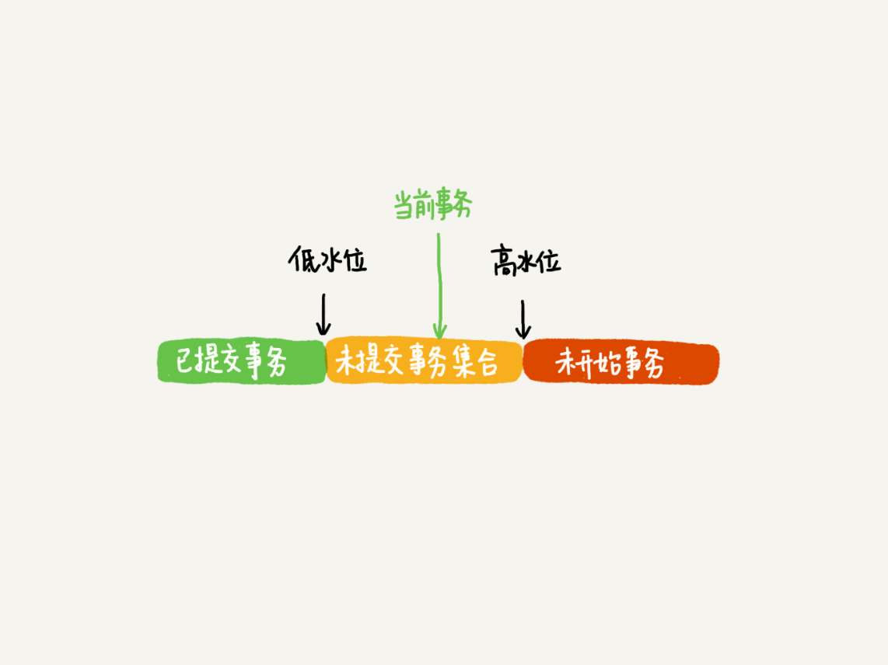

摘自：`http://xuyangyang.club/articles/2019/03/13/1552460434876.html`

## 1、事务的启动

`begin/start transaction`命令并不是一个事务的起点，在执行到它们之后的第一个操作`InnoDB`表的语句，事务才真正启动。如果你想要马上启动一个事务，可以使用`start transaction with consistent snapshot`这个命令。

## 2、事务的隔离级别

* 未提交读是指，一个事务还没提交时，它做的变更就能被别的事务看到。
* 提交读是指，一个事务提交之后，它做的变更才会被其他事务看到。
* 可重复读是指，一个事务在执行过程中看到的数据，总是跟这个事务在启动时看到的数据是一致的。当然在可重复读隔离级别下，未提交变更对其他事务也是不可见的。
* 串行化，顾名思义是对于同一行记录，“写"会加"写锁”,“读"会加"读锁”。当出现读写锁冲突的时候，后访问的事务必须等前一个事务执行完成，才能继续执行。

在不同的隔离级别下，事务`A`会有哪些不同的返回结果：

* 若隔离级别是"未提交读"，则`V1`的值就是2。这时候事务`B`虽然还没有提交，但是结果已经被`A`看到了。因此，`V2，V3`也都是2。

* 若隔离级别是"提交读"，则`V1`是1，`V2`的值是2，事务`B`的更新在提交之后才能被`A`看到。所以，`V3`的值也是2。

* 若隔离级别是"可重复读"，则`V1`是1，`V2`是1，`V3`是2。之所以`V2`还是1，遵循的就是这个要求：事务在执行期间看到的数据前后是一致的。

* 若隔离级别是"串行化"，则在事务`B`执行”将1改成2“的时候，会被锁住。直到事务A提交后，事务B才可以继续执行，所以从A的角度看，`V1、V2`的值时1，`V3`的值是2。

在实现上，数据库里面会创建一个**视图**，访问的时候以视图的逻辑结果为准。在"可重复性读"隔离级别下，这个视图是在事务启动时创建的，整个事务存在期间都用这个视图。在"提交读"隔离级别下，这个视图是在每个`SQL`语句开始执行的时候创建的。"未提交读"隔离级别下直接返回记录上的最新值，没有视图概念；而"串行化"隔离级别下直接用加锁的方式来避免并行访问。

## 3、"快照"在`MVCC`里是这么工作的？

`InnoDB`里面每个事务有一个唯一的事务`ID`，叫做`transaction id`。它是事务开始的时候想`InnoDB`的事务系统申请的，是按申请顺序严格递增的。

而每行数据也是有多个版本的。每次事务更新数据的时候，都会生成一个新的数据版本，并且把这个`transaction id`赋值给这个数据版本的事务`ID`，记作`row trx_id`。同时，旧的数据版本要保留，并且在新的数据版本中，能够有信息可以直接拿到它。

`InnoDB`为每个事务构造了一个数组，用来保存这个事务启动瞬间，当前正在"活跃"的所有事务`ID`。"活跃"指的是启动了但还未提交。数组里面事务`ID`的最小值记作低水位，当前系统里面已经创建过的事务`ID`的最大值加1记作高水位。这个视图数组和高低水平，就组成了当前事务的一致性视图。而数据版本的可见性规则，就是基于数据的`row trx_id`和这个一致性视图的对比结果得到的。这个视图数组把所有的`row trx_id`分成了几种不同的情况：

这样对于当前事务的启动瞬间来说，一个数据版本的`row trx_id`，有以下几种可能。

1. 如果落在绿色部分，表示这个版本是已提交的事务或者当前事务自己生成的，这个数据是可见的。
2. 如果落在红色部分，表示这个版本有将来启动的事务生成的，是肯定不可见的。
3. 如果落在黄色部分，那么就有两种情况：

- 若`row trx_id`在数组中，表示这个版本是还没提交的事务生成的，不可见。
- 若`row trx_id`不在数组中，表示这个版本是已经提交了事务生成的，可见。

## 4、更新逻辑

更新数据都是先读后写的，而这个读，只能都当前的值，称为"当前读"。

除了`update`语句外，`select`语句如果加锁，也是当前读。

## 5、幻读是什么

幻读指的是一个事务在前后两次查询同一个范围的时候，后一次查询看到了前一次查询没有看到的行。（这个查询必须为当前读），并且有如下说明：

1. 在可重复读隔离级别下，普通的查询是快照读，是不会看到别的事务插入的数据的。因此，幻读在"当前读"下才会出现。
2. 在另外一个事务中修改了数据，当前事务用“当前读”看到，不能称之为幻读。幻读仅专指“新插入的行”。

## 6、如何解决幻读？

产生幻读的原因是，行锁只能锁住行，但是新插入记录这个动作，要更新的是记录之前的“间隙”。因此，为了解决幻读问题，`InnoDB`只好引入新的锁，也就是间隙锁（`Gap Lock`）。

间隙锁跟行锁不一样，跟间隙锁存在冲突关系的，是“往这个间隙中插入一个记录”这个操作，间隙锁之间都不存在冲突关系。间隙锁和行锁合称`next-key lock`，每个`next-key lock`是前开后闭区间。间隙锁只在可重复读隔离级别下才会生效。

## 7、加锁规则

1. 原则1：加锁的基本单位是`next-key lock`，`next-key lock`是前开后闭区间。
2. 原则2：查找过程中访问到的对象才会加锁。
3. 优化1：索引上的等值查询，给唯一索引加锁的时候，`next-key lock`退化为行锁。
4. 优化2：索引上的等值查询，向右遍历时且最后一个值不满足等值条件时,`next-key lock`退化为间隙锁。
5. 一个`bug`：唯一索引上的范围查询会访问到不满足条件的第一个值为止。

