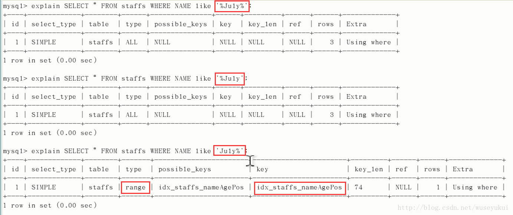

## 1、`MySQL` 有哪些存储引擎啊？都有什么区别？

* `MyISAM`

    该引擎在读取数据方面速度很快，而且不占用大量的内存和存储资源；但是`ISAM`**不支持事务处理**、不支持外来键、不能够容错、也不支持索引（聚集索引）。表锁设计，支持全文索引。

* `InnoDB`

    该存储引擎为`MySQL`表提供了**`ACID`事务**支持、系统崩溃修复能力和多版本并发控制（即`MVCC Multi-Version Concurrency Control`）的**行级锁**。 该引擎存储引擎**支持外键** ,外键所在的表称为子表而所依赖的表称为父表。还支持**非锁定读**，即默认读取是不加锁的。该引擎在`5.5`后的`MySQL`数据库中为默认存储引擎。

比较

* 事务：`InnoDB` 是事务型的，可以使用 `Commit` 和 `Rollback` 语句。

* 并发：`MyISAM `只支持表级锁，而` InnoDB` 还支持行级锁。

* 外键：`InnoDB` 支持外键。

* 备份：`InnoDB `支持在线热备份。

* 崩溃恢复：`MyISAM` 崩溃后发生损坏的概率比` InnoDB` 高很多，而且恢复的速度也更慢。

* 其它特性：`MyISAM` 支持压缩表和空间数据索引。

*  `InnoDB`是聚集索引，数据文件是和索引绑在一起的，必须要有主键，通过主键索引效率很高。但是辅助索引需要两次查询，先查询到主键，然后再通过主键查询到数据。因此，主键不应该过大，因为主键太大，其他索引也都会很大。而`MyISAM`是非聚集索引，数据文件是分离的，索引保存的是数据文件的指针。主键索引和辅助索引是独立的。

* `InnoDB`不保存表的具体行数，执行`select count(*) from table`时需要全表扫描。而`MyISAM`用一个变量保存了整个表的行数，执行上述语句时只需要读出该变量即可，速度很快

* `Innodb`不支持全文索引，而`MyISAM`支持全文索引，查询效率上`MyISAM`要高

    


## 2、`Float、Decimal` 存储金额的区别？

`float`是浮点数，不能指定小数位。 `decimal`是精确数，可以指定精度。对精确度要求比较高时，建议使用`decimal`来存，`decimal`在`mysql`内存是以字符串存储的，用于定义货币要求精确度高的数据。`float`占4个字节，`double`占8个字节，`decimail(M,D)`占`M+2`个字节。

## 3、`Datetime、Timestamp` 存储时间的区别？

* `datetime` 
    保存格式为`YYYYMMDDHHMMSS`（年月日时分秒）的整数，所以，它与时区无关，存入的是什么值就是什么值，不会根据当前时区进行转换。
* `timestamp`
    存入的是自`1970-01-01`午夜(格林尼治标准时间)以来的秒数，它和`unix`时间戳相同。所以它与时区有关，查询时转为相应的时区时间。比如，存储的是`1970-01-01 00:00:00`，客户端是北京，那么就加8个时区的小时`1970-01-01 08:00:00`。

## 4、对比一下`B+`树索引和 `Hash`索引？

`B+`树是一个平衡的多叉树。`B+`树从根节点到叶子节点的搜索效率基本相当，不会出现大幅波动。哈希索引采用一定的哈希算法，把键值换成新的哈希值，检索时不需要类似`B+`树那样从根节点逐级查找，只需一次哈希算法即可立刻定位到相应的位置。

## 5、`MySQL`索引类型有哪些

* 聚集索引

    就是按照每张表的主键构造一颗B+树，同时叶子节点照顾你存放的即为整张表的行记录数据，也将聚集索引的叶子节点成为数据页。每个数据页都是通过一个双向链表来进行链接。在多数情况下，查询优化器倾向于采用聚集索引，因为能直接在叶子节点上招到数据。此外，由于定义了数据的逻辑顺序，聚集索引能很快发现某一段的数据页需要扫描。注意：非叶子节点并不保存数据。

* 辅助索引（非聚集索引）

    叶子节点并不能包含行记录的全部数据，叶子节点除了包含键值外，每个叶子节点中的索引行还包含了一个书签，此书签指向聚集索引的索引键。注意：同样非叶子节点也不保存数据。

* 联合索引

    是指对表上的多个列进行索引，某个查询是否走索引，要看联合索引树中此字段是否已排序。若已经排序则会走索引，否则不走索引。

* 覆盖索引

    其实也是一种辅助索引，即从辅助索引中就可以得到查询的记录，而不需要查询聚集索引中的记录。使用覆盖索引的一个好处是不包含整行记录的所有信息，故其大小要远小于聚集索引，可以减少大量的IO操作。比如查询数据量等操作就可以使用覆盖索引。

* 前缀索引
    对于` BLOB、TEXT` 和` VARCHAR` 类型的列，必须使用前缀索引，只索引开始的部分字符。对于前缀长度的选取需要根据索引选择性来确定。


## 6、如何管理 `MySQL`索引？

```sql
alter table table_test add index index_test1(name) ;
create index index_test2 on table_test(age);
drop index name on table_test ;
```


## 7、索引优化

（1）独立的列
  在进行查询时，索引列不能是表达式的一部分，也不能是函数的参数，否则无法使用索引。
  例如下面的查询不能使用 `actor_id` 列的索引：

  ```sql
  SELECT actor_id FROM sakila.actor WHERE actor_id + 1 = 5;
  ```

（2）多列索引
    在需要使用多个列作为条件进行查询时，使用多列索引比使用多个单列索引性能更好。例如下面的语句中，最好把` actor_id` 和` film_id `设置为多列索引。

```sql
SELECT film_id, actor_ id FROM sakila.film_actor
WHERE actor_id = 1 AND film_id = 1;
```

（3）索引列的顺序
    让选择性最强的索引列放在前面。索引的选择性是指：不重复的索引值和记录总数的比值。最大值为 1，此时每个记录都有唯一的索引与其对应。选择性越高，查询效率也越高。例如下面显示的结果中` customer_id `的选择性比 `staff_id `更高，因此最好把 `customer_id` 列放在多列索引的前面。

```sql
SELECT COUNT(DISTINCT staff_id)/COUNT(*) AS staff_id_selectivity,
COUNT(DISTINCT customer_id)/COUNT(*) AS customer_id_selectivity,
COUNT(*)
FROM payment;

   staff_id_selectivity: 0.0001
customer_id_selectivity: 0.0373
               COUNT(*): 16049
```


​    

（4）前缀索引
    对于 `BLOB、TEXT` 和 `VARCHAR `类型的列，必须使用前缀索引，只索引开始的部分字符。对于前缀长度的选取需要根据索引选择性来确定。

（5）覆盖索引
    索引包含所有需要查询的字段的值。具有以下优点：
    索引通常远小于数据行的大小，只读取索引能大大减少数据访问量。一些存储引擎（例如` MyISAM`）在内存中只缓存索引，而数据依赖于操作系统来缓存。因此，只访问索引可以不使用系统调用（通常比较费时）。对于 `InnoDB `引擎，若辅助索引能够覆盖查询，则无需访问主索引。


## 8、索引与锁有什么关系？

如果字段没有索引，即使使用where条件也会进行表级锁。如果有索引，会锁定对应where条件中索引值的所有行，可理解为对该索引值进行了索引（所以即使另一事务查询的是其他行，但因为索引值形同们也会被锁住）。哈希索引适合等值查询，但是不无法进行范围查询，没办法利用索引完成排序， 不支持多列联合索引的最左匹配规则。如果有大量重复键值得情况下，哈希索引的效率会很低，因为存在哈希碰撞问题


## 9、`Innodb`事务

`ACID`：原子性（`atomicity`）、一致性（`consistency`）、隔离性（`isolation`）、持久性（`durability`）

* 原子性：原子性是指事务包含的所有操作要么全部成功，要么全部失败回滚。
* 一致性：一致性是指事务必须使数据库从一个一致的状态变到另外一个一致的状态，也就是执行事务之前和之后的状态都必须处于一致的状态。

* 隔离性：隔离性是指当多个用户并发访问数据库时，比如操作同一张表时，数据库为每一个用户开启的事务，不能被其他事务的操作所干扰，多个并发事务之间要相互隔离

* 持久性：持久性是指一个事务一旦被提交了，那么对于数据库中的数据改变就是永久性的，即便是在数据库系统遭遇到故障的情况下也不会丢失提交事务的操作。

## 10、事务带来的问题

* 脏读（`Dirty Read`）：一个事务处理过程里读取了另一个未提交的事务中的数据

* 不可重复读（`NonRepeatable Read`）:对于数据库中的某个数据，一个事务范围内多次查询却返回了不同的数据值，这是由于在查询的间隔期间，另外一个事务修改并提交了该数据

    不可重复读和脏读的区别是，脏读是某一事务读取了另一个事务未提交的脏数据，而不可重复读则是读取了前一事务提交的数据。在某些情况下，不可重复读并不是问题，比如我们多次查询某个数据当然以最后查询得到的结果为主。但在另一些情况下就有可能发生问题，例如对于同一个数据A和B依次查询就可能不同，A和B就可能打起来了……

* 幻读（`Phantom Read`）
    在一个事务中读取到了别的事务插入的数据，导致前后不一致

    如丙存款100元未提交，这时银行做报表统计`account`表中所有用户的总额为500元，然后丙提交了，这时银行再统计发现帐户为600元了，造成虚读同样会使银行不知所措，到底以哪个为准。


## 11、查询优化的基本思路

* 优化更需要优化的 `Query` 
    如：高并发的`Query`

* 定位优化对象的性能瓶颈； 
    带着问题去处理`Query`：当要处理一条 `Query `的时候，我们首先要判断出这个 `Query` 的瓶颈到底是` IO` 还是`CPU`。到底是因为在数据访问消耗了太多的时间，还是在数据的运算（如分组排序等）方面花费了太多资源？

* 明确的优化目标； 
    根据需求和数据库状况确定 `Query` 应该满足的一个性能范围是怎样的，这也就是我们的优化目标范围

* 用 `Explain`来分析 `SELECT `查询语句，开发人员可以通过分析 `Explain` 结果来优化查询语句。比较重要的字段有：
    `select_type` : 查询类型，有简单查询、联合查询、子查询等
    `key` : 使用的索引
    `rows `: 扫描的行数

* 多使用 `profile`：可以用来分析过去所有查询的相关数据

* 永远用小结果集驱动大的结果集； 
    驱动结果集越大，所需要循环的此时就越多，那么被驱动表的访问次数自然也就越多，而每次访问被驱动表，即使需要的逻辑` IO `很少，循环次数多了，总量自然也不可能很小，而且每次循环都不能避免的需要消耗 `CPU` ，所以 `CPU` 运算量也会跟着增加。所以，在优化` Join Query `的时候，最基本的原则就是“小结果集驱动大结果集”，通过这个原则来减少嵌套循环中的循环次数，达到减少` IO` 总量以及 `CPU` 运算的次数。

* 尽可能在索引中完成排序；

* 只取出自己需要的` Columns`； 
    对于任何 `Query`，返回的数据都是需要通过网络数据包传回给客户端，如果取出的 `Column` 越多，需要传输的数据量自然会越大，不论是从网络带宽方面考虑还是从网络传输的缓冲区来看，都是一个浪费。

* 仅仅使用最有效的过滤条件； 
    过滤条件不一定越多越好；选择索引时，同等调价下占用空间小的索引会更高效

* 尽可能避免复杂的` Join `和子查询； 
    我们的` Query` 语句所涉及到的表越多，所需要锁定的资源就越多。也就是说，越复杂的` Join` 语句，所需要锁定的资源也就越多，所阻塞的其他线程也就越多。相反，如果我们将比较复杂的 `Query` 语句分拆成多个较为简单的 `Query` 语句分步执行，每次锁定的资源也就会少很多，所阻塞的其他线程也要少一些。


## 12、隔离级别

| 隔离级别/读数据一致性及允许的并发副作用 | 读数据一致性                             | 脏读 | 不可重复读 | 幻读 |
| --------------------------------------- | ---------------------------------------- | ---- | ---------- | ---- |
| 未提交读（`Read uncommitted`）          | 最低级别，只能保证不读取物理上损坏的数据 | 是   | 是         | 是   |
| 已提交度（`Read committed`）            | 语句级                                   | 否   | 是         | 是   |
| 可重复读（`Repeatable read`）           | 事务级                                   | 否   | 否         | 是   |
| 可序列化（`Serializable`）              | 最高级别，事务级                         | 否   | 否         | 否   |


## 13、`Mysql`中的锁

### 13.1 按封锁类型分类
* 1）排他锁（又称写锁，`X`锁）：会阻塞其他事务读和写。
    若事务`T`对数据对象A加上`X`锁，则只允许T读取和修改`A`，其他任何事务都不能再对加任何类型的锁，知道`T`释放`A`上的锁。这就保证了其他事务在`T`释放`A`上的锁之前不能再读取和修改`A`。

* 2）共享锁（又称读取，`S`锁）：会阻塞其他事务修改表数据。
    若事务`T`对数据对象A加上`S`锁，则其他事务只能再对`A`加`S`锁，而不能`X`锁，直到`T`释放`A`上的锁。这就保证了其他事务可以读`A`，但在`T`释放`A`上的`S`锁之前不能对`A`做任何修改。
* 3）`X`锁和`S`锁都是加载某一个数据对象上的。也就是数据的粒度。

### 13.2 按封锁的数据粒度分类如下
* 1）行级锁定（`row-level`）：行级锁：开销大，加锁慢；会出现死锁；锁定粒度最小，发生锁冲突的概率最低，并发度也最高。
    **详细：**行级锁定最大的特点就是锁定对象的颗粒度很小，也是目前各大数据库管理软件所实现的锁定颗粒度最小的。由于锁定颗粒度很小，所以发生锁定资源争用的概率也最小，能够给予应用程序尽可能大的并发处理能力而提高一些需要高并发应用系统的整体性能。
    **缺陷：**由于锁定资源的颗粒度很小，所以每次获取锁和释放锁需要做的事情也更多，带来的消耗自然也就更大了。此外，行级锁定也最容易发生死锁。

* 2）表级锁定（`table-level`）：表级锁：开销小，加锁快；不会出现死锁；锁定粒度大，发生锁冲突的概率最高，并发度最低。
    **详细：**和行级锁定相反，表级别的锁定是`MySQL`各存储引擎中最大颗粒度的锁定机制。该锁定机制最大的特点是实现逻辑非常简单，带来的系统负面影响最小。所以获取锁和释放锁的速度很快。由于表级锁一次会将整个表锁定，所以可以很好的避免困扰我们的死锁问题。
    **缺陷：**锁定颗粒度大所带来最大的负面影响就是出现锁定资源争用的概率也会最高，致使并发度大打折扣。

* 3）页级锁定（`page-level`）：（`MySQL`特有）页级锁：开销和加锁时间界于表锁和行锁之间；会出现死锁；锁定粒度界于表锁和行锁之间，并发度一般。
    **详细：**页级锁定是`MySQL`中比较独特的一种锁定级别，在其他数据库管理软件中也并不是太常见。页级锁定的特点是锁定颗粒度介于行级锁定与表级锁之间，所以获取锁定所需要的资源开销，以及所能提供的并发处理能力也同样是介于上面二者之间。
    **缺陷：**页级锁定和行级锁定一样，会发生死锁。

从这里我们应该引申去思考行锁更多的缺点：（因为我们执行sql主要依赖行锁来提高并发度）
1- 比表级锁、页级锁消耗更多内存
2- 如果你在大部分数据上经常进行`GROUP BY`操作或者必须经常扫描整个表，比其它锁定明显慢很多。
3- 更容易发生死锁。

其次，我们应该思考什么情况下用表锁、行锁（因为我们主要使用引擎默认是这两个，`MyISAM`是表级锁；`InnoDb`是行级锁，当然也支持表级锁）


## 14、`B`树与`B+`树的区别

有了`B`树，为什么还需要`B+`树呢？那就要先说下`B`树的缺点了，人类对于性能的追求是无止境的，`B`树相比二叉树虽好，但还是存在以下问题：

1.每个节点中既要存索引信息，又要存其对应的数据，如果数据很大，那么当树的体量很大时，每次读到内存中的树的信息就会不太够。

2.`B`树遍历整个树的过程和二叉树本质上是一样的，`B`树相对二叉树虽然提高了磁盘`IO`性能，但并没有解决遍历元素效率低下的问题。

针对以上两个问题，`B+`树诞生了，`B+`树相比`B`树，本质上是一样的，区别就在与`B+`树的所有根节点都不带有任何数据信息，只有索引信息，所有数据信息全部存储在叶子节点里，这样，整个树的每个节点所占的内存空间就变小了，读到内存中的索引信息就会更多一些，相当于减少了磁盘`IO`次数，问题`1`就得到了解决。又由`B`树的性质可以得到，所有叶子节点都会在同一层，`B+`树会以一个链表的形式将所有叶子节点的信息全部串联起来，这样，想遍历所有数据信息只需要顺序遍历叶子节点就可以了，方便又高效，问题二就得到了解决。不仅如此，`B+`树还有一个相应的优质特性，就是`B+`树的查询效率是非常稳定的，因为所有信息都存储在了叶子节点里面，从根节点到所有叶子节点的路径是相同的。那么，我们总结一下`B+`树的优点：

（1) `B+`树的磁盘读写代价更低

`B+`的内部结点并没有指向关键字具体信息的指针。因此其内部结点相对`B`树更小。如果把所有同一内部结点的关键字存放在同一盘块中，那么盘块所能容纳的关键字数量也越多。一次性读入内存中的需要查找的关键字也就越多。相对来说`IO`读写次数也就降低了。

（2）`B+`树的数据信息遍历更加方便

`B+`树只要遍历叶子节点就可以实现整棵树的遍历，而`B`树不支持这样的操作（或者说效率太低），而且在数据库中基于范围的查询是非常频繁的，所以数据库索引基本采用`B+`树

（3) `B+`树的查询效率更加稳定

由于非终结点并不是最终指向文件内容的结点，而只是叶子结点中关键字的索引。所以任何关键字的查找必须走一条从根结点到叶子结点的路。所有关键字查询的路径长度相同，导致每一个数据的查询效率相当。

## 15、B+ Tree的叶子节点都可以存哪些东西

在 InnoDB 里，索引B+ Tree的叶子节点存储了整行数据的是主键索引，也被称之为聚簇索引。而索引B+ Tree的叶子节点存储了主键的值的是非主键索引，也被称之为非聚簇索引。同时聚簇索引查询会更快，因为主键索引树的叶子节点直接就是我们要查询的整行数据了。而非主键索引的叶子节点是主键的值，查到主键的值以后，还需要再通过主键的值再进行一次查询，也就是回表。当然使用非聚簇索引也不是什么情况下都需要回表。覆盖索引（covering index）指一个查询语句的执行只用从索引中就能够取得，不必从数据表中读取。也可以称之为实现了索引覆盖。 当一条查询语句符合覆盖索引条件时，MySQL只需要通过索引就可以返回查询所需要的数据，这样避免了查到索引后再返回表操作，减少I/O提高效率。 如，表covering_index_sample中有一个普通索引 `idx_key1_key2(key1,key2)`。当我们通过SQL语句：`select key2 from covering_index_sample where key1 = ‘keytest’;`的时候，就可以通过覆盖索引查询，无需回表。


## 16、联合索引、最左匹配

在创建多列索引时，根据业务需求，where子句中使用最频繁的一列放在最左边，因为MySQL索引查询会遵循最左前缀匹配的原则，即最左优先，在检索数据时从联合索引的最左边开始匹配。所以当我们创建一个联合索引的时候，如`(key1,key2,key3)`，相当于创建了`（key1）、(key1,key2)`和`(key1,key2,key3)`三个索引，这就是最左匹配原则。


## 17、在MySQL 5.6中，对索引做了哪些优化

` Index Condition Pushdown`（索引下推） `MySQL 5.6`引入了索引下推优化，默认开启，使用`SET optimizer_switch = ‘index_condition_pushdown=off’;`可以将其关闭。官方文档中给的例子和解释如下： people表中`（zipcode，lastname，firstname）`构成一个索引

```sql
SELECT * FROM people WHERE zipcode=‘95054’ AND lastname LIKE ‘%etrunia%’ AND address LIKE ‘%Main Street%’;
```

如果没有使用索引下推技术，则`MySQL`会通过`zipcode='95054’`从存储引擎中查询对应的数据，返回到MySQL服务端，然后MySQL服务端基于`lastname LIKE '%etrunia%'`和`address LIKE '%Main Street%'`来判断数据是否符合条件。 如果使用了索引下推技术，则MYSQL首先会返回符合`zipcode='95054’`的索引，然后根据`lastname LIKE '%etrunia%'和address LIKE '%Main Street%'`来判断索引是否符合条件。如果符合条件，则根据该索引来定位对应的数据，如果不符合，则直接reject掉。 有了索引下推优化，可以在有like条件查询的情况下，减少回表次数。

## 18、如何判断索引是否生效？

可以使用explain和profile对查询语句进行分析。


## 19、索引在什么情况下没起作用

* 1、全值匹配肯定会走索引

* 2、最佳左前缀法则（带头索引不能死，中间索引不能断），如果不满足条件则索引无法生效。

* 3、不要在索引上做任何操作（计算、函数、自动/手动类型转换），不然会导致索引失效而转向全表扫描

* 4、mysql存储引擎不能继续使用索引中范围条件（bettween、<、>、in等）右边的列

    

* 5、尽量使用覆盖索引（只查询索引的列（索引列和查询列一致）），减少select

* 6、索引字段上使用（！= 或者 < >）判断时，会导致索引失效而转向全表扫描

* 7、索引字段上使用 is null / is not null 判断时，会导致索引失效而转向全表扫描

* 8、索引字段使用like以通配符开头（‘%字符串’）时，会导致索引失效而转向全表扫描

    

    由结果可知，like以通配符结束相当于范围查找，索引不会失效。与范围条件（bettween、<、>、in等）不同的是：不会导致右边的索引失效。

    **问题：解决like ‘%字符串%’时，索引失效问题的方法？** 
    使用覆盖索引可以解决。 

    

* 9、索引字段是字符串，但查询时不加单引号，会导致索引失效而转向全表扫描

* 10、索引字段使用 or 时，会导致索引失效而转向全表扫描


## 20、CHAR和VARCHAR的区别

* 1.CHAR和VARCHAR类型在存储和检索方面有所不同
* 2.CHAR列长度固定为创建表时声明的长度，长度值范围是1到255。当CHAR值被存储时，它们被用空格填充到特定长度，检索CHAR值时需删除尾随空格。


## 21、三大范式

摘自：`https://www.cnblogs.com/zhhh/archive/2011/04/21/2023355.html`

* 如果数据库表中的所有字段值都是不可分解的原子值，就说明该数据库表满足了第一范式。

    第一范式的合理遵循需要根据系统的实际需求来定。比如某些数据库系统中需要用到“地址”这个属性，本来直接将“地址”属性设计成一个数据库表的字段就行。但是如果系统经常会访问“地址”属性中的“城市”部分，那么就非要将“地址”这个属性重新拆分为省份、城市、详细地址等多个部分进行存储，这*样在对地址中某一部分操作的时候将非常方便。这样设计才算满足了数据库的第一范式

* 第二范式在第一范式的基础之上更进一层。第二范式需要确保数据库表中的每一列都和主键相关，而不能只与主键的某一部分相关（主要针对联合主键而言）。也就是说在一个数据库表中，一个表中只能保存一种数据，不可以把多种数据保存在同一张数据库表中。

    比如要设计一个订单信息表，因为订单中可能会有多种商品，所以要将订单编号和商品编号作为数据库表的联合主键

* 第三范式需要确保数据表中的每一列数据都和主键直接相关，而不能间接相关。

    比如在设计一个订单数据表的时候，可以将客户编号作为一个外键和订单表建立相应的关系。而不可以在订单表中添加关于客户其它信息（比如姓名、所属公司等）的字段。