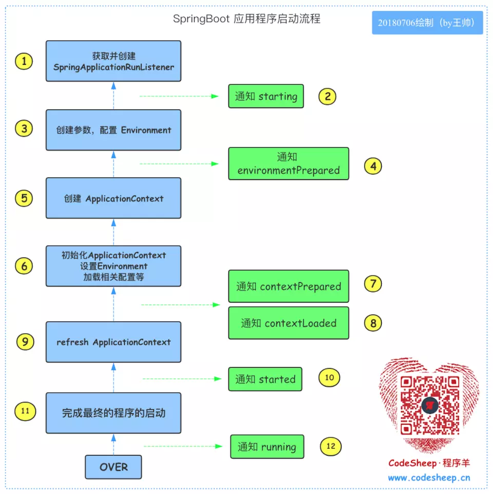

SpringBoot启动流程

参考：

```
https://juejin.im/post/5b8f05a5f265da43296c6102
```


# 一、初始化SpringApplication

```java
@SpringBootApplication
public class DemoApplication {
	public static void main(String[] args) {
		SpringApplication.run(DemoApplication.class, args);
	}
}
```

我们看看内部情况

```java
public static ConfigurableApplicationContext run(Class<?> primarySource,
		String... args) {
	return run(new Class<?>[] { primarySource }, args);
}

public static ConfigurableApplicationContext run(Class<?>[] primarySources,
		String[] args) {
    //先初始化一个SpringApplication实例，再进行启动
	return new SpringApplication(primarySources).run(args);
}

public SpringApplication(Class<?>... primarySources) {
	this(null, primarySources);
}

public SpringApplication(ResourceLoader resourceLoader, Class<?>... primarySources) {
	this.resourceLoader = resourceLoader;
	Assert.notNull(primarySources, "PrimarySources must not be null");
	this.primarySources = new LinkedHashSet<>(Arrays.asList(primarySources));
    //(1) 推断应用的类型：创建的是 REACTIVE应用、SERVLET应用、NONE 三种中的某一种
	this.webApplicationType = deduceWebApplicationType();
    //(2)使用 SpringFactoriesLoader查找并加载 classpath下 META-INF/spring.factories
    //文件中所有可用的 ApplicationContextInitializer
	setInitializers((Collection) getSpringFactoriesInstances(
			ApplicationContextInitializer.class));
    //(3)使用 SpringFactoriesLoader查找并加载 classpath下 META-INF/spring.factories
    //文件中的所有可用的 ApplicationListener
	setListeners((Collection) getSpringFactoriesInstances(ApplicationListener.class));
    //(4)推断并设置 main方法的定义类
	this.mainApplicationClass = deduceMainApplicationClass();
}
```

说明：

* （1）推断应用的类型：创建的是` REACTIVE`应用、`SERVLET`应用、`NONE `三种中的某一种

    ```java
    private WebApplicationType deduceWebApplicationType() {
    	if (ClassUtils.isPresent(REACTIVE_WEB_ENVIRONMENT_CLASS, null)
    			&& !ClassUtils.isPresent(MVC_WEB_ENVIRONMENT_CLASS, null)) {
    		return WebApplicationType.REACTIVE;
    	}
    	for (String className : WEB_ENVIRONMENT_CLASSES) {
    		if (!ClassUtils.isPresent(className, null)) {
    			return WebApplicationType.NONE;
    		}
    	}
    	return WebApplicationType.SERVLET;
    }
    ```

    这里判断创建三种类型的应用，分别是响应式、普通`servlet`式、普通`java`应用。

* （2）使用 `SpringFactoriesLoader`查找并加载 classpath下 `META-INF/spring.factories`文件中所有可用的 `ApplicationContextInitializer`

    ```java
    private <T> Collection<T> getSpringFactoriesInstances(Class<T> type) {
    	return getSpringFactoriesInstances(type, new Class<?>[] {});
    }
    
    private <T> Collection<T> getSpringFactoriesInstances(Class<T> type,
    		Class<?>[] parameterTypes, Object... args) {
    	ClassLoader classLoader = Thread.currentThread().getContextClassLoader();
    	// Use names and ensure unique to protect against duplicates
    	Set<String> names = new LinkedHashSet<>(
    			SpringFactoriesLoader.loadFactoryNames(type, classLoader));
    	List<T> instances = createSpringFactoriesInstances(type, parameterTypes,
    			classLoader, args, names);
    	AnnotationAwareOrderComparator.sort(instances);
    	return instances;
    }
    ```

    ```properties
    # Application Context Initializers
    org.springframework.context.ApplicationContextInitializer=\
    org.springframework.boot.context.ConfigurationWarningsApplicationContextInitializer,\
    org.springframework.boot.context.ContextIdApplicationContextInitializer,\
    org.springframework.boot.context.config.DelegatingApplicationContextInitializer,\
    org.springframework.boot.web.context.ServerPortInfoApplicationContextInitializer
    ```

* （3）使用 `SpringFactoriesLoader`查找并加载 classpath下 `META-INF/spring.factories`文件中的所有可用的 `ApplicationListener`

    ```java
    private <T> Collection<T> getSpringFactoriesInstances(Class<T> type) {
    	return getSpringFactoriesInstances(type, new Class<?>[] {});
    }
    
    private <T> Collection<T> getSpringFactoriesInstances(Class<T> type,
    		Class<?>[] parameterTypes, Object... args) {
    	ClassLoader classLoader = Thread.currentThread().getContextClassLoader();
    	// Use names and ensure unique to protect against duplicates
    	Set<String> names = new LinkedHashSet<>(
    			SpringFactoriesLoader.loadFactoryNames(type, classLoader));
    	List<T> instances = createSpringFactoriesInstances(type, parameterTypes,
    			classLoader, args, names);
    	AnnotationAwareOrderComparator.sort(instances);
    	return instances;
    }
    ```

    ```properties
    # Application Listeners
    org.springframework.context.ApplicationListener=\
    org.springframework.boot.ClearCachesApplicationListener,\
    org.springframework.boot.builder.ParentContextCloserApplicationListener,\
    org.springframework.boot.context.FileEncodingApplicationListener,\
    org.springframework.boot.context.config.AnsiOutputApplicationListener,\
    org.springframework.boot.context.config.ConfigFileApplicationListener,\
    org.springframework.boot.context.config.DelegatingApplicationListener,\
    org.springframework.boot.context.logging.ClasspathLoggingApplicationListener,\
    org.springframework.boot.context.logging.LoggingApplicationListener,\
    org.springframework.boot.liquibase.LiquibaseServiceLocatorApplicationListener
    ```

* （4）推断并设置 `main`方法的定义类

    ```java
    private Class<?> deduceMainApplicationClass() {
    	try {
    		StackTraceElement[] stackTrace = new RuntimeException().getStackTrace();
    		for (StackTraceElement stackTraceElement : stackTrace) {
    			if ("main".equals(stackTraceElement.getMethodName())) {
    				return Class.forName(stackTraceElement.getClassName());
    			}
    		}
    	}
    	catch (ClassNotFoundException ex) {
    		// Swallow and continue
    	}
    	return null;
    }
    ```

    

# 二、应用启动

`SpringApplication`创建完之后通过`run`方法进行启动

```java
public ConfigurableApplicationContext run(String... args) {
	StopWatch stopWatch = new StopWatch();
	stopWatch.start();
	ConfigurableApplicationContext context = null;
	Collection<SpringBootExceptionReporter> exceptionReporters = new ArrayList<>();
	configureHeadlessProperty();
    //(1)通过 SpringFactoriesLoader 加载 META-INF/spring.factories 
    //文件，获取并创建 SpringApplicationRunListener 对象
	SpringApplicationRunListeners listeners = getRunListeners(args);
    //(2)然后由 SpringApplicationRunListener 来发出 starting 消息
	listeners.starting();
	try {
        //(3)创建参数，并配置当前 SpringBoot 应用将要使用的 Environment
		ApplicationArguments applicationArguments = new DefaultApplicationArguments(
				args);
        //(4)完成之后，依然由 SpringApplicationRunListener 来发出 environmentPrepared 消息
		ConfigurableEnvironment environment = prepareEnvironment(listeners,
				applicationArguments);
		configureIgnoreBeanInfo(environment);
		Banner printedBanner = printBanner(environment);
        //(5)创建 ApplicationContext
		context = createApplicationContext();
		exceptionReporters = getSpringFactoriesInstances(
				SpringBootExceptionReporter.class,
				new Class[] { ConfigurableApplicationContext.class }, context);
        //(6)初始化 ApplicationContext，并设置 Environment，加载相关配置等
        //(7)由 SpringApplicationRunListener 来发出 contextPrepared 消息，
        //告知SpringBoot 应用使用的 ApplicationContext 已准备OK
        //(8)将各种 beans 装载入 ApplicationContext，
        //继续由 SpringApplicationRunListener 来发出 contextLoaded 消息，
        //告知 SpringBoot 应用使用的 ApplicationContext 已装填OK
		prepareContext(context, environment, listeners, applicationArguments,
				printedBanner);
        //(9)refresh ApplicationContext，完成IoC容器可用的最后一步
		refreshContext(context);
		afterRefresh(context, applicationArguments);
		stopWatch.stop();
		if (this.logStartupInfo) {
			new StartupInfoLogger(this.mainApplicationClass)
					.logStarted(getApplicationLog(), stopWatch);
		}
        //(10)由 SpringApplicationRunListener 来发出 started 消息
		listeners.started(context);
        //(11)完成最终的程序的启动
		callRunners(context, applicationArguments);
	}
	catch (Throwable ex) {
		handleRunFailure(context, ex, exceptionReporters, listeners);
		throw new IllegalStateException(ex);
	}
	try {
        //(12)由 SpringApplicationRunListener 来发出 running 消息，告知程序已运行起来了
		listeners.running(context);
	}
	catch (Throwable ex) {
		handleRunFailure(context, ex, exceptionReporters, null);
		throw new IllegalStateException(ex);
	}
	return context;
}
```

整体流程说明：



详细说明：

* （1）通过 `SpringFactoriesLoader` 加载 `META-INF/spring.factories` 文件，获取并创建 `SpringApplicationRunListener` 对象

    ```java
    private SpringApplicationRunListeners getRunListeners(String[] args) {
    	Class<?>[] types = new Class<?>[] { SpringApplication.class, String[].class };
    	return new SpringApplicationRunListeners(logger, getSpringFactoriesInstances(
    			SpringApplicationRunListener.class, types, this, args));
    }
    ```

    ```properties
    # Run Listeners
    org.springframework.boot.SpringApplicationRunListener=\
    org.springframework.boot.context.event.EventPublishingRunListener
    ```

* （2）然后由 `SpringApplicationRunListener` 来发出 `starting` 消息

* （3）创建参数，并配置当前 `SpringBoot `应用将要使用的` Environment`

* （4）完成之后，依然由 `SpringApplicationRunListener` 来发出 `environmentPrepared `消息

* （5）创建 `ApplicationContext`

* （6）初始化 `ApplicationContext`，并设置 `Environment`，加载相关配置等

* （7）由 `SpringApplicationRunListener` 来发出 `contextPrepared` 消息，告知`SpringBoot` 应用使用的 `ApplicationContext` 已准备`OK`

* （8）将各种 beans 装载入 `ApplicationContext`，继续由 `SpringApplicationRunListener` 来发出 `contextLoaded` 消息，告知 `SpringBoot` 应用使用的 `ApplicationContext` 已装填`OK`

* （9）refresh ApplicationContext`，完成`IoC`容器可用的最后一步

* （10）由 `SpringApplicationRunListener` 来发出 `started` 消息

* （11）完成最终的程序的启动

* （12）由 `SpringApplicationRunListener` 来发出 `running` 消息，告知程序已运行起来了


