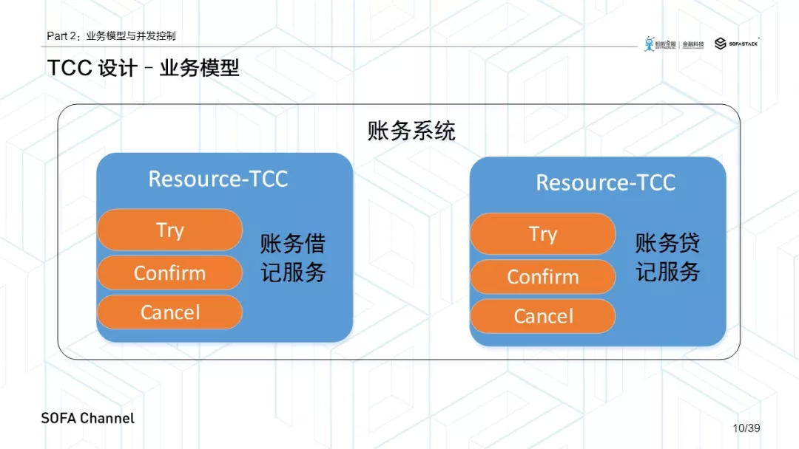
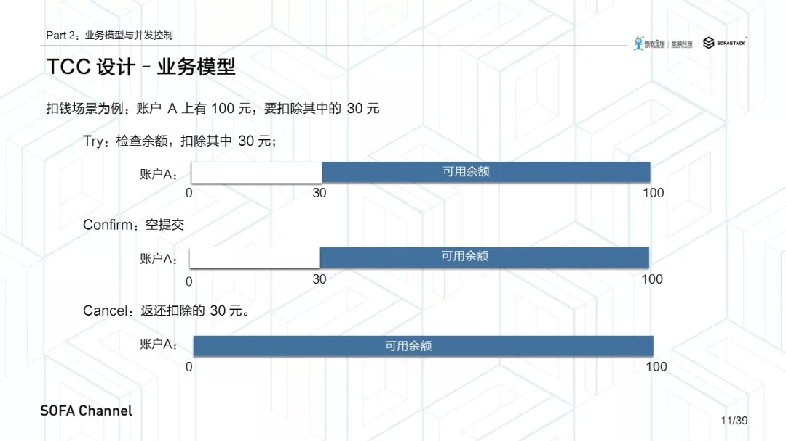
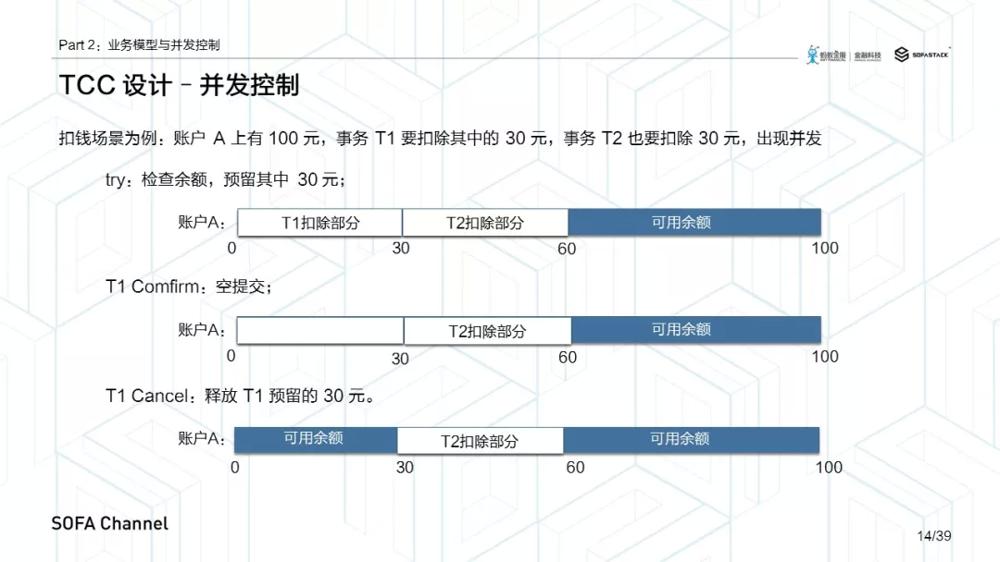
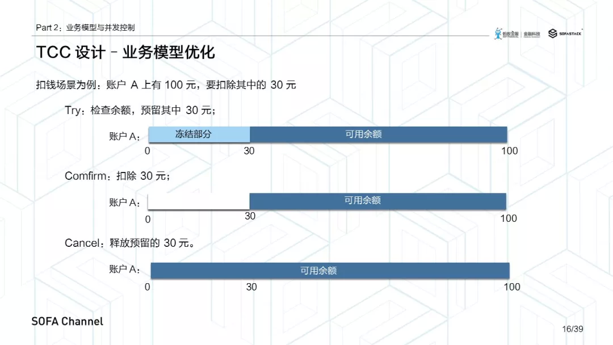
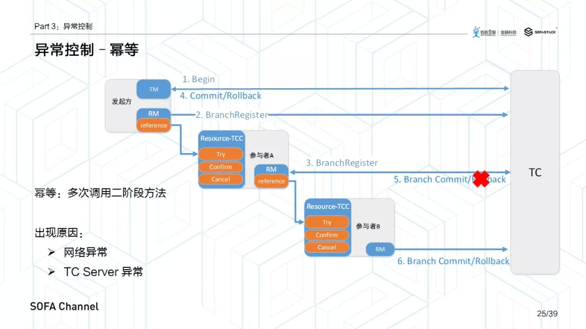
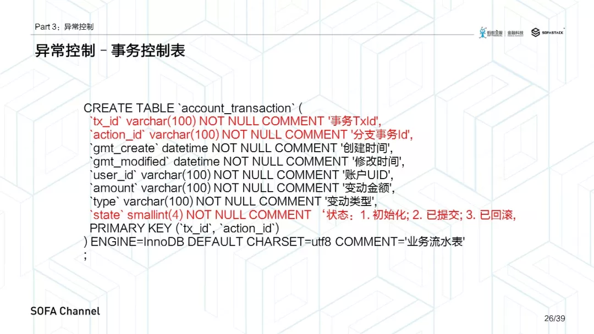
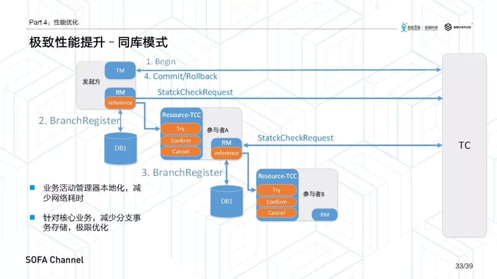
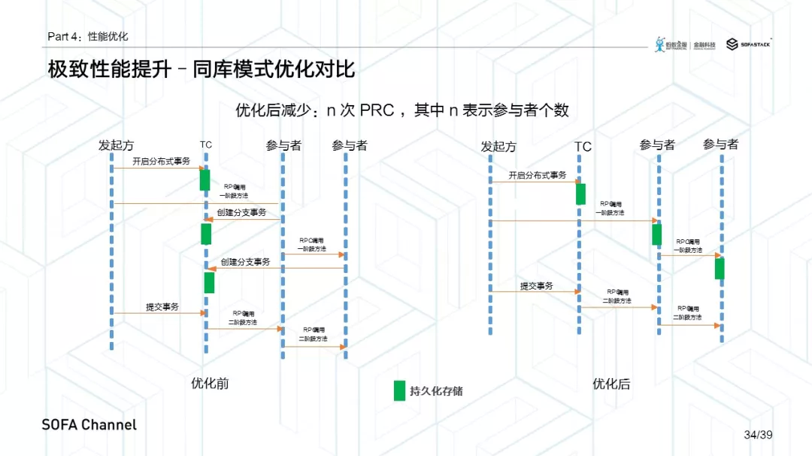

摘自：`https://www.infoq.cn/article/G33hCC-QoSJPlkt4e64E`

## 1 Seata 的 TCC 模式

### 1.1 服务化拆分

下面我们就进入第一个主题，Seata 的 TCC 模式。蚂蚁金服早期是单系统架构，所有业务服务几乎都在少数几个系统中。随着业务的发展，业务越来越复杂，服务之间的耦合度也越来越高，故我们对系统进行了重构，服务按照功能进行解耦和垂直拆分。拆分之后所带来的问题就是一个业务活动原来只需要调用一个服务就能完成，现在需要调用多个服务才能完成，而网络、机器等不可靠，数据一致性的问题很容易出现，与可扩展性、高可用容灾等要求并肩成为金融 IT 架构支撑业务转型升级的最大挑战之一。

从图中可以看到，从单系统到微服务转变，其实是一个资源横向扩展的过程，资源的横向扩展是指当单台机器达到资源性能瓶颈，无法满足业务增长需求时，就需要横向扩展资源，形成集群。通过横向扩展资源，提升非热点数据的并发性能，这对于大体量的互联网产品来说，是至关重要的。服务的拆分，也可以认为是资源的横向扩展，只不过方向不同而已。

资源横向扩展可能沿着两个方向发展，包括业务拆分和数据分片：

- 业务拆分。根据功能对数据进行分组，并将不同的微服务分布在多个不同的数据库上，这实际上就是 SOA 架构下的服务化。业务拆分就是把业务逻辑从一个单系统拆分到多个微服务中。
- 数据分片。在微服务内部将数据拆分到多个数据库上，为横向扩展增加一个新的维度。数据分片就是把一个微服务下的单个 DB 拆分成多个 DB，具备一个 Sharding 的功能。通过这样的拆解，相当于一种资源的横向扩展，从而使得整个架构可以承载更高的吞吐。

横向扩展的两种方法可以同时进行运用：交易、支付与账务三个不同微服务可以存储在不同的数据库中。另外，每个微服务内根据其业务量可以再拆分到多个数据库中，各微服务可以相互独立地进行扩展。

Seata 关注的就是微服务架构下的数据一致性问题，是一整套的分布式事务解决方案。Seata 框架包含两种模式，一种是 AT 模式。AT 模式主要从数据分片的角度，关注多 DB 访问的数据一致性，当然也包括多服务下的多 DB 数据访问一致性问题。

另外一个就是 TCC 模式，TCC 模式主要关注业务拆分，在按照业务横向扩展资源时，解决微服务间调用的一致性问题，保证读资源访问的事务属性。

今天我们主要讲的就是 TCC 模式。在讲 TCC 之前，我们先回顾一下 AT 模式，这样有助于我们理解后面的 TCC 模式。

### 1.2 AT 模式

对于 AT 模式，之前其他同学已经分享过很多次，大家也应该比较熟悉了。AT 模式下，把每个数据库被当做是一个 Resource，Seata 里称为 DataSource Resource。业务通过 JDBC 标准接口访问数据库资源时，Seata 框架会对所有请求进行拦截，做一些操作。每个本地事务提交时，Seata RM（Resource Manager，资源管理器） 都会向 TC（Transaction Coordinator，事务协调器） 注册一个分支事务。当请求链路调用完成后，发起方通知 TC 提交或回滚分布式事务，进入二阶段调用流程。此时，TC 会根据之前注册的分支事务回调到对应参与者去执行对应资源的第二阶段。TC 是怎么找到分支事务与资源的对应关系呢？每个资源都有一个全局唯一的资源 ID，并且在初始化时用该 ID 向 TC 注册资源。在运行时，每个分支事务的注册都会带上其资源 ID。这样 TC 就能在二阶段调用时正确找到对应的资源。

这就是我们的 AT 模式。简单总结一下，就是把每个数据库当做一个 Resource，在本地事务提交时会去注册一个分支事务。

### 1.3 TCC 模式

那么对应到 TCC 模式里，也是一样的，Seata 框架把每组 TCC 接口当做一个 Resource，称为 TCC Resource。这套 TCC 接口可以是 RPC，也以是服务内 JVM 调用。在业务启动时，Seata 框架会自动扫描识别到 TCC 接口的调用方和发布方。如果是 RPC 的话，就是 sofa:reference、sofa:service、dubbo:reference、dubbo:service 等。

扫描到 TCC 接口的调用方和发布方之后。如果是发布方，会在业务启动时向 TC 注册 TCC Resource，与 DataSource Resource 一样，每个资源也会带有一个资源 ID。

如果是调用方，Seata 框架会给调用方加上切面，与 AT 模式一样，在运行时，该切面会拦截所有对 TCC 接口的调用。每调用一次 Try 接口，切面会先向 TC 注册一个分支事务，然后才去执行原来的 RPC 调用。当请求链路调用完成后，TC 通过分支事务的资源 ID 回调到正确的参与者去执行对应 TCC 资源的 Confirm 或 Cancel 方法。

在讲完了整个框架模型以后，大家可能会问 TCC 三个接口怎么实现。因为框架本身很简单，主要是扫描 TCC 接口，注册资源，拦截接口调用，注册分支事务，最后回调二阶段接口。最核心的实际上是 TCC 接口的实现逻辑。下面我将根据蚂蚁金服内部多年的实践来为大家分析怎么实现一个完备的 TCC 接口。

## 2 TCC 业务模式与并发控制

### 2.1 TCC 设计原则

从 TCC 模型的框架可以发现，TCC 模型的核心在于 TCC 接口的设计。用户在接入 TCC 时，大部分工作都集中在如何实现 TCC 服务上。下面我会分享蚂蚁金服内多年的 TCC 应用实践以及在 TCC 设计和实现过程中的注意事项。

设计一套 TCC 接口最重要的是什么？主要有两点，**第一点，需要将操作分成两阶段完成**。TCC（Try-Confirm-Cancel）分布式事务模型相对于 XA 等传统模型，其特征在于它不依赖 RM 对分布式事务的支持，而是通过对业务逻辑的分解来实现分布式事务。

TCC 模型认为对于业务系统中一个特定的业务逻辑 ，其对外提供服务时，必须接受一些不确定性，即对业务逻辑初步操作的调用仅是一个临时性操作，调用它的主业务服务保留了后续的取消权。如果主业务服务认为全局事务应该回滚，它会要求取消之前的临时性操作，这就对应从业务服务的取消操作。而当主业务服务认为全局事务应该提交时，它会放弃之前临时性操作的取消权，这对应从业务服务的确认操作。每一个初步操作，最终都会被确认或取消。因此，针对一个具体的业务服务，TCC 分布式事务模型需要业务系统提供三段业务逻辑：

1. 初步操作 Try：完成所有业务检查，预留必须的业务资源。
2. 确认操作 Confirm：真正执行的业务逻辑，不做任何业务检查，只使用 Try 阶段预留的业务资源。因此，只要 Try 操作成功，Confirm 必须能成功。另外，Confirm 操作需满足幂等性，保证一笔分布式事务能且只能成功一次。
3. 取消操作 Cancel：释放 Try 阶段预留的业务资源。同样的，Cancel 操作也需要满足幂等性。

**第二点，就是要根据自身的业务模型控制并发，这个对应 ACID 中的隔离性**。后面会详细讲到。

### 2.2 账务系统模型设计

下面我们以金融核心链路里的账务服务来分析一下。首先一个最简化的账务模型就是图中所列，每个用户或商户有一个账户及其可用余额。然后，分析下账务服务的所有业务逻辑操作，无论是交易、充值、转账、退款等，都可以认为是对账户的加钱与扣钱。

因此，我们可以把账务系统拆分成两套 TCC 接口，即两个 TCC Resource，一个是加钱 TCC 接口，一个是扣钱 TCC 接口。

那这两套接口分别需要做什么事情呢？如何将其分成两个阶段完成？下面将会举例说明 TCC 业务模式的设计过程，并逐渐优化。

我们先来看扣钱的 TCC 资源怎么实现。场景为 A 转账 30 元给 B。账户 A 的余额中有 100 元，需要扣除其中 30 元。这里的余额就是所谓的业务资源，按照前面提到的原则，在第一阶段需要检查并预留业务资源，因此，我们在扣钱 TCC 资源的 Try 接口里先检查 A 账户余额是否足够，然后预留余额里的业务资源，即扣除 30 元。

在 Confirm 接口，由于业务资源已经在 Try 接口里扣除掉了，那么在第二阶段的 Confirm 接口里，可以什么都不用做。而在 Cancel 接口里，则需要把 Try 接口里扣除掉的 30 元还给账户。这是一个比较简单的扣钱 TCC 资源的实现，后面会继续优化它。

而在加钱的 TCC 资源里。在第一阶段 Try 接口里不能直接给账户加钱，如果这个时候给账户增加了可用余额，那么在一阶段执行完后，账户里的钱就可以被使用了。但是一阶段执行完以后，有可能是要回滚的。因此，真正加钱的动作需要放在 Confirm 接口里。对于加钱这个动作，第一阶段 Try 接口里不需要预留任何资源，可以设计为空操作。那相应的，Cancel 接口没有资源需要释放，也是一个空操作。只有真正需要提交时，再在 Confirm 接口里给账户增加可用余额。

这就是一个最简单的扣钱和加钱的 TCC 资源的设计。在扣钱 TCC 资源里，Try 接口预留资源扣除余额，Confirm 接口空操作，Cancel 接口释放资源，增加余额。在加钱 TCC 资源里，Try 接口无需预留资源，空操作；Confirm 接口直接增加余额；Cancel 接口无需释放资源，空操作。

### 2.3 账务系统模型并发控制

之前提到，设计一套 TCC 接口需要有两点，一点是需要拆分业务逻辑成两阶段完成。这个我们已经介绍了。另外一点是要根据自身的业务模型控制并发。

Seata 框架本身仅提供两阶段原子提交协议，保证分布式事务原子性。事务的隔离需要交给业务逻辑来实现。隔离的本质就是控制并发，防止并发事务操作相同资源而引起的结果错乱。

举个例子，比如金融行业里管理用户资金，当用户发起交易时，一般会先检查用户资金，如果资金充足，则扣除相应交易金额，增加卖家资金，完成交易。如果没有事务隔离，用户同时发起两笔交易，两笔交易的检查都认为资金充足，实际上却只够支付一笔交易，结果两笔交易都支付成功，导致资损。

可以发现，并发控制是业务逻辑执行正确的保证，但是像两阶段锁这样的并发访问控制技术要求一直持有数据库资源锁直到整个事务执行结束，特别是在分布式事务架构下，要求持有锁到分布式事务第二阶段执行结束，也就是说，分布式事务会加长资源锁的持有时间，导致并发性能进一步下降。

因此，TCC 模型的隔离性思想就是通过业务的改造，在第一阶段结束之后，从底层数据库资源层面的加锁过渡为上层业务层面的加锁，从而释放底层数据库锁资源，放宽分布式事务锁协议，将锁的粒度降到最低，以最大限度提高业务并发性能。

还是以上面的例子举例，“账户 A 上有 100 元，事务 T1 要扣除其中的 30 元，事务 T2 也要扣除 30 元，出现并发”。在第一阶段 Try 操作中，需要先利用数据库资源层面的加锁，检查账户可用余额，如果余额充足，则预留业务资源，扣除本次交易金额，一阶段结束后，虽然数据库层面资源锁被释放了，但这笔资金被业务隔离，不允许除本事务之外的其它并发事务动用。

并发的事务 T2 在事务 T1 一阶段接口结束释放了数据库层面的资源锁以后，就可以继续操作，跟事务 T1 一样，加锁，检查余额，扣除交易金额。

事务 T1 和 T2 分别扣除的那一部分资金，相互之间无干扰。这样在分布式事务的二阶段，无论 T1 是提交还是回滚，都不会对 T2 产生影响，这样 T1 和 T2 可以在同一个账户上并发执行。

大家可以感受下，一阶段结束以后，实际上采用业务加锁的方式，隔离账户资金，在第一阶段结束后直接释放底层资源锁，该用户和卖家的其他交易都可以立刻并发执行，而不用等到整个分布式事务结束，可以获得更高的并发交易能力。

这里稍微有点抽象，下面我们将会针对业务模型进行优化，大家可以更直观的感受业务加锁的思想。

### 2.4 账务系统模型优化

前面的模型大家肯定会想，为啥一阶段就把钱扣除了？是的。之前只是为了简单说明 TCC 模型的设计思想。在实际中，为了更好的用户体验，在第一阶段，一般不会直接把账户的余额扣除，而是冻结，这样给用户展示的时候，就可以很清晰的知道，哪些是可用余额，哪些是冻结金额。

那业务模型变成什么样了呢？如图所示，需要在业务模型中增加冻结金额字段，用来表示账户有多少金额处以冻结状态。

既然业务模型发生了变化，那扣钱和加钱的 TCC 接口也应该相应的调整。还是以前面的例子来说明。

在扣钱的 TCC 资源里。Try 接口不再是直接扣除账户的可用余额，而是真正的预留资源，冻结部分可用余额，即减少可用余额，增加冻结金额。Confirm 接口也不再是空操作，而是使用 Try 接口预留的业务资源，即将该部分冻结金额扣除；最后在 Cancel 接口里，就是释放预留资源，把 Try 接口的冻结金额扣除，增加账户可用余额。加钱的 TCC 资源由于不涉及冻结金额的使用，所以无需更改。

通过这样的优化，可以更直观的感受到 TCC 接口的预留资源、使用资源、释放资源的过程。

那并发控制又变成什么样了呢？跟前面大部分类似，在事务 T1 的第一阶段 Try 操作中，先锁定账户，检查账户可用余额，如果余额充足，则预留业务资源，减少可用余额，增加冻结金额。并发的事务 T2 类似，加锁，检查余额，减少可用余额金额，增加冻结金额。

这里可以发现，事务 T1 和 T2 在一阶段执行完成后，都释放了数据库层面的资源锁，但是在各自二阶段的时候，相互之间并无干扰，各自使用本事务内第一阶段 Try 接口内冻结金额即可。这里大家就可以直观感受到，在每个事务的第一阶段，先通过数据库层面的资源锁，预留业务资源，即冻结金额。虽然在一阶段结束以后，数据库层面的资源锁被释放了，但是第二阶段的执行并不会被干扰，这是因为数据库层面资源锁释放以后通过业务隔离的方式为这部分资源加锁，不允许除本事务之外的其它并发事务动用，从而保证该事务的第二阶段能够正确顺利的执行。

通过这两个例子，为大家讲解了怎么去设计一套完备的 TCC 接口。最主要的有两点，一点是将业务逻辑拆分成两个阶段完成，即 Try、Confirm、Cancel 接口。其中 Try 接口检查资源、预留资源、Confirm 使用资源、Cancel 接口释放预留资源。另外一点就是并发控制，采用数据库锁与业务加锁的方式结合。由于业务加锁的特性不影响性能，因此，尽可能降低数据库锁粒度，过渡为业务加锁，从而提高业务并发能力。

## 3 TCC 异常控制

在有了一套完备的 TCC 接口之后，是不是就真的高枕无忧了呢？答案是否定的。在微服务架构下，很有可能出现网络超时、重发，机器宕机等一系列的异常 Case。一旦遇到这些 Case，就会导致我们的分布式事务执行过程出现异常。根据蚂蚁金服内部多年的使用来看，最常见的主要是这三种异常，分别是空回滚、幂等、悬挂。

因此，TCC 接口里还需要解决这三类异常。实际上，这三类问题可以在 Seata 框架里完成，只不过我们现在的 Seata 框架还不具备，之后我们会把这些异常 Case 的处理移植到 Seata 框架里，业务就无需关注这些异常情况，专注于业务逻辑即可。

虽然业务之后无需关心，但是了解一下其内部实现机制，也能更好的排查问题。下面我将为大家一一讲解这三类异常出现的原因以及对应的解决方案。

### 3.1 空回滚

**首先是空回滚**。什么是空回滚？空回滚就是对于一个分布式事务，在没有调用 TCC 资源 Try 方法的情况下，调用了二阶段的 Cancel 方法，Cancel 方法需要识别出这是一个空回滚，然后直接返回成功。

什么样的情形会造成空回滚呢？可以看图中的第 2 步，前面讲过，注册分支事务是在调用 RPC 时，Seata 框架的切面会拦截到该次调用请求，先向 TC 注册一个分支事务，然后才去执行 RPC 调用逻辑。如果 RPC 调用逻辑有问题，比如调用方机器宕机、网络异常，都会造成 RPC 调用失败，即未执行 Try 方法。但是分布式事务已经开启了，需要推进到终态，因此，TC 会回调参与者二阶段 Cancel 接口，从而形成空回滚。

那会不会有空提交呢？理论上来说不会的，如果调用方宕机，那分布式事务默认是回滚的。如果是网络异常，那 RPC 调用失败，发起方应该通知 TC 回滚分布式事务，这里可以看出为什么是理论上的，就是说发起方可以在 RPC 调用失败的情况下依然通知 TC 提交，这时就会发生空提交，这种情况要么是编码问题，要么开发同学明确知道需要这样做。

那怎么解决空回滚呢？前面提到，Cancel 要识别出空回滚，直接返回成功。那关键就是要识别出这个空回滚。思路很简单就是需要知道一阶段是否执行，如果执行了，那就是正常回滚；如果没执行，那就是空回滚。因此，需要一张额外的事务控制表，其中有分布式事务 ID 和分支事务 ID，第一阶段 Try 方法里会插入一条记录，表示一阶段执行了。Cancel 接口里读取该记录，如果该记录存在，则正常回滚；如果该记录不存在，则是空回滚。

### 3.2 幂等

**接下来是幂等**。幂等就是对于同一个分布式事务的同一个分支事务，重复去调用该分支事务的第二阶段接口，因此，要求 TCC 的二阶段 Confirm 和 Cancel 接口保证幂等，不会重复使用或者释放资源。如果幂等控制没有做好，很有可能导致资损等严重问题。

什么样的情形会造成重复提交或回滚？从图中可以看到，提交或回滚是一次 TC 到参与者的网络调用。因此，网络故障、参与者宕机等都有可能造成参与者 TCC 资源实际执行了二阶段防范，但是 TC 没有收到返回结果的情况，这时，TC 就会重复调用，直至调用成功，整个分布式事务结束。

怎么解决重复执行的幂等问题呢？一个简单的思路就是记录每个分支事务的执行状态。在执行前状态，如果已执行，那就不再执行；否则，正常执行。前面在讲空回滚的时候，已经有一张事务控制表了，事务控制表的每条记录关联一个分支事务，那我们完全可以在这张事务控制表上加一个状态字段，用来记录每个分支事务的执行状态。

如图所示，该状态字段有三个值，分别是初始化、已提交、已回滚。Try 方法插入时，是初始化状态。二阶段 Confirm 和 Cancel 方法执行后修改为已提交或已回滚状态。当重复调用二阶段接口时，先获取该事务控制表对应记录，检查状态，如果已执行，则直接返回成功；否则正常执行。

### 3.3 悬挂

**最后是防悬挂**。按照惯例，咱们来先讲讲什么是悬挂。悬挂就是对于一个分布式事务，其二阶段 Cancel 接口比 Try 接口先执行。因为允许空回滚的原因，Cancel 接口认为 Try 接口没执行，空回滚直接返回成功，对于 Seata 框架来说，认为分布式事务的二阶段接口已经执行成功，整个分布式事务就结束了。但是这之后 Try 方法才真正开始执行，预留业务资源，前面提到事务并发控制的业务加锁，对于一个 Try 方法预留的业务资源，只有该分布式事务才能使用，然而 Seata 框架认为该分布式事务已经结束，也就是说，当出现这种情况时，该分布式事务第一阶段预留的业务资源就再也没有人能够处理了，对于这种情况，我们就称为悬挂，即业务资源预留后没法继续处理。

什么样的情况会造成悬挂呢？按照前面所讲，在 RPC 调用时，先注册分支事务，再执行 RPC 调用，如果此时 RPC 调用的网络发生拥堵，通常 RPC 调用是有超时时间的，RPC 超时以后，发起方就会通知 TC 回滚该分布式事务，可能回滚完成后，RPC 请求才到达参与者，真正执行，从而造成悬挂。

怎么实现才能做到防悬挂呢？根据悬挂出现的条件先来分析下，悬挂是指二阶段 Cancel 执行完后，一阶段才执行。也就是说，为了避免悬挂，如果二阶段执行完成，那一阶段就不能再继续执行。因此，当一阶段执行时，需要先检查二阶段是否已经执行完成，如果已经执行，则一阶段不再执行；否则可以正常执行。那怎么检查二阶段是否已经执行呢？大家是否想到了刚才解决空回滚和幂等时用到的事务控制表，可以在二阶段执行时插入一条事务控制记录，状态为已回滚，这样当一阶段执行时，先读取该记录，如果记录存在，就认为二阶段已经执行；否则二阶段没执行。

### 3.3 异常控制实现

在分析完空回滚、幂等、悬挂等异常 Case 的成因以及解决方案以后，下面我们就综合起来考虑，一个 TCC 接口如何完整的解决这三个问题。

**首先是 Try 方法**。结合前面讲到空回滚和悬挂异常，Try 方法主要需要考虑两个问题，一个是 Try 方法需要能够告诉二阶段接口，已经预留业务资源成功。第二个是需要检查第二阶段是否已经执行完成，如果已完成，则不再执行。因此，Try 方法的逻辑可以如图所示：

先插入事务控制表记录，如果插入成功，说明第二阶段还没有执行，可以继续执行第一阶段。如果插入失败，则说明第二阶段已经执行或正在执行，则抛出异常，终止即可。

**接下来是 Confirm 方法**。因为 Confirm 方法不允许空回滚，也就是说，Confirm 方法一定要在 Try 方法之后执行。因此，Confirm 方法只需要关注重复提交的问题。可以先锁定事务记录，如果事务记录为空，则说明是一个空提交，不允许，终止执行。如果事务记录不为空，则继续检查状态是否为初始化，如果是，则说明一阶段正确执行，那二阶段正常执行即可。如果状态是已提交，则认为是重复提交，直接返回成功即可；如果状态是已回滚，也是一个异常，一个已回滚的事务，不能重新提交，需要能够拦截到这种异常情况，并报警。

**最后是 Cancel 方法**。因为 Cancel 方法允许空回滚，并且要在先执行的情况下，让 Try 方法感知到 Cancel 已经执行，所以和 Confirm 方法略有不同。首先依然是锁定事务记录。如果事务记录为空，则认为 Try 方法还没执行，即是空回滚。空回滚的情况下，应该先插入一条事务记录，确保后续的 Try 方法不会再执行。如果插入成功，则说明 Try 方法还没有执行，空回滚继续执行。如果插入失败，则认为 Try 方法正再执行，等待 TC 的重试即可。如果一开始读取事务记录不为空，则说明 Try 方法已经执行完毕，再检查状态是否为初始化，如果是，则还没有执行过其他二阶段方法，正常执行 Cancel 逻辑。如果状态为已回滚，则说明这是重复调用，允许幂等，直接返回成功即可。如果状态为已提交，则同样是一个异常，一个已提交的事务，不能再次回滚。

通过这一部分的讲解，大家应该对 TCC 模型下最常见的三类异常 Case，空回滚、幂等、悬挂的成因有所了解，也从实际例子中知道了怎么解决这三类异常，在解决了这三类异常的情况下，我们的 TCC 接口设计就是比较完备的了。后续我们将会把这些解决方案移植到 Seata 框架中，由 Seata 框架来完成异常的处理，开发 TCC 接口的同学就不再需要关心了。

## 4 TCC 性能优化

虽然 TCC 模型已经完备，但是随着业务的增长，对于 TCC 模型的挑战也越来越大，可能还需要一些特殊的优化，才能满足业务需求。下面我们将会给大家讲讲，蚂蚁金服内部在 TCC 模型上都做了哪些优化。

### 4.1 同库模式

第一个优化方案是改为同库模式。同库模式简单来说，就是分支事务记录与业务数据在相同的库中。什么意思呢？之前提到，在注册分支事务记录的时候，框架的调用方切面会先向 TC 注册一个分支事务记录，注册成功后，才会继续往下执行 RPC 调用。TC 在收到分支事务记录注册请求后，会往自己的数据库里插入一条分支事务记录，从而保证事务数据的持久化存储。那同库模式就是调用方切面不再向 TC 注册了，而是直接往业务的数据库里插入一条事务记录。

在讲解同库模式的性能优化点之前，先给大家简单讲讲同库模式的恢复逻辑。一个分布式事务的提交或回滚还是由发起方通知 TC，但是由于分支事务记录保存在业务数据库，而不是 TC 端。因此，TC 不知道有哪些分支事务记录，在收到提交或回滚的通知后，仅仅是记录一下该分布式事务的状态。那分支事务记录怎么真正执行第二阶段呢？需要在各个参与者内部启动一个异步任务，定期捞取业务数据库中未结束的分支事务记录，然后向 TC 检查整个分布式事务的状态，即图中的 StateCheckRequest 请求。TC 在收到这个请求后，会根据之前保存的分布式事务的状态，告诉参与者是提交还是回滚，从而完成分支事务记录。

那这样做有什么好处呢？左边是采用同库模式前的调用关系图，在每次调用一个参与者的时候，都是先向 TC 注册一个分布式事务记录，TC 再持久化存储在自己的数据库中，也就是说，一个分支事务记录的注册，包含一次 RPC 和一次持久化存储。

右边是优化后的调用关系图。从图中可以看出，每次调用一个参与者的时候，都是直接保存在业务的数据库中，从而减少与 TC 之间的 RPC 调用。优化后，有多少个参与者，就节约多少次 RPC 调用。

这就是同库模式的性能方案。把分支事务记录保存在业务数据库中，从而减少与 TC 的 RPC 调用。

### 4.2 异步化

另外一个性能优化方式就是异步化，什么是异步化。TCC 模型的一个作用就是把两阶段拆分成了两个独立的阶段，通过资源业务锁定的方式进行关联。资源业务锁定方式的好处在于，既不会阻塞其他事务在第一阶段对于相同资源的继续使用，也不会影响本事务第二阶段的正确执行。从理论上来说，只要业务允许，事务的第二阶段什么时候执行都可以，反正资源已经业务锁定，不会有其他事务动用该事务锁定的资源。

假设只有一个中间账户的情况下，每次调用支付服务的 Commit 接口，都会锁定中间账户，中间账户存在热点性能问题。

但是，在担保交易场景中，七天以后才需要将资金从中间账户划拨给商户，中间账户并不需要对外展示。因此，在执行完支付服务的第一阶段后，就可以认为本次交易的支付环节已经完成，并向用户和商户返回支付成功的结果，并不需要马上执行支付服务二阶段的 Commit 接口，等到低锋期时，再慢慢消化，异步地执行。

## 5 总结

今天进行了 Seata TCC 模式的深度解析。主要介绍 Seata TCC 模式的原理，从 TCC 业务模型与并发控制的角度告诉大家怎么设计一个 TCC 的接口以及怎么处理空回滚、幂等、悬挂等异常，最后对蚂蚁金服内部对 TCC 的性能优化点简单介绍，使得 TCC 模式能够满足更高的业务需求。